# Information Layer

_[← EA home](../README.md)_

The passive structure of the architecture: the data objects that represent
the [business objects](../2_business/4_business-objects.md), and how
information flows, is represented, and persists.

## Analysis order

Files are numbered in the order they are analyzed: first _what information
exists_, then _how it moves and is represented_, and finally _where it is
physically stored, classified, and retained_.

| #   | Document                                           | Elements                                              | Question it answers                                 |
| --- | ---------------------------------------------------| -------------------------------------------------------| ------------------------------------------------------ |
| 1   | [1_data-objects.md](./1_data-objects.md)           | Data Objects (domain types) and their code locations  | What information exists?                             |
| 2   | [2_data-flows.md](./2_data-flows.md)               | Representations, persistence and flow relationships   | How does it move between representations?            |
| 3   | [3_data-architecture.md](./3_data-architecture.md) | Schema, classification, retention                     | Where does it live, how sensitive is it, how long?   |

`3_data-architecture.md` is where **data classification** (public,
internal, sensitive, regulated, …) and **retention** live — reference it
whenever a business rule or technology decision depends on how sensitive a
piece of data is.

## Layer view

<!--
  TEMPLATE — replace with the project's real data objects and how they
  flow between representations (input format, in-memory model, persisted
  form) once known.
-->

```mermaid
flowchart TB
  subgraph CORE["Domain (in-memory)"]
    obj["«Data Object» <Domain type>"]:::application
  end

  subgraph EDGE["Representations"]
    input["«Representation» <Input format>"]:::business
    store[("«Artifact» <Persisted form>")]:::technology
  end

  input -->|parsed into| obj
  obj -->|persisted as| store

  classDef business fill:#fffbb5,stroke:#b8a200,color:#333
  classDef application fill:#c2f0ff,stroke:#0288d1,color:#333
  classDef technology fill:#c9e7b7,stroke:#558b2f,color:#333
```

