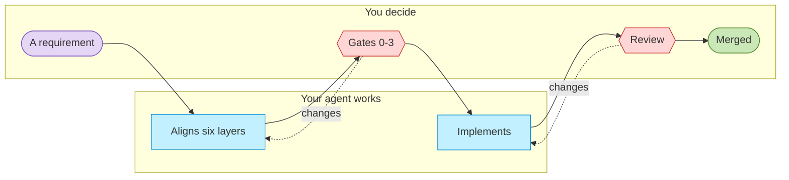

# ArChreator

**Your AI can build anything. It still can't know what you meant.**

ArChreator turns what you know about your business into an architecture an
agent can build from — plain Markdown in your own repo, with you approving at
explicit gates before a line of code exists.

[](https://github.com/roanboc/archreator/actions/workflows/docs-check.yml)
[](https://github.com/roanboc/archreator/actions/workflows/skills-check.yml)
[](./LICENSE)
[](./plugins/archreator/skills/README.md)

---

## The problem

Most software doesn't fail because the code was hard. It fails because the
problem was misunderstood — and an agent amplifies that, confidently, at
speed. You get a working implementation of the wrong thing, in an afternoon.

The fix isn't a better prompt. It's writing down what an agent would otherwise
have to guess: who you serve, what you offer, who does what, and which system
realizes each piece.

## How it works

A requirement never becomes code directly. It walks down six architecture
layers, stops wherever a human has to decide, and only then gets built.



**You own both ends; the middle is the agent's.** The dotted edges are the two
loops that can't be skipped — a gate you decline sends the work back *before
any code exists*, and a review you decline sends it back *before anything
merges*.

Drawn in the method's own palette: cyan is always an AI actor, here and in
every model you'll build, so you never mistake one for a person.

### The six layers

Numbered in the order they're assessed. Deriving one before the layer above it
is agreed is the mistake the whole method exists to prevent.

| # | Layer | The question it answers |
| - | ----- | ----------------------- |
| 0 | Business design | Who are the customers, and how does each offering pay? |
| 1 | Strategy | Why does this exist, and what must it be able to do? |
| 2 | Business | Who does what, and which services are offered? |
| 3 | Information | What information exists, and where does it live? |
| 4 | Application | Which software realizes each business service? |
| 5 | Technology | What runs it all — runtimes, build, hosting? |

You don't fill in all six for a weekend project. **One method, three depths** —
an app, an organization, or an enterprise — and the agent tells you which one
it picked and why.

## The distinguishing bet

**An AI is modeled as a member of the organization, not a tool used by it.**

Every actor in your model carries a kind — human, AI, or hybrid. Every AI
actor carries an autonomy level, concrete decision rights, and a named
escalation path. So "the agent handles triage" stops being a hand-wave and
becomes a row you can point at, argue with, and change on purpose.

## Quick start

In Claude Code:

```shell
/plugin marketplace add roanboc/archreator
/plugin install archreator@archreator
```

In GitHub Copilot — the CLI, VS Code, or the Copilot app:

```shell
copilot plugin marketplace add roanboc/archreator
copilot plugin install archreator@archreator
```

Then just say what you want to model. The `establish-project` skill takes it
from there — it asks two questions, picks a depth, and writes you a working
project on the first commit.

On Codex, on Gemini CLI, or if you'd rather clone the scaffold than install
anything, [`docs/adopting.md`](./docs/adopting.md) has the recipe for each and
says exactly what lands in your project either way.

## What you get

| | |
| --- | --- |
| **15 agent skills** | The method itself. Each is named for the process it realizes, and your agent picks the right one from what you said — you never invoke them by name. [Catalogue](./plugins/archreator/skills/README.md) |
| **A scaffold** | Six layer folders, the notation, two validators, and placeholder entry points. A working project before you've written anything. [What's in it](./plugins/archreator/scaffold/architecture/README.md) |
| **Validators that run in CI** | Every element reference resolves, no identifier is reused, every link points at something real. A stale model fails loudly instead of misleading an agent |
| **A portal and a PDF, when you need them** | The same documents as a searchable website and as one printable document, for the people who will never open a repository. Both are rebuilt from the Markdown and thrown away. [How it works](./docs/publishing.md) |
| **Nothing to operate** | No database, no server, no account, and nothing to export before an agent can read it. Markdown in git is the model |

> **See it in use.** Worked models — an organization, the method modeling
> itself, the guidance site — live in
> [`architecture-archreator`](https://github.com/roanboc/architecture-archreator).
> This repo holds the method; that one holds real examples of it applied.

## Why Markdown, and not a modeling tool

Because the reader that matters can't open a modeling tool.

An architecture kept in a tool's own format is invisible to your agent and
invisible to code review. Markdown in git is diffable, greppable, reviewable
in a pull request, and readable natively by the thing you're asking to build
from it. That single choice is why nothing has to be exported before the model
can be used, and why there is nothing to keep running.

Rendering it for people is a separate, optional step —
[a portal and a PDF](./docs/publishing.md) are one command each, regenerated
from the Markdown and gitignored, so the published copy can never become the
second model everyone edits instead.

## Where to go from here

| To understand | Read |
| ------------- | ---- |
| **What the method does, and how** | [`docs/method.md`](./docs/method.md) — the process, the layers, the loop |
| **How to adopt it in your project** | [`docs/adopting.md`](./docs/adopting.md) |
| **What each skill is for** | [`plugins/archreator/skills/README.md`](./plugins/archreator/skills/README.md) — the catalogue, in the order they're used |
| **How the model reaches people who won't clone it** | [`docs/publishing.md`](./docs/publishing.md) — the portal, the PDF, and how a question comes back |
| **The method as a levelled process model** | [`docs/process/`](./docs/process/README.md) — the macro map, a SIPOC per process, and which skill realizes each |
| **The format every skill follows** | [`docs/skill-format.md`](./docs/skill-format.md) — frontmatter, the fixed sections, and the glyphs that mark them |
| **Which standards it rests on** | [`docs/standards-alignment.md`](./docs/standards-alignment.md) — every coined term, the established name behind it, and where the method is genuinely its own |
| **What a filled-in model looks like** | [`architecture-archreator`](https://github.com/roanboc/architecture-archreator) |
| **How to contribute** | [`CONTRIBUTING.md`](./CONTRIBUTING.md) |

## What's in this repository

- **The skills** — [`plugins/archreator/skills/`](./plugins/archreator/skills/README.md)
- **The scaffold** — [`plugins/archreator/scaffold/`](./plugins/archreator/scaffold/architecture/README.md), copied into your project by `establish-project`
- **The plugin manifests** — [`plugin.json`](./plugins/archreator/plugin.json), [`.claude-plugin/plugin.json`](./plugins/archreator/.claude-plugin/plugin.json) and [`marketplace.json`](./.claude-plugin/marketplace.json), publishing to Claude Code, GitHub Copilot and Codex
- **Docs and site** — [`docs/`](./docs/method.md) and the one-page [`site/`](./site/index.html)

No application code, and no worked models — those live in the sibling repo.

---

**ArChreator** — *architecture* + *creator*. Free, open source, MIT.
Built by [roanboc](https://github.com/roanboc).
