# ArChreator

**Your AI can build anything. It still can't know what you meant.**

ArChreator turns what you know about your business into an architecture an
agent can build from — plain Markdown in your own repo, with you approving at
explicit gates before a line of code exists.

[](https://github.com/roanboc/archreator/actions/workflows/docs-check.yml)
[](https://github.com/roanboc/archreator/actions/workflows/skills-check.yml)
[](./LICENSE)
[](./plugins/archreator/skills/README.md)

---

## The problem

Building software was hard, and slow. That was the visible problem, and it
covered for everything behind it — a requirement nobody had pinned down,
business context that lived in one person's head, an assumption three people
each understood differently. None of it had to be settled, because the build
was always the thing running late.

AI took that delay away faster than anyone planned for, and what it was
covering is now the whole problem. **Vague requirements and missing context
no longer slow a project down — they get built.** An agent handed an
assumption nobody stated does not stop and ask. It fills the gap with
something plausible and carries on, at speed, and you get a working version of
the wrong thing in an afternoon. Understanding the problem, and which solution
actually fits it, is the part that stays human.

So the thing worth building now is not a faster way to produce software. It is
a way to get your own assumptions written down where people can disagree with
them — who you serve, what you offer, who does what, and which system does
each piece — early, while disagreeing is still cheap. The fix isn't a better
prompt.

## How it works

A requirement never becomes code directly. It walks down six architecture
layers — grouped into three questions — in two halves: the one you rule, and
the one you can hand over.

### First — what you are actually asking for

```mermaid
flowchart LR
  req(["A requirement"]):::human
  intention["<b>Intention</b><br/>why, and for whom"]:::ai
  gA{{"❖ <b>Direction</b><br/>you approve where this is going"}}:::gate
  operation["<b>Operation</b><br/>who does what, and<br/>with which information"]:::ai
  gB{{"❖ <b>Understanding</b><br/>you approve, before any code exists"}}:::gate
  out(["A sharper requirement —<br/>agreed, and written down"]):::done

  req --> intention --> gA --> operation --> gB --> out
  gA -.->|"changes"| intention
  gB -.->|"changes"| operation
  classDef human fill:#e6d6f5,stroke:#7e57c2,color:#333
  classDef ai fill:#c2f0ff,stroke:#0288d1,color:#333
  classDef gate fill:#ffd6d6,stroke:#c62828,color:#333
  classDef gateopt fill:#ffd6d6,stroke:#c62828,color:#333,stroke-dasharray: 5 5
  classDef done fill:#c9e7b7,stroke:#558b2f,color:#333
```



**This half pays for itself even if nothing gets built.** The agent drafts;
you settle. What you end up holding is your own requirement, sharper than the
one you arrived with — who it serves, what it has to do, and which of your
assumptions turned out to disagree with each other. The dotted edges are the
loops that can't be skipped, and neither gate here is about code.

**Those names are the method's, not the diagram's.** Direction, Understanding
and Design are what the skills call them too, so nothing you read later
renames what you just approved.

### Then — what gets built from it


**Nobody asks you to read the code.** What comes back to you is the working
thing, and the question is whether it does what you asked for. If you *are*
technical, or someone on your side is, the pull request is right there and the
dashed gate will show you the design before it is built — but that is an
option you take, not a toll you pay.

Each half is bounded, and each ends in something worth having: the first in
understanding, the second in the outcome. That is also why the second picture
ends where the first one began.

Drawn in the method's own palette: cyan is always an AI actor, here and in
every model you'll build, so you never mistake one for a person.

### The six layers

Numbered in the order they're assessed. Deriving one before the layer above it
is agreed is the mistake the whole method exists to prevent.

| Group | # | Layer | The question it answers |
| ----- | - | ----- | ----------------------- |
| **Intention** | 0 | Business design | Who are the customers, and how does each offering pay? |
| **Intention** | 1 | Strategy | Why does this exist, and what must it be able to do? |
| **Operation** | 2 | Business | Who does what, and which services are offered? |
| **Operation** | 3 | Information | What information exists, and where does it live? |
| **Realization** | 4 | Application | Which software realizes each business service? |
| **Realization** | 5 | Technology | What runs it all — runtimes, build, hosting? |

The groups are a way to read the six, not a seventh thing to learn. The line
between **Operation** and **Realization** is the one that matters: it is where
the method stops and asks, and everything above it is agreed before any code
exists.

You don't fill in all six for a weekend project. **One method, three depths** —
an app, an organization, or an enterprise — and the agent tells you which one
it picked and why.

## The distinguishing bet

**An AI is modeled as a member of the organization, not a tool used by it.**

Every actor in your model carries a kind — human, AI, or hybrid. Every AI
actor carries an autonomy level, concrete decision rights, and a named
escalation path. So "the agent handles triage" stops being a hand-wave and
becomes a row you can point at, argue with, and change on purpose.

## Quick start

In Claude Code:

```shell
/plugin marketplace add roanboc/archreator
/plugin install archreator@archreator
```

In GitHub Copilot — the CLI, VS Code, or the Copilot app:

```shell
copilot plugin marketplace add roanboc/archreator
copilot plugin install archreator@archreator
```

Then just say what you want to model. The `establish-project` skill takes it
from there — it asks two questions, picks a depth, and writes you a working
project on the first commit.

**If you already are an architect**, the other route is to read the model
directly: it is a standard layered structure in plain files, navigable in the
order you already know, and you never have to ask an agent to summarise it for
you.

On Codex, on Gemini CLI, or if you'd rather clone the scaffold than install
anything, [`docs/adopting.md`](./docs/adopting.md) has the recipe for each and
says exactly what lands in your project either way.

## What you get

| | |
| --- | --- |
| **18 agent skills** | The method itself. Each is named for the process it realizes, and your agent picks the right one from what you said — you never invoke them by name. [Catalogue](./plugins/archreator/skills/README.md) |
| **Eleven files on your first commit** | And every one of them is used. Your model's front page says, per layer, whether it is here, somewhere else, out of scope, or a gap — a folder appears when it has something to hold. [What's in it](./plugins/archreator/scaffold/architecture/README.md) |
| **Validators that run in CI** | Every element reference resolves, no identifier is reused, every link points at something real. A stale model fails loudly instead of misleading an agent |
| **A portal, on request** | The same documents as a searchable website, for the people who will never open a repository. Stock MkDocs, one command, gitignored output. [How it works](./docs/adopting.md#reaching-a-reader-who-will-not-open-the-repository) |
| **Nothing to operate, and nothing cached** | No database, no server, no account, nothing to export before an agent can read it, and no projection that can answer from a revision the model has moved past. Markdown in git is the model, and every tool reads it fresh |

> **See it in use.** Worked models — an organization, the method modeling
> itself, the guidance site — live in
> [`architecture-archreator`](https://github.com/roanboc/architecture-archreator).
> This repo holds the method; that one holds real examples of it applied.

## Why Markdown, and not a modeling tool

Because the reader that matters can't open a modeling tool.

An architecture kept in a tool's own format is invisible to your agent and
invisible to code review. Markdown in git is diffable, greppable, reviewable
in a pull request, and readable natively by the thing you're asking to build
from it. That single choice is why nothing has to be exported before the model
can be used, and why there is nothing to keep running.

Rendering it for people is a separate, optional step —
[a portal](./docs/adopting.md#reaching-a-reader-who-will-not-open-the-repository) is one command, regenerated
from the Markdown and gitignored, so the published copy can never become the
second model everyone edits instead.

## Where to go from here

| To understand | Read |
| ------------- | ---- |
| **What the method does, and how** | [`docs/method.md`](./docs/method.md) — the process, the layers, the loop |
| **How to adopt it in your project** | [`docs/adopting.md`](./docs/adopting.md) |
| **What each skill is for** | [`plugins/archreator/skills/README.md`](./plugins/archreator/skills/README.md) — the catalogue, in the order they're used |
| **How the model reaches people who won't clone it** | [`docs/adopting.md`](./docs/adopting.md#reaching-a-reader-who-will-not-open-the-repository) — the portal, and the brief that answers one question |
| **The method as a levelled process model** | [`docs/process/`](./docs/process/README.md) — the macro map, a SIPOC per process, and which skill realizes each |
| **The format every skill follows** | [`docs/skill-format.md`](./docs/skill-format.md) — frontmatter, the fixed sections, and the glyphs that mark them |
| **Which standards it rests on** | [`docs/standards-alignment.md`](./docs/standards-alignment.md) — every coined term, the established name behind it, and where the method is genuinely its own |
| **What a filled-in model looks like** | [`architecture-archreator`](https://github.com/roanboc/architecture-archreator) |
| **How to contribute** | [`CONTRIBUTING.md`](./CONTRIBUTING.md) |

## What's in this repository

- **The skills** — [`plugins/archreator/skills/`](./plugins/archreator/skills/README.md)
- **The scaffold** — [`plugins/archreator/scaffold/`](./plugins/archreator/scaffold/architecture/README.md), copied into your project by `establish-project`
- **The plugin manifests** — [`plugin.json`](./plugins/archreator/plugin.json), [`.claude-plugin/plugin.json`](./plugins/archreator/.claude-plugin/plugin.json) and [`marketplace.json`](./.claude-plugin/marketplace.json), publishing to Claude Code, GitHub Copilot and Codex
- **Docs and site** — [`docs/`](./docs/method.md) and the one-page [`site/`](./site/index.html)

No application code, and no worked models — those live in the sibling repo.

---

**ArChreator** — *architecture* + *creator*. Free, open source, MIT.
Built by [roanboc](https://github.com/roanboc).
