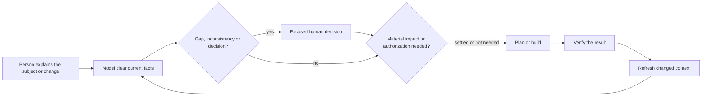

# The method

_[Repository README](../README.md)_

ArChreator turns what people know about an initiative or business into a small,
current architecture that can be read directly and traversed by an agent.

## Customers and routes

The primary guided customer is an independent builder who knows the subject but
does not need to learn enterprise architecture first. Enterprise architects are
first-class expert customers: they can inspect the standard areas, identifiers,
relationships and portal without asking an agent to regenerate an explanation.

Business and domain owners decide unresolved meaning and material changes. An
agent drafts, traverses and implements within the authority it has been given.

## One source, several views

Canonical facts live in Markdown under `architecture/`. The front door is
`architecture/README.md`; it states the model boundary and links only areas
that contain local content. The detailed model contract is in
[`model-structure.md`](../plugins/archreator/skills/architecture-document-style/references/model-structure.md).
Every other canonical file states its location directly. When an element is
decomposed, each populated level has a file and every child definition names
its parent in human-readable form.

ArChreator's simplicity is in what a project must carry, not in removing the
method. Typed skills retain explicit activation and non-activation conditions,
invariants, judgements, inputs, outputs, conditional human checkpoints,
handoffs, anti-patterns and completion tests. The
[skill format](./skill-format.md) adapts the Agent Instruction Protocol (AIP),
and the [process model](./process/README.md) binds the workflows to
supplier-input-process-output-customer (SIPOC) outcomes.

The repository, focused briefs and portal are views of the same source:

- repository navigation supports direct inspection and review;
- decision briefs carry only what a person needs to resolve one issue;
- impact briefs explain what a proposed change affects in both directions;
- understanding briefs teach what exists with wider context and a useful visual;
- the portal supports browsing, search and business explanation outside the
  repository interface.

Temporary views live under `.archreator/work/`. Only resolved decisions and
delivered current facts return to the canonical model.

## Normal flow

There is no blanket model approval. Human judgement appears only when evidence
cannot safely resolve meaning, a material change needs authorization, or an
outcome needs human acceptance. Automated and engineering verification still
applies to every delivered change.

## Levels and federation

A model states whether it is Enterprise, Domain or Solution. The owning model
defines a fact once; a lower model refines an exposed contract and never copies
its parent. A cross-model reference remains human-first, such as Order service
[customer-platform::BSVC1].

ArChreator keeps these federation semantics because multiple repositories need
them. It does not prescribe registry transport, authentication, caching or a
central graph before a real three-level use case proves what is needed.

## What ArChreator deliberately excludes

- empty architecture folders and placeholder catalogues;
- mandatory Gate 0 to Gate 3 records;
- permanent scope documents for routine work;
- SQLite or any persisted query projection;
- whole-model PDF export;
- an agent-only interface to the architecture.
