# The method

_[← Repository README](../README.md)_

**What you get out of this is your own requirement, sharper than the one you
arrived with** — who it serves, what it has to do, and which of your
assumptions turned out to disagree with each other.

The one-paragraph version of how: **a requirement never becomes code
directly.** It is worked through numbered architecture layers, stopped at
the named gates you grant, captured in a scope document, and only then
implemented. You keep the strategy and business judgement; AI agents do the
modeling and the building in between, and every actor's kind and autonomy is
written down.

You are never asked to learn a notation to answer a question about your own
business. If you already know one, the model is a standard layered structure in
plain files you can navigate directly.

## The loop: Requester → Agent → Reviewer

Every change moves through three roles, and nothing assumes a human fills the
middle one: an AI agent and a person follow the same steps, in the same order,
against the same documents.

| Role | Who | Does |
| ---- | --- | ---- |
| **Requester** | You | Says what should change — a requirement or a problem, not a diff. **Grants the gate approvals** before any code is written |
| **Agent** | An AI agent (or a person) | Walks the architecture ladder, stops at each gate for the Requester's approval, writes a short scope document, implements, and opens a PR |
| **Reviewer** | You | Reviews and merges. Nothing ships without a human approving it |

## The six layers

The architecture folder is numbered in the order layers are assessed.
Deriving one before the one above it is validated is what the whole method
exists to prevent.

| # | Layer | Answers |
| - | ----- | ------- |
| 0 | Business design | Who are the customers, what do they need, and how does each offering pay? |
| 1 | Strategy | Why does this exist? Who cares? What capabilities and value stream? |
| 2 | Business | Who does what? Which services are offered, through which processes? |
| 3 | Information | What information exists, where does it live, how does it flow? |
| 4 | Application | Which software services and components realize the business services? |
| 5 | Technology | What runs it all — runtimes, tooling, build, hosting, deployment? |

Layer 0 is the odd one out — it holds no ArchiMate elements, only the
Value Proposition and Business Model canvases the architecture is derived
from. It is filled only when the initiative is modeling an organization.

**All six describe today**, which leaves two questions they cannot answer.

*Where did the estate come from, if no requirement ever asked for it?* An
organization modeled after the fact has processes, applications and
infrastructure no change request will ever produce. Layers 2–5 are filled for
it once, from evidence rather than from a requirement, by the
[`discover-current-landscape` skill](../plugins/archreator/skills/discover-current-landscape/SKILL.md)
— which stops where a declared boundary says, so a reader can tell what was left
out from what was missed.

*Where is it going?* That lives in `architecture/6_transition/`, the one folder
permitted to describe a future: target plateaus, the gaps between them and
today, and the order the gaps are closed in. The
[`plan-the-transition` skill](../plugins/archreator/skills/plan-the-transition/SKILL.md)
writes it, and the Requester approves it as **direction** — not as permission
to build any of it. Intent lives in one folder so every numbered layer reads as
a description of now.

## One method, three depths

The same six layers describe a weekend app and a twenty-business-line
company alike. What changes is **how much of them gets filled in and which
gates apply.** Every project declares one depth in `AGENTS.md`, and **the
agent tells you which depth it picked and why**.

| Depth | The subject is | You get | Gates |
| ----- | -------------- | ------- | ----- |
| **1 — Application** | one app or tool | a light strategy layer: goals and principles, enough to judge a change against | Understanding on every change, before code; Direction once, when the strategy is first discovered |
| **2 — Organization** | a company, department, or service line | value proposition and business model canvases, and the operating model derived from them | two |
| **3 — Enterprise** | several business lines | the above, plus each line modeled as a domain with its own charter and service contracts | two, plus every affected domain's owner |

Depth is a starting posture, never a ceiling — deepening is a normal
change, not a restart.

## When it stops and asks you

**Two gates, named for what you approve**, and the names are the ones the
[repository README](../README.md#how-it-works) already uses on its two
pictures:

| Gate | You approve | It applies when |
| ---- | ----------- | --------------- |
| **Direction** | Where this is going — the canvases where the subject is an organization, then the strategy derived from them, or a roadmap | The change moves *why* or *for whom* |
| **Understanding** | Who does what, and with which information — before any code exists | Every change that will produce code |

**An ordinary change to a single application meets one gate.** Direction
belongs to discovery and planning, so a Depth 1 project meets it only when one
of those runs: its first strategy discovery, or a roadmap.

Direction may be granted in two sittings where the subject is an organization —
the canvases first, the strategy derived from them second — and it is still one
gate.

Approval is granted by the Requester and recorded in the scope document's
**Approvals** table — which gate, who approved, when, and what was shown. An
approval that isn't recorded didn't happen, and a gate that was not granted
gets no row: the table records what happened, never what did not.

Between the gates, two things stop the work, and the agent says which:
**material uncertainty** (two readings of the request build different things,
and nothing in the model settles it) and **authorization** (the work would
commit you to spend, exposure, or publication you have not agreed).

Which gate applies to a given change, and what you are shown at each, is
defined in exactly one place — the
[`align-change-through-layers` skill](../plugins/archreator/skills/align-change-through-layers/SKILL.md)
§ The gates. This page names the gates; it does not restate the rule.

Pure bug fixes that change no documented behavior pass no gates.

## Process flow

How a requirement gets from "someone wants a change" to "merged".

```mermaid
flowchart LR
  req(["⚇ Requester presents a requirement"])
  align["⚙ Agent aligns it through the layers"]
  gates{{"❖ the gates — the Requester approves"}}
  build["⚙ Agent implements, keeping the documents true"]
  rev(["⚇ Reviewer reads the whole branch"])
  merged(["Merged"])

  req --> align --> gates
  gates -->|changes requested| align
  gates -->|approved| build --> rev
  rev -->|changes requested| build
  rev -->|approved| merged

  classDef business fill:#fffbb5,stroke:#c8c04a,color:#333
  classDef implementation fill:#ffd6d6,stroke:#d99b9b,color:#333
  class req,align,build,rev,merged business
  class gates implementation
```

Two loops, and neither can be skipped: the Requester's, which runs before any
code exists, and the Reviewer's, which runs before any code merges.

Inside the Agent boxes there is branching — a "no change" verdict on a layer,
a "pure bug fix, no scope document" statement, a conflict with an approved
Principle that stops the work, a call the agent took and recorded as draft.
**Every one of those is stated and recorded, never a silent skip.** Drawn out,
that branching is the levelled process model in
[`docs/process/`](./process/README.md); written out step by step it is the
[`align-change-through-layers` skill](../plugins/archreator/skills/align-change-through-layers/SKILL.md).

## Where the model lives

Layer folders and files are numbered by assessment order. Each element
carries a short ID — a type prefix and a number, like `G1`, `CAP3`,
`BSVC2` — which extends its parent's where a catalogue has levels, so the
second capability under `CAP3` is `CAP3.2`. Every element names the code
artifact, page, or written procedure that realizes it, or is explicitly
marked "Pending — future initiative". Two validators in
[`plugins/archreator/scaffold/scripts/`](../plugins/archreator/scaffold/scripts/) enforce that references
resolve, that every leveled ID has a parent, and that no identifier is reused.

Beside the numbered layers sit the folders that are not layers:
`architecture/scope/` (one document per initiative), `architecture/decisions/`
(calls smaller than an initiative), `architecture/domains/` (Depth 3 only),
`architecture/6_transition/` (where it is going) and `architecture/reference/`
(the source material the model was built from, dated, indexed, never published).

**Every document that defines an element says how far it has been validated**,
with one of three glyphs in its preamble: `○` not started, `◐` a draft
catalogue, `●` validated at a named gate on a named date. A draft catalogue is
a list of things somebody said exist, written down with notes so they can be
checked — it is *not* an architecture draft, and on the page the two are
identical. The marker is what separates them, and `check_model.py` fails a
document that defines elements without declaring one.

The Markdown is the model, and a reader who never opens a repository is served
by rendering it rather than by a second copy: one command writes a
searchable-website configuration, a focused brief answers one question, and
everything generated is gitignored — see
[`docs/adopting.md`](./adopting.md#reaching-a-reader-who-will-not-open-the-repository).

The scaffold at [`plugins/archreator/scaffold/`](../plugins/archreator/scaffold/architecture/README.md) opens with a
status row per layer rather than empty folders; a layer's README arrives when
a skill first fills it. The full conventions — numbering, ArchiMate on
Mermaid, colour ramps, actor kinds — are in the
[`architecture-document-style` skill](../plugins/archreator/skills/architecture-document-style/SKILL.md)
and its references.
