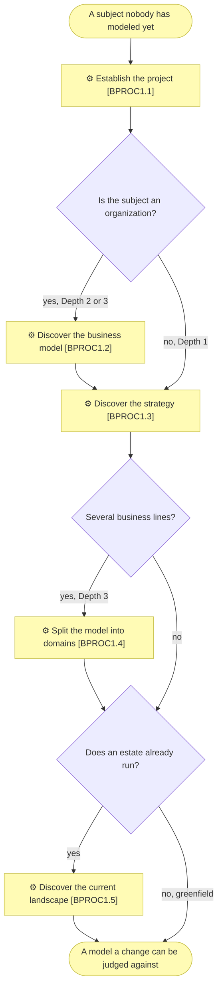
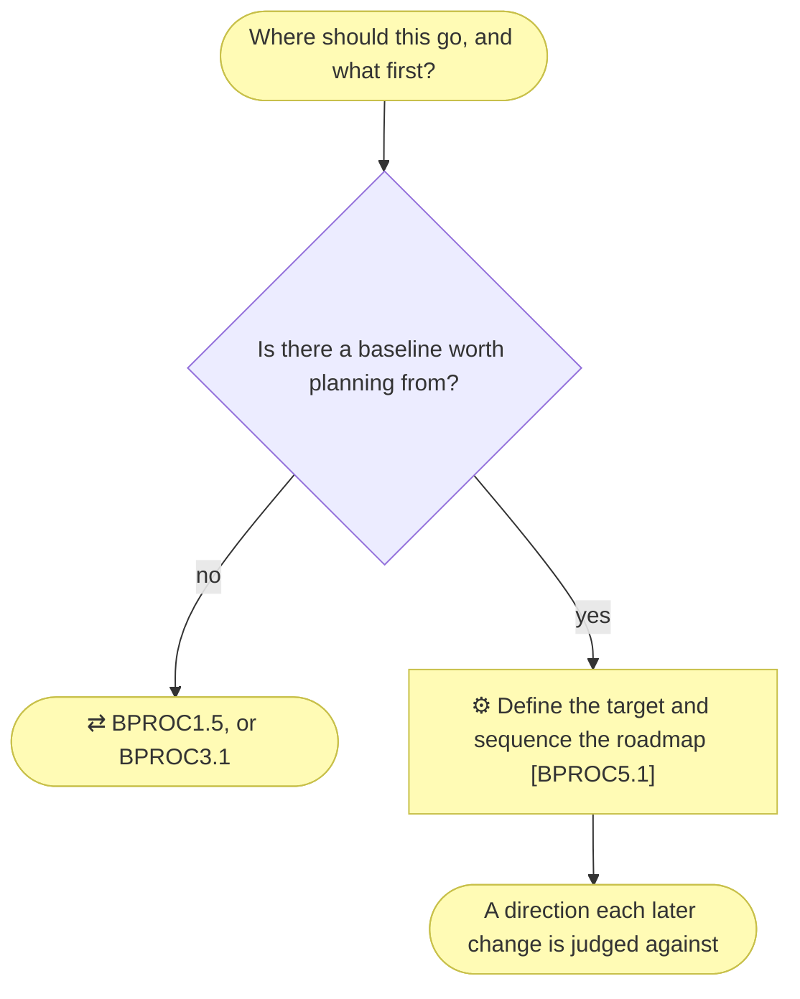
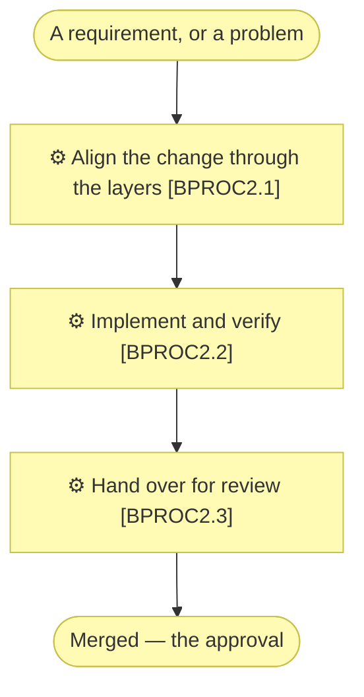
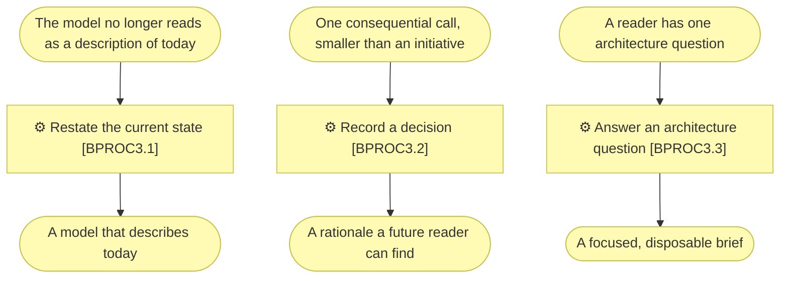

# Level 1 — the macro processes

_[← The process model](./README.md)_

The five macro processes, each with its level-2 children, ordered on this page by
when they run rather than by identifier — `BPROC5` was added last and runs second.
An identifier is assigned once and never reallocated, so a number says when a
process joined the model; the sequence is carried by this page's order and the
map, never by the number.
The map that places them relative to one another is on
[the index page](./README.md#the-macro-process-map); this page opens each one up.
What every child process consumes and produces is in
[`2_level-2-processes.md`](./2_level-2-processes.md).

## `BPROC1` — Establish the architecture model

Turns a subject nobody has modeled into a populated, approved model the next change
can be judged against.

The depth question is asked once, at `BPROC1.1`, and it decides which of these
processes run at all. A Depth 1 application never enters `BPROC1.2`, and only a
Depth 3 enterprise enters `BPROC1.4`.

`BPROC1.5` is decided by a different question, asked later: whether the subject was
already running before anyone modeled it. A greenfield project skips it and fills its
lower layers one initiative at a time through `BPROC2`; an organization that has
existed for years cannot, because the estate is not a consequence of any requirement.

## `BPROC5` — Plan the transition

Turns an approved description of today into a destination, the distance to it, and the
order that distance is closed in.

The only process whose output describes a future. Everything else in the model is
held to describing what is true now; the exemption is one folder,
`architecture/6_transition/`, and it is the whole of `BPROC5`'s output.

Built directly and merged like any initiative, rather than needing an approval
of its own — see [`2_level-2-processes.md`](./2_level-2-processes.md).

## `BPROC2` — Deliver an architected change

Turns a Requester's requirement into merged code whose architecture documents are
still true.

`BPROC2.1`'s interior is the one branch detailed to level 3, in
[`3_level-3-align-a-change.md`](./3_level-3-align-a-change.md).

## `BPROC3` — Keep the model true

Keeps a model truthful, records the calls that explain it, and turns one
reader question into a bounded reading without changing the model.

The three children share a band and nothing else: different triggers, run
independently, never handing off to one another, so the band has no internal
sequence.

## `BPROC4` — Learn from the engagement

Turns what the method failed to cover into proposals, before the memory of it
evaporates.

One child, and the thinnest band in the model. Its output is the only input
`BPROC1` has for changing the method itself.
