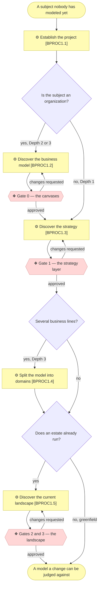
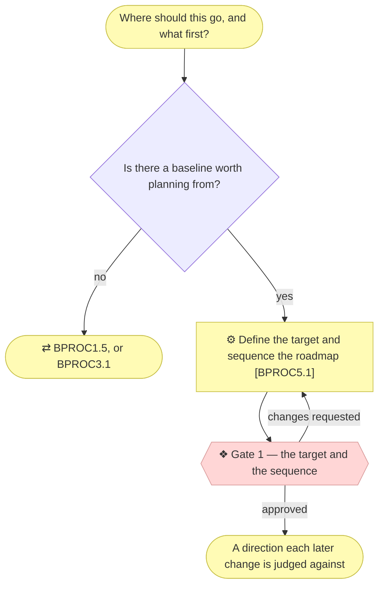
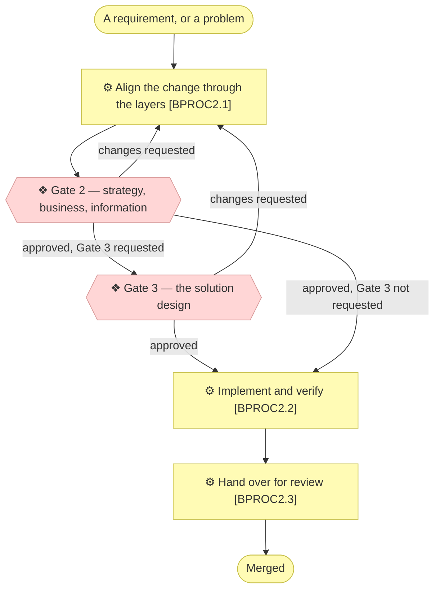
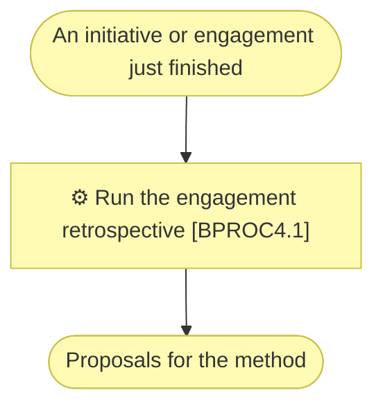

# Level 1 — the macro processes

_[← The process model](./README.md)_

The five macro processes, each with its level-2 children, ordered on this page by
when they run rather than by identifier — `BPROC5` was added last and runs second.
The map that places them relative to one another is on
[the index page](./README.md#the-macro-process-map); this page opens each one up.
What every child process consumes and produces is in
[`2_level-2-processes.md`](./2_level-2-processes.md).

## `BPROC1` — Establish the architecture model

Turns a subject nobody has modeled into a populated, approved model the next change
can be judged against.



The depth question is asked once, at `BPROC1.1`, and it decides which of these
processes run at all. A Depth 1 application never enters `BPROC1.2`, and only a
Depth 3 enterprise enters `BPROC1.4`.

`BPROC1.5` is decided by a different question, asked later: whether the subject was
already running before anyone modeled it. A greenfield project skips it and fills its
lower layers one initiative at a time through `BPROC2`; an organization that has
existed for years cannot, because the estate is not a consequence of any requirement
and no requirement will ever ask for it to be written down.

## `BPROC5` — Plan the transition

Turns an approved description of today into a destination, the distance to it, and the
order that distance is closed in.



The only process whose output describes a future. Everything else in the model —
every layer document, every validator, every restatement — is held to describing
what is true now, and that rule is worth keeping precisely because one place is
exempt from it. The exemption is a folder, `architecture/roadmap/`, and it is the
whole of `BPROC5`'s output.

It reuses Gate 1 rather than adding a fifth gate. The reasoning is in
[`2_level-2-processes.md`](./2_level-2-processes.md).

## `BPROC2` — Deliver an architected change

Turns a Requester's requirement into merged code whose architecture documents are
still true.



`BPROC2.1` is the only process in the model that can reach two gates, and the second
is the Requester's option rather than the method's requirement. Its interior is the
one branch detailed to level 3, in
[`3_level-3-align-a-change.md`](./3_level-3-align-a-change.md).

## `BPROC3` — Keep the model true

Turns a model that has drifted from what shipped back into a description of today.

```mermaid
flowchart TD
  drift(["The model no longer reads as a description of today"])
  call(["One consequential call, smaller than an initiative"])
  p31["⚙ Restate the current state [BPROC3.1]"]
  g2b{{"❖ Gate 2 — the restatement"}}
  p32["⚙ Record a decision [BPROC3.2]"]
  back(["A model that describes today"])
  rec(["A rationale a future reader can find"])

  drift --> p31 --> g2b -->|approved| back
  g2b -->|changes requested| p31
  call --> p32 --> rec

  classDef business fill:#fffbb5,stroke:#c8c04a,color:#333
  classDef implementation fill:#ffd6d6,stroke:#d99b9b,color:#333
  class p31,p32,drift,call,back,rec business
  class g2b implementation
```

The two children share a band and nothing else. They answer different triggers, run
independently, and never hand off to one another, which is why the band has no
internal sequence.

## `BPROC4` — Learn from the engagement

Turns what the method failed to cover into proposals, before the memory of it
evaporates.



One child, and the thinnest band in the model. It earns its place because its output
is the only input `BPROC1` has for changing the method itself.
