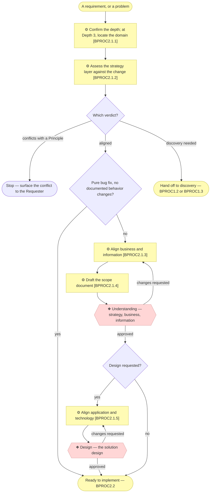

# Level 3 — inside `BPROC2.1`, "Align the change through the layers"

_[← The process model](./README.md) · [Level 2](./2_level-2-processes.md)_

The one process decomposed past level 2, and the
[focus table](./README.md#the-focus-table) says why: the Understanding and Design gates both
sit here, and their branching is more than one diagram can carry legibly.

| ID | Sub-process | Trigger | Output |
| -- | ----------- | ------- | ------ |
| `BPROC2.1.1` | Confirm the depth; at Depth 3, locate the domain | A requirement arrives | A stated depth, and the owning domain where there is one |
| `BPROC2.1.2` | Assess the strategy layer against the change | The depth is stated | One of four verdicts, stated and recorded |
| `BPROC2.1.3` | Align business and information | The verdict is "aligned" and this is not a pure bug fix | Changed `2_business/` and `3_information/`, or explicit "no change" verdicts |
| `BPROC2.1.4` | Draft the scope document | The layers are aligned | The next numbered document in `architecture/scope/`, indexed |
| `BPROC2.1.5` | Align application and technology | Understanding is approved | Changed `4_application/` and `5_technology/` |

Every edge leaving a rhombus is a verdict the agent **states and records** — a "no
change" on a layer, a "pure bug fix, no scope document", an open question logged.
None of them is a silent skip, and that is the difference between a branch and a
shortcut.

The two edges that leave the happy path are the ones worth knowing. A **conflict**
stops the process: the change contradicts a Principle already approved, and only the
Requester can resolve that. A **discovery** verdict does not stop it — it hands off
to `BPROC1.2` or `BPROC1.3` and comes back, which is why the arrow leaves rather
than ends.

The step-by-step form of this diagram is the
[`align-change-through-layers` skill](../../plugins/archreator/skills/align-change-through-layers/SKILL.md);
this page says where the steps sit, not what they say.
