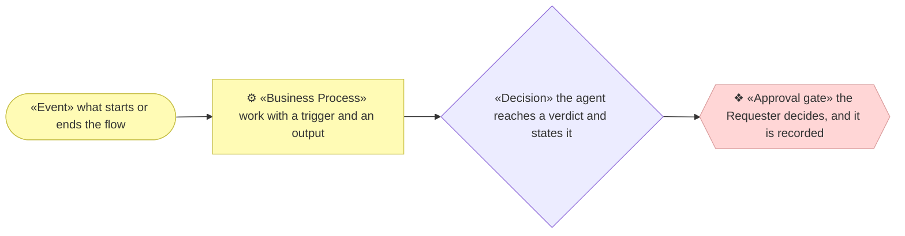
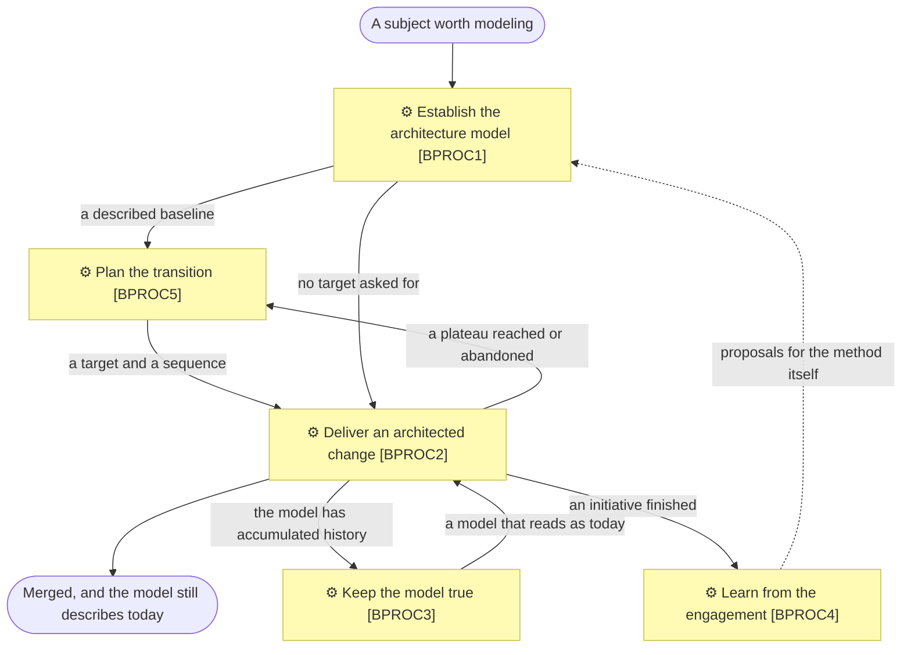

# The process model

_[← Repository README](../../README.md) · [The method](../method.md)_

The method applied to itself. [`method.md`](../method.md) explains what archreator
does in plain English; this folder states it as a process model — levelled, with a
trigger, an input, an output and an owner on every process, and a named skill
realizing each one.

That is not decoration. archreator tells the organizations it models to level their
processes and to ground every element in something real. A method that asks for it
and does not do it is asking on credit. It also buys something practical: with each
process naming the skill that realizes it, a process no skill implements is a **hole
in the method**, and CI can say so.

## How to read this folder

| Page | Holds |
| ---- | ----- |
| This page | The notation, the macro map, and the focus table |
| [`1_level-1-macro-processes.md`](./1_level-1-macro-processes.md) | The five macro processes, each with its children in sequence |
| [`2_level-2-processes.md`](./2_level-2-processes.md) | Every level-2 process, with the full SIPOC |
| [`3_level-3-align-a-change.md`](./3_level-3-align-a-change.md) | The one branch decomposed to level 3, and why it is the only one |

Levels 1 and 2 are complete across the whole method. Level 3 exists for one process
only, and the focus table below says why.

**Identifiers carry their parent, and not the running order.** `BPROC2.1` is a
level-2 process whose parent is the macro process `BPROC2`. The depth of the number
is the level, so a reader who meets an ID anywhere in the repository can place it
without a lookup. `BPROC5` runs second and is numbered fifth, because it joined the
model last and an assigned identifier is never reallocated — the map above is where
the order is read, never the numbers. The rule is
[`architecture-document-style`](../../plugins/archreator/skills/architecture-document-style/SKILL.md)
§ Levels number hierarchically, and this model is the first thing in the repository
to use it.

## Notation

| Glyph | Shape | Element | ID prefix |
| ----- | ----- | ------- | --------- |
| `⚙` | Rectangle | Business Process | `BPROC` |
| `❖` | Hexagon, rose | Approval gate — a Requester decision, recorded in an Approvals table | — |
| — | Rhombus | Decision — a verdict the agent reaches and states | — |
| — | Stadium | Event — what starts or ends a flow | — |

Glyph, shape and colour follow
[`architecture/README.md` § Notation conventions](../../plugins/archreator/scaffold/architecture/README.md#notation-conventions),
which stays the single source. The **approval gate** has no ArchiMate element type, so
it takes a shape of its own here. As an ordinary decision rhombus it is
indistinguishable from a verdict the agent reaches alone, and that is the distinction
which matters most on this page: an agent decision continues the flow, a gate stops it
until a person acts.

## The macro process map

| ID | Band | Macro process | Purpose | Composed of |
| -- | ---- | ------------- | ------- | ----------- |
| `BPROC1` | Operational | Establish the architecture model | Turns a subject nobody has modeled into a populated, approved model the next change can be judged against | `BPROC1.1` · `BPROC1.2` · `BPROC1.3` · `BPROC1.4` · `BPROC1.5` |
| `BPROC5` | Operational | Plan the transition | Turns an approved description of today into a destination, the distance to it, and the order that distance is closed in | `BPROC5.1` |
| `BPROC2` | Operational | Deliver an architected change | Turns a Requester's requirement into merged code whose architecture documents are still true | `BPROC2.1` · `BPROC2.2` · `BPROC2.3` |
| `BPROC3` | Support | Keep the model true | Turns a model that has drifted from what shipped back into a description of today | `BPROC3.1` · `BPROC3.2` |
| `BPROC4` | Evaluation | Learn from the engagement | Turns what the method failed to cover into proposals, before the memory of it evaporates | `BPROC4.1` |

The four bands are the classification
[`process-and-capability-levels`](../../plugins/archreator/skills/process-and-capability-levels/SKILL.md)
prescribes. They carry no identifiers, because nothing realizes a band.

**The Strategic band is empty, and that is a scope statement rather than a gap.**
Setting archreator's own direction — its stakeholders, drivers, goals and principles
— is real work, but the method's skills do not perform it. It is modeled in the
sibling repository
[`architecture-archreator`](https://github.com/roanboc/architecture-archreator),
where the method's own motivation layer and its scope documents live. Nothing here
would realize it, so nothing here claims it.

## The focus table

Every level-2 process, and how far down it is detailed.

| ID | Process | Detailed to | Justified by | Note |
| -- | ------- | ----------- | ------------ | ---- |
| `BPROC1.1` | Establish the project | Level 2 | — | Runs once per project. No pain raised |
| `BPROC1.2` | Discover the business model | Level 2 | — | The conversation's shape is the skill's subject, not a sequence |
| `BPROC1.3` | Discover the strategy | Level 2 | — | As above |
| `BPROC1.4` | Split the model into domains | Level 2 | — | Depth 3 only. Revisit when an enterprise engagement raises one |
| `BPROC1.5` | Discover the current landscape | Level 2 | — | The steps are a sweep order, not a branching flow. Revisit when a real estate engagement finds one |
| `BPROC5.1` | Define the target and sequence the roadmap | Level 2 | — | Six steps and one gate. Revisit if sequencing an estate-sized backlog turns out to need its own procedure |
| `BPROC2.1` | Align the change through the layers | **Level 3** | The method's own flow was unreadable | Every gate but Gate 0 and Gate 1 sits here, and the branching is why the single diagram it replaced could not be followed |
| `BPROC2.2` | Implement and verify | Level 2 | — | Sequence varies by stack; detailing it would model the code, not the method |
| `BPROC2.3` | Hand over for review | Level 2 | — | One step and one template |
| `BPROC3.1` | Restate the current state | Level 2 | — | No pain raised. Revisit when one is |
| `BPROC3.2` | Record a decision | Level 2 | — | One document, one template |
| `BPROC4.1` | Run the engagement retrospective | Level 2 | — | Six questions, no sequence between them |

One branch of twelve is detailed to level 3. That ratio is the point of the
breadth-first, depth-on-pain rule: the map is complete across the whole method, and
only the branch somebody actually stumbled on is decomposed.
