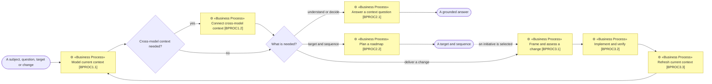

# The process model

_[Repository README](../../README.md) · [The method](../method.md) · [Skill format](../skill-format.md)_

**Location:** ArChreator method → Process model.

This is ArChreator applied to itself: a compact view of the work the method
performs and the skills that perform it. The numbered files define each
populated level; this index explains how work moves between them.

## Process flow

## Populated levels

| Document | Defines |
| --- | --- |
| [Macro processes — Level 1](./1_level-1-macro-processes.md) | Three macro processes and the Level 2 processes each contains |
| [Processes — Level 2](./2_level-2-processes.md) | Seven complete supplier-input-process-output-customer contracts and their skill bindings |

The hierarchy is complete to Level 2. Implement and verify [BPROC3.2] is the
second child of Deliver change and keep context true [BPROC3]; order of
execution comes from the flow rather than the number. No current need justifies
a Level 3 method-process file.

## Skill and gate relationship

Procedures perform ordered work. Document templates produce a focused artifact
inside that work. Rulebooks preserve language, architecture and process
consistency without becoming extra processes.

Human gates are conditional exceptions inside the Level 2 processes. They run
only for material gaps or inconsistencies, consequential authorization, or
explicitly required acceptance. Clear evidence and routine verification
continue without a blanket approval sequence.
