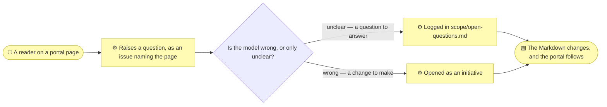

# Publishing the model

_[← Repository README](../README.md) · [The method](./method.md)_

The Markdown under `architecture/` is the model. Everything on this page is a
**rendering** of it, for the readers a repository does not reach: the
stakeholder who will not clone anything, the executive who wants a document in
a mail attachment, the auditor who needs a dated copy, the colleague who
searches rather than browses.

Two things ship in the scaffold, both derived and both disposable:

| | What it is | Run |
| --- | --- | --- |
| **The portal** | The model as a searchable website — every document, every diagram, navigation from the folder numbering | `python3 scripts/build_docs.py` |
| **The document** | The whole model as one PDF, printed from the portal's own single-page view | `python3 scripts/export_pdf.py` |

## The rule that makes this safe

A published copy of a model is the classic way to end up with two models. The
discipline is the one
[`build_model.py`](../plugins/archreator/scaffold/scripts/build_model.py) already lives
under, and it is three rules:

- **Regenerated, never edited.** Every run rebuilds the portal from the
  Markdown. There is no page you can fix in the portal and nowhere to fix it.
- **Gitignored.** Everything lands in `.docs/`, which is never committed. A
  derived file in the history is a derived file that can go stale.
- **Nothing reads it that could have read the Markdown.** An agent reads the
  documents; this exists for the consumers that cannot.

Delete `.docs/` and nothing is lost.

`stack-selection` § A persisted projection needs one of four triggers lists
the trigger this answers — *a dashboard, a report or a rendered model
cannot read Markdown tables*. It answers it in a different way than the SQLite
projection does, and the two are not alternatives: **the projection answers
questions about the model, the portal lets someone read it.** A project that
wants both runs both; most want neither until somebody outside the repository
needs to see the model.

## What the portal publishes, and why it is staged

MkDocs publishes one directory. A project keeps its documents where they
belong instead, so `build_docs.py` copies them into `.docs/src/` first —
`architecture/`, `docs/`, `scripts/`, and the Markdown files in the project
root — **keeping every path exactly as it is in the repository**.

That last part is what makes the portal honest. Because `architecture/README.md`
is still at `architecture/README.md` in the staged tree, the "edit this page"
pencil on every page opens *that* file in git. A reader who disagrees with a
page is one click from the file that produced it.

Navigation comes from the numbering the method already imposes: `1_strategy`
sorts before `2_business` because the folders were numbered in the order the
layers are assessed. Nothing declares a table of contents, so a new document
appears in the portal the moment it exists.

## The feedback the portal is for

Publishing widens the audience, and a wider audience has questions. The point
is that a question has somewhere to go **back into the model** rather than into
a reply nobody records:



Every page carries three things, and each is a way back to the source:

- **Its source path**, so nobody mistakes the rendering for the model.
- **The pencil**, which opens that file in git — a correction becomes a pull
  request through the ordinary process, not an exception to it.
- **"Raise a question about this page"**, which opens an issue prefilled with
  the page it came from. The scaffold ships the issue form it lands on, under
  `.github/ISSUE_TEMPLATE/`.

An answered question ends up in one of two places: `architecture/scope/open-questions.md`
when it is a question the model owes an answer to, or a new initiative when it
is a change — the same two places a question raised in a conversation ends up.
Neither is new machinery. The portal only gives the question a door.

## Comments on a page

The issue link is a door into the change process. A comment thread is the
other thing readers ask for — somewhere to say "this contradicts what we
agreed in March" without opening anything. The scaffold ships the wiring for
it and leaves it off:
[`overrides/partials/comments.html`](../plugins/archreator/scaffold/overrides/partials/comments.html)
overrides the empty partial Material includes at the foot of every page, and
renders nothing until `mkdocs.yml` carries the values.

**What it needs.** [giscus](https://giscus.app) keeps the threads in the
repository's own GitHub Discussions. Its prerequisites are what decide
whether this is available to you at all:

| Needs | Why it matters |
| ----- | -------------- |
| A **public** repository | giscus reads and writes Discussions through a public API. A private model cannot use it — see below |
| **Discussions** enabled | Settings → General → Features → Discussions. The category you point at is where every page's thread lands |
| The **giscus app** installed on the repository | It is what posts on a reader's behalf |
| A **GitHub account** per commenter | Anyone who can read the repository can comment; nobody else can |

giscus.app generates the four values from the repository name. They go in
`mkdocs.yml` and nothing else changes:

```yaml
extra:
  giscus:
    repo: acme/widgets
    repo_id: R_kgDO…
    category: Architecture
    category_id: DIC_kwDO…
```

Threads are keyed on the page's path, so a discussion follows the document
rather than its title, and the widget is deliberately absent from
`print_page/` — a comment thread on the copy of a page is not a thread anyone
can answer, and in a PDF it is a blank box.

**If the repository is private**, giscus is out, and so is every other
GitHub-backed widget. What still works with no service to operate is a link:
a new Discussion, prefilled with the page, in the same shape as the question
link beside it. Three lines in
[`overrides/main.html`](../plugins/archreator/scaffold/overrides/main.html):

```html
<a href="{{ config.repo_url }}/discussions/new?category=architecture&title=Discussion:%20{{ page.title | urlencode }}">
  Discuss this page
</a>
```

The alternatives are worth knowing and mostly worth declining: **utterances**
has the same public-repository limit; **Hypothesis** annotates any page and
keeps the annotations on its own service; **Isso**, **Commento** and
**Remark42** are self-hosted, which trades the comment box for a server to run
and a database to back up. A method whose whole claim is that there is nothing
to operate should think twice before adding the first thing.

**And the rule the threads do not escape.** A comment is a conversation about
a document; the document is the model. An answer that stays in a thread has
changed nothing — it belongs in the page, in
`architecture/scope/open-questions.md`, or in an initiative. That is why the
link that opens a proper question sits on every page whether or not comments
are switched on.

## Running it

```bash
python3 scripts/build_docs.py             # build the portal into .docs/site/
python3 scripts/build_docs.py --serve     # ... and rebuild as the model is edited
python3 scripts/export_pdf.py             # the whole model as .docs/architecture.pdf
```

Both scripts declare their dependencies inline, so `uv run scripts/build_docs.py`
fetches MkDocs into a throwaway environment and installs nothing. Without `uv`,
install them once: `pip install mkdocs-material mkdocs-print-site-plugin`.

`--serve` binds to localhost. For a workshop where other people need to open
it, `--addr 0.0.0.0:8000` serves it to the network — unauthenticated, to
anyone who can reach the machine, so it is a room's convenience rather than a
way to publish.

The PDF needs a Chromium-family browser — Chromium, Chrome or Edge — which it
finds on `PATH`, at the usual install location, or wherever `--browser` and
`CHROME_PATH` point. There is no second renderer: the PDF is the portal's own
print page, printed. The document's headings become its bookmarks, so a reader
opens a hundred pages with a navigation tree rather than a scrollbar; a
browser too old to know the switch prints the same document without them. Without a browser the export still builds that page and
says where it is, so any browser's Print → Save as PDF produces the same
document by hand.

**The diagrams are checked.** The theme fetches Mermaid from a CDN while a page
renders, so a machine with no route to it prints every diagram as the source
text that would have drawn it — a document that looks finished and is not. The
export loads the page a second time, counts the diagrams that were drawn
against the ones the model wrote, and says so when they do not match.

## Handing it to whoever will host it

**The deliverable is `.docs/site/` — a folder of static HTML.** No server, no
database, no build step downstream. Every page is a real `.html` file, so the
folder opens by double-clicking `index.html`, survives being zipped, and is
served correctly by anything: a shared drive, an intranet path, an S3 bucket,
an nginx already running, GitHub Pages.

Nothing in the scaffold publishes it, deliberately. A shipped workflow that
fails until somebody enables Pages is worse than no workflow, and for most
organizations Pages is the wrong answer anyway — a private repository's model
published there stops being private. So the method builds the folder and stops.
Where it goes is the organization's call, and a disclosure decision rather than
a technical one: **decide who the portal is for**, and record the call with
`record-decision` when it is not obvious.

Three recipes, in the order most projects need them:

| To | Do |
| -- | -- |
| **Hand it over** | `python3 scripts/build_docs.py`, then send or copy `.docs/site/`. Zipped, it opens on any machine with a browser and no tooling at all |
| **Host it anywhere** | Point a static host at `.docs/site/`, or sync it: `aws s3 sync .docs/site s3://…`, `rsync -a .docs/site/ server:/var/www/model/` |
| **Publish it to GitHub Pages** | `uv run mkdocs gh-deploy --config-file mkdocs.yml` — one command, pushes the built site to the `gh-pages` branch. Run it when you mean to, or from the workflow below |

The workflow, for a project that wants it on every push. It is not shipped:
copy it into `.github/workflows/publish-docs.yml` deliberately, and switch
Pages on first (Settings → Pages → Source: GitHub Actions), or the runs go
red.

```yaml
name: Publish docs

on:
  push:
    branches: [main]
    paths: ["architecture/**", "*.md", "mkdocs.yml", "overrides/**", "scripts/**"]
  workflow_dispatch:

permissions:
  contents: read
  pages: write
  id-token: write

concurrency:
  group: pages
  cancel-in-progress: true

jobs:
  build:
    runs-on: ubuntu-latest
    steps:
      - uses: actions/checkout@v4
      - uses: astral-sh/setup-uv@v5
      - run: uv run scripts/build_docs.py
      - uses: actions/upload-pages-artifact@v3
        with:
          path: .docs/site
  deploy:
    needs: build
    runs-on: ubuntu-latest
    environment:
      name: github-pages
      url: ${{ steps.deployment.outputs.page_url }}
    steps:
      - id: deployment
        uses: actions/deploy-pages@v4
```

Until it is hosted somewhere, **the PDF is the distribution channel**: it is a
file you can attach to a mail, and it is the same rendering. A portal nobody
has hosted has not widened the audience by one reader.

## Leaving documents out of the PDF

A portal is complete by definition — it is the model, rendered. A document
handed to someone is a selection: the board does not need the scope documents,
and a customer-facing pack does not need the technology layer.

What the PDF carries is one list in `mkdocs.yml`, and the pages it names stay
in the portal:

```yaml
plugins:
  print-site:
    exclude:
      - architecture/scope/*
      - architecture/decisions/*
```

A second audience is a second config file that inherits the first and changes
only that list:

```yaml
# mkdocs-board.yml
INHERIT: mkdocs.yml
plugins:
  print-site:
    exclude:
      - architecture/scope/*
      - architecture/5_technology/*
```

```bash
python3 scripts/export_pdf.py                          # .docs/architecture.pdf
python3 scripts/export_pdf.py --config mkdocs-board.yml # .docs/architecture-board.pdf
```

Each audience builds into its own site directory and writes its own file, so
exporting one never overwrites another.

**This is selection, not secrecy.** A document left out of a PDF is still in
the repository and still in the portal, and the model is still the Markdown.
If a layer must not reach a reader at all, that is a decision about who the
portal is for — made once, recorded, and applied where the portal is hosted.

## What it does not do

- **It does not validate anything.** `check_links.py` and `check_model.py` are
  the gates; this is a tool, like the projection. Nothing has to be green for
  it and nothing breaks if it is never run.
- **It renders, it does not summarize.** A page in the portal says exactly what
  the file says. If the portal reads badly, the document reads badly.
- **It needs the network at view time**, unless you take it off. The theme
  loads Mermaid and its web fonts from a CDN when a page is opened, which a
  corporate network may well refuse. Two changes make the portal
  self-contained: drop a copy of `mermaid.min.js` into `overrides/assets/` and
  name it in `mkdocs.yml`, which the theme then uses instead of asking the CDN,
  and set `theme.font: false`, which drops the web fonts for the system ones.

  ```yaml
  theme:
    name: material
    font: false
  extra_javascript:
    - assets/mermaid.min.js
  ```
- **It is not the model.** It is a copy of the model on the day it was built.
  The Markdown in git is what anyone should argue with.
