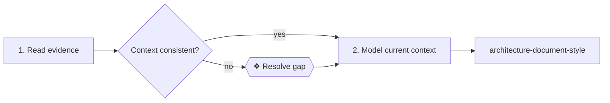

# The skill format

_[Repository README](../README.md) · [Process model](./process/README.md)_

An ArChreator skill is a small, reviewable operating contract. Its structure
makes activation, judgement, outputs and handoffs visible to both a person and
an agent; it is more than a reusable prompt.

Each skill is one `SKILL.md` file in a folder with the same name. The format is
adapted from the Agent Instruction Protocol (AIP) and binds the skill to the
supplier-input-process-output-customer (SIPOC) process model without making the
two structures identical.

## Frontmatter

```yaml
---
name: model-context
description: Procedure — run this when current architecture context is missing, incomplete or stale.
metadata:
  archreator:
    kind: gated-procedure
    realizes_process: BPROC1.1
    gates: none
---
```

| Field | Required | Meaning |
| --- | --- | --- |
| `name` | Yes | Matches the folder; lowercase words separated by hyphens |
| `description` | Yes | The activation summary an agent sees before opening the skill |
| `metadata.archreator.kind` | Yes | `gated-procedure`, `document-template` or `rulebook` |
| `metadata.archreator.realizes_process` | When applicable | One or more level-2 process IDs, written as a comma-separated string |
| `metadata.archreator.gates` | Yes | Conditional human gates declared by the skill, or `none` |

The description begins with the kind marker: `Procedure —`, `Document —` or
`Rulebook —`. The title repeats the kind as `# ⚙`, `# ▤` or `# ※`.

The kinds have different jobs:

- A `gated-procedure` performs ordered work. The name means it can express a
  human stop, not that every run contains one; `gates: none` is valid and
  should be common.
- A `document-template` defines one artifact's purpose, minimum content and
  completion test.
- A `rulebook` supplies constraints applied inside other work.

Metadata values are strings. A list is therefore a comma-separated string,
not a YAML sequence.

## Sections

The glyph identifies the section kind. The heading text identifies the
section for cross-references.

| Glyph | Section | Holds | Procedure | Template | Rulebook |
| --- | --- | --- | :---: | :---: | :---: |
| `⊕` | When to use this | Observable activation conditions | required | required | required |
| `⊖` | When not to | Negative space and the better route | required | required | required |
| `⌖` | Where this sits | Process binding, gates and a small flow diagram | required | required | required |
| `⚓` | Invariants | Rules that hold throughout execution | required | — | — |
| `⚙` | Steps | Numbered work | required | — | — |
| `▤` | Template | The artifact's shape | — | required | — |
| `※` | Rules | Constraints on the artifact or work | — | required | required |
| `⇄` | Hands off to | Skills reached, what they receive and what returns | required | optional | optional |
| `✎` | Worked example | One concrete application | optional | optional | optional |
| `⚠` | Anti-patterns | Plausible mistakes and their correction | required | required | required |
| `☑` | Done when | Checkable completion conditions | required | required | optional |

`When not to` and `Anti-patterns` are part of the method, not editorial extras.
They make the skill's boundary explicit and prevent a correct procedure from
being applied to the wrong problem.

## Inside a procedure step

Each numbered step makes its data movement explicit:

| Glyph | Marker | Meaning |
| --- | --- | --- |
| `←` | Needs | Inputs consumed from the requester, repository or an earlier step |
| `→` | Produces | The observable output, naming a path when a file is written |
| `⚖` | Judgement | Criteria to weigh where reasoning, rather than a fixed mechanism, is required |
| `❖` | Gate | A conditional stop that requires a person to decide or authorize |

`Needs` and `Produces` each use their own paragraph so the rendered document
does not collapse them into one line. Use `Judgement` only where discretion is
real. Automate a deterministic rule over structured input; explain a judgement
over incomplete or contextual input.

A `Gate` is an exception, not a phase boundary. Use one only when:

- evidence contains a material gap or inconsistency that must be resolved;
- an action needs material authorization outside the agent's authority; or
- acceptance by a responsible person is explicitly required.

Routine review, clear evidence and automated verification do not create human
gates. Every `❖` marker matches a gate named in frontmatter; when the skill has
no inherent stop, declare `gates: none`. Do not introduce numbered gate
ceremonies shared by every project.

## Diagrams and handoffs

`Where this sits` includes the smallest Mermaid flow that exposes the skill's
steps, decisions, conditional gates and handoffs. Filled process boxes are work
inside the skill, decision diamonds are agent judgements, hexagons are human
gates and unfilled boxes are other skills.



The `Hands off to` section states why another skill is invoked, exactly what it
receives and what result comes back. Naming a dependency without its data
contract leaves the workflow incomplete.

## Process binding

The process model says **why work exists and who receives its output**. Its
SIPOC row names the trigger, suppliers, inputs, output, customers and owner. A
skill says **how an agent performs a coherent unit of that work**.

The binding is many-to-many. A procedure may realize several processes when
one activation carries work across their boundary, and a process may use a
procedure, a document template and a rulebook together. A rulebook or template
can realize or support a process without becoming a standalone process. Record
direct bindings in `realizes_process`; show supporting skills in `Where this
sits` and `Hands off to`.

Process boundaries follow accountability: one trigger, output, customer and
owner. Skill boundaries follow activation and context. Neither catalogue
should be split merely to mirror the other.

## Cross-references

- Refer to another skill as `` `skill-name` § Heading `` so both the skill and
  the exact contract are clear.
- A skill links only within the plugin's `skills/` directory. Name a consuming
  repository path in a code span, such as `architecture/README.md`.
- Never cite an element ID from one customer model as if it were universal.
- When a heading or skill name changes, update every reference in the same
  change.

## Why Markdown rather than AIP YAML

[AIP](https://github.com/zach-blumenfeld/aip) contributes the execution-graph
discipline used here: explicit kinds, invariants, negative space, typed step
inputs and outputs, handoffs and anti-patterns. ArChreator keeps those concepts
but writes them in Markdown.

The method's steps are mostly contextual judgements rather than script-backed
nodes joined by machine-typed edges. Markdown keeps one artifact readable by
the builder, enterprise architect and agent, while also carrying tables,
cross-references and Mermaid diagrams. Scripts still belong behind fixed,
testable mechanisms; they do not require the whole skill to become YAML.

## Anti-patterns

- Free-form advice with no activation boundary, output or completion test.
- A procedure that hides inputs and outputs inside prose.
- A gate for every review, layer or ordinary verification step.
- One skill mixing procedure, template and rulebook responsibilities instead
  of handing off explicitly.
- A diagram that omits a branch, gate or handoff described by the steps.
- A process ID added only to make a skill appear grounded, without a matching
  SIPOC output.
