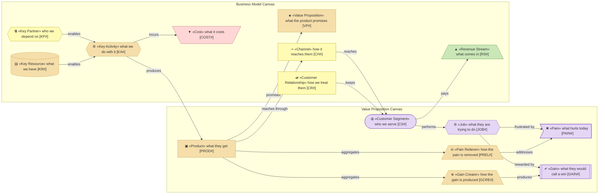
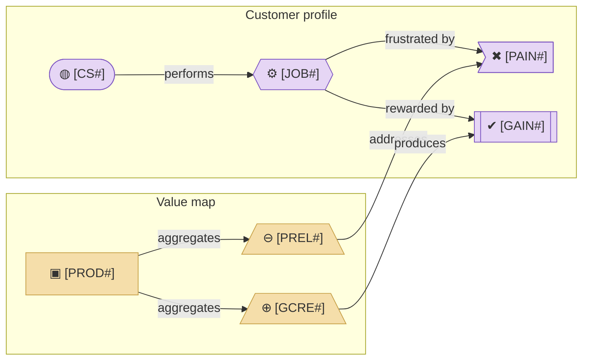

# Business Design Layer

_[← EA home](../README.md)_

The business model in the language the business uses: who the customers are,
what they are trying to get done, what hurts today, and which product or
service relieves it. For each product, how it is delivered and paid for.

**ArchiMate viewpoint:** none. Two Strategyzer canvases: a
[Value Proposition Canvas](https://www.strategyzer.com/library/the-value-proposition-canvas)
per customer segment and a
[Business Model Canvas](https://www.strategyzer.com/library/the-business-model-canvas)
per product or service. Layers 1 to 5 are derived from their blocks.

<!--
  TEMPLATE — emitted by `discover-business-model` on an organization only; an
  application project never has this folder. The block-by-block mapping to
  ArchiMate and the fit rule are the method's (`architecture-document-style`,
  the canvases reference); the fit verdict is written in the value proposition
  canvas. Keep this page in the layer README shape and nothing else.
-->

## Documents

| #   | Document                                                             | Elements                                                                          | Question it answers                                     |
| --- | -------------------------------------------------------------------- | --------------------------------------------------------------------------------- | -------------------------------------------------------- |
| 1   | [1_value-proposition-canvas.md](./1_value-proposition-canvas.md)     | Customer Segments, Jobs, Pains, Gains, Products & Services, Pain Relievers, Gain Creators | Who do we serve, what do they need, and what do we offer? |
| 2   | [2_business-model-canvas.md](./2_business-model-canvas.md)           | The nine BMC blocks, one canvas per product or service                            | How is each offering delivered, and how does it pay?     |

## Metamodel

<!--
  The notation of this layer, written once: every element type the layer's
  documents draw, with its glyph, shape, colour, stereotype and prefix, and
  how the types typically connect. Keep it in step with the documents below;
  they carry no legend of their own.
-->

The customer profile takes the Motivation fill and the value map the Strategy
fill, because that is where each block lands once derived; the segment and the
product are the same elements on both canvases. Revenue borrows the Technology
green and cost the Implementation rose, because no ArchiMate element lends
them a colour.

## Layer view

<!--
  TEMPLATE — replace with the project's real segment, job, pain, gain,
  product, and the capability that relieves the pain, once known. Keep the
  shape: the customer profile on the left, the value map on the right, and
  the "addresses"/"produces" edges between them — those edges are the fit.
-->

The canvas blocks take the Motivation and Strategy fills because that is
where they land once derived. The palette's single source is the
`architecture-document-style` rulebook § ArchiMate on Mermaid.
