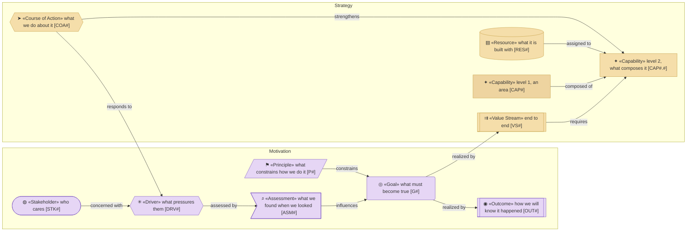
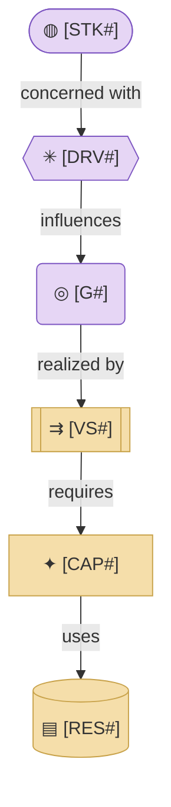

# Strategy & Motivation Layer

_[← EA home](../README.md)_

The top-down business context: who has a stake, why the subject exists in its
current form, which capabilities it needs, and how value flows end to end.

**ArchiMate viewpoint:** Motivation and Strategy: Stakeholder, Driver,
Assessment, Goal, Outcome, Principle, Value Stream, Capability, Resource,
Course of Action.

<!--
  TEMPLATE — on the company track every element traces to a canvas block and
  the `Source` column says which; on the application track leave the column
  out. Principles have no canvas block. Leveled capabilities:
  `process-and-capability-levels`. Principles as the constraints a change is
  checked against: `align-change-through-layers`, step 1.
-->

## Documents

| #   | Document                                                             | Elements                                                         | Question it answers                                | Source (company track)                             |
| --- | ---------------------------------------------------------------------| ------------------------------------------------------------------ | ---------------------------------------------------- | ---------------------------------------------------- |
| 1   | [1_motivation.md](./1_motivation.md)                                 | Stakeholders, Drivers, Assessments, Goals, Outcomes, Principles | Who cares, what pressures them, what must be true?  | Customer Segments, Jobs, Pains, Gains               |
| 2   | [2_capabilities-and-resources.md](./2_capabilities-and-resources.md) | Capabilities, Resources, Courses of Action; leveled capabilities in a folder of the same name | What must we be able to do, and with what? | Pain Relievers, Gain Creators, Key Resources, Key Activities |
| 3   | [3_value-stream.md](./3_value-stream.md)                             | Value Stream and its stage mapping                               | How does value flow end-to-end?                     | Key Activities, Channels                             |

## Metamodel

<!--
  The notation of this layer, written once: every element type the layer's
  documents draw, with its glyph, shape, colour, stereotype and prefix, and
  how the types typically connect. Keep it in step with the documents below;
  they carry no legend of their own.
-->

Purple is Motivation and tan is Strategy; the darker tan marks a level-1
capability.

## Layer view

<!--
  TEMPLATE — replace with the project's real stakeholder(s), driver(s),
  goal, value stream, capability, and resource once known.
-->

