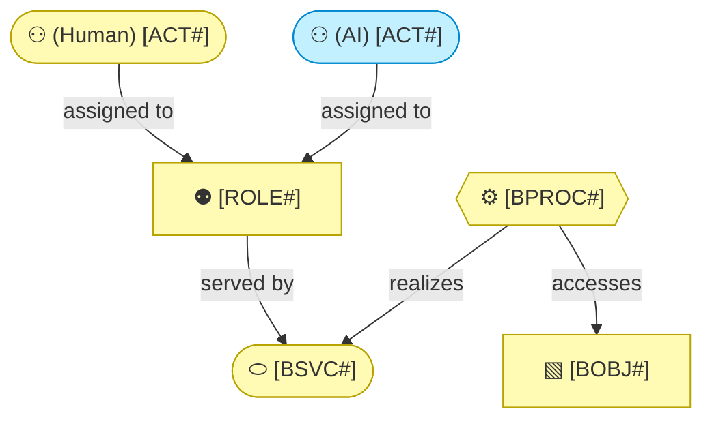

# Business Layer

_[← EA home](../README.md)_

Who interacts with the system, the services it offers them, the processes
those services run through, the business objects they handle, and the domain
vocabulary and rules that constrain all of it.

## Analysis order

Files are numbered in the order they are analyzed: identify _who_ first,
then _what they are offered_, then _how it is delivered_, then _what is
handled_, and finally the domain vocabulary and rules.

| #   | Document                                                          | Elements                                           | Question it answers                              |
| --- | -------------------------------------------------------------------| ---------------------------------------------------- | --------------------------------------------------- |
| 1   | [1_business-actors-and-roles.md](./1_business-actors-and-roles.md) | Business Actors and Roles, organizational units, external partners (Contracts, Collaborations) | Who interacts with the system, and who do we depend on? |
| 2   | [2_business-services.md](./2_business-services.md)                | Products, Business Services, Business Interfaces (channels) | What is offered to them, and through which channels? |
| 3   | [3_business-processes.md](./3_business-processes.md) — or a folder of the same name, one document per level, once leveled | Business Processes | How are those services delivered, and at what level of detail? |
| 4   | [4_business-objects.md](./4_business-objects.md)                  | Business Objects                                   | What things do the processes handle?              |
| 5   | [5_domain-context-and-rules.md](./5_domain-context-and-rules.md)  | Problem statement, system context, glossary, rules | What vocabulary and constraints bind everything?  |

`3_business-processes.md` is one document while the catalogue is small. **On
an organization it becomes leveled**: level 1 is the macro process map,
classified into strategic, operational, support and evaluation; level 2 is the
end-to-end processes inside each; and level 3 exists only for the branches a
named pain justifies detailing. Past roughly fifteen elements in a level the
file becomes a folder of the same name with one document per level.
**Identifiers carry the level**, so no table needs a parent column. The
`process-and-capability-levels` skill holds the categories, the level
definitions, and the focus table recording which branches were deliberately
left at level 2.

`5_domain-context-and-rules.md` carries the project's **glossary** (reuse its
terms in code and commits) and its **business rules table** — every new rule
gets a row there, with its rationale, before it gets a line of code. A role ×
operation access matrix belongs there too.

`2_business-services.md` is where a **«Product»** aggregates the services
that make it up. A single-application project usually has one implicit product
and can leave it out; an organization sells several, and the portfolio is what
makes the rest of the model make sense. On the company track the products,
channels, and customer relationships are derived from the business model
canvases (see
[0_business-design/](../0_business-design/README.md#from-canvas-to-archimate)),
and Key Partners land in `1_business-actors-and-roles.md` as external actors,
each with the «Contract» or «Business Collaboration» that binds them.

`1_business-actors-and-roles.md` states each actor's **kind** — human, AI, or
hybrid — and, for AI/hybrid actors, its autonomy level, decision rights, and
escalation path (see the `architecture-document-style` skill's actor notation).
This is an AI system's role **in the business being modeled**, not its role in
how this repository is developed (see `CONTRIBUTING.md`). If an initiative
changes one of those values, consider a `record-decision` alongside the scope
document.

## Layer view

<!--
  TEMPLATE — replace with the project's real actors, roles, services, and
  business objects once known. Keep at least one actor's kind explicit
  (Human/AI/Hybrid) even if every actor in this project turns out to be
  human — an explicit "(Human)" beats a silent default. The kind is the one
  type word a content node keeps; the stereotype belongs in the legend.
-->

The AI actor takes the Application cyan inside a business diagram — one of the
two colour overrides in the `architecture-document-style` rulebook § ArchiMate
on Mermaid — so a reader never mistakes it for a person.

Every business service is realized by application services — the mapping is
in [4_application/1_application-services.md](../4_application/1_application-services.md).
