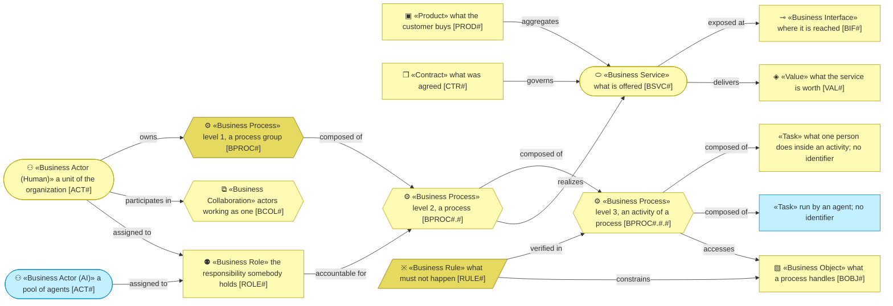

# Business Layer

_[← EA home](../README.md)_

Who does the work, what they are offered, how it is delivered, what the
processes handle, and the vocabulary and rules that bind all of it.

**ArchiMate viewpoint:** Business layer: Business Actor, Business Role,
Business Collaboration, Contract, Product, Business Service, Business
Interface, Business Process, Business Object, Business Rule.

<!--
  TEMPLATE — the author's notes, not the reader's. Processes stay in one
  document at levels 1 and 2, with one activities document per detailed
  process in `activities/` (`process-and-capability-levels`). The glossary and
  the business rules table live in 5_domain-context-and-rules.md; a product
  aggregates its services in 2_business-services.md. Each actor states its
  kind — human, AI or hybrid — and an AI actor its autonomy level, decision
  rights and escalation path (the actor notation in
  `architecture-document-style`): its role in the business modelled, not in
  how this repository is developed.
-->

## Documents

| #   | Document                                                          | Elements                                           | Question it answers                              |
| --- | -------------------------------------------------------------------| ---------------------------------------------------- | --------------------------------------------------- |
| 1   | [1_business-actors-and-roles.md](./1_business-actors-and-roles.md) | Business Actors and Roles, organizational units, external partners (Contracts, Collaborations) | Who does the work, and who do we depend on? |
| 2   | [2_business-services.md](./2_business-services.md)                | Products, Business Services, Business Interfaces (channels) | What is offered to them, and through which channels? |
| 3   | [3_business-processes.md](./3_business-processes.md)              | Process groups and processes; the activities of each detailed process in `activities/` | How are those services delivered, and at what level of detail? |
| 4   | [4_business-objects.md](./4_business-objects.md)                  | Business Objects                                   | What things do the processes handle?              |
| 5   | [5_domain-context-and-rules.md](./5_domain-context-and-rules.md)  | Problem statement, system context, glossary, rules | What vocabulary and constraints bind everything?  |

## Metamodel

<!--
  The notation of this layer, written once: every element type the layer's
  documents draw, with its glyph, shape, colour, stereotype and prefix, and
  how the types typically connect. Keep it in step with the documents below;
  they carry no legend of their own.
-->

An AI actor takes the Application cyan inside a business diagram — one of the
two colour overrides in the `architecture-document-style` rulebook § ArchiMate
on Mermaid — so a reader never mistakes it for a person; the same cyan marks a
task an agent runs, and an agent covers tasks, never a whole activity. The
darker yellow marks a level-1 process and a rule.

## Layer view

<!--
  TEMPLATE — replace with the project's real actors, roles, services, and
  business objects once known. Keep at least one actor's kind explicit
  (Human/AI/Hybrid) even if every actor in this project turns out to be
  human — an explicit "(Human)" beats a silent default. The kind is the one
  type word a content node keeps; no node carries a stereotype.
-->

The AI actor takes the Application cyan inside a business diagram — one of the
two colour overrides in the `architecture-document-style` rulebook § ArchiMate
on Mermaid — so a reader never mistakes it for a person.

Every business service is realized by application services — the mapping is
in [4_application/1_application-services.md](../4_application/1_application-services.md).
