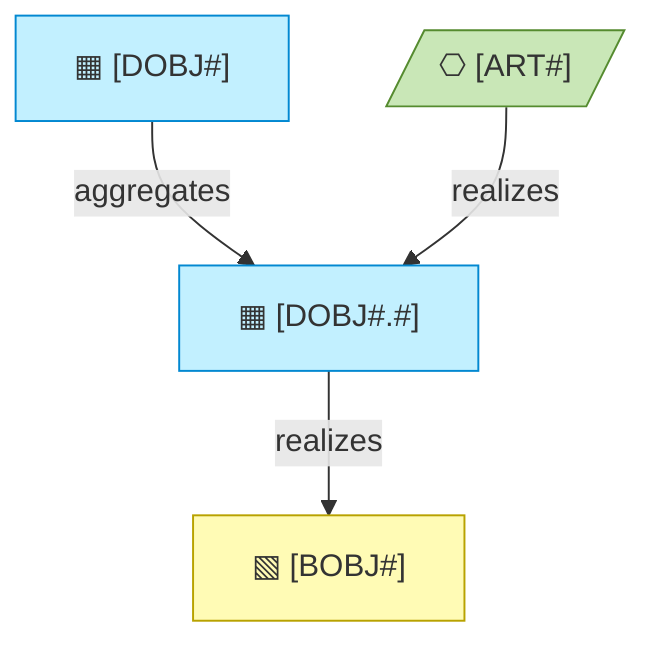

# Information Layer

_[← EA home](../README.md)_

The passive structure of the architecture: the data domains that own the
information, the data objects inside them that represent the
[business objects](../2_business/4_business-objects.md), and how
information flows, is represented, and persists.

## Analysis order

Files are numbered in the order they are analyzed: first _who owns which
information_ — the data domains — then _what exists inside each_, then _how
it moves and is represented_, and finally _where it is physically stored,
classified, and retained_.

| #   | Document                                           | Elements                                              | Question it answers                                 |
| --- | ---------------------------------------------------| -------------------------------------------------------| ------------------------------------------------------ |
| 1   | [1_data-domains.md](./1_data-domains.md)           | Data domains and their owners — few boxes, one map    | Who owns which information?                          |
| 2   | [2_data-objects.md](./2_data-objects.md)           | Data Objects per domain, and their code locations     | What information exists, and in which domain?        |
| 3   | [3_data-flows.md](./3_data-flows.md)               | Representations, persistence and flow relationships   | How does it move between representations?            |
| 4   | [4_data-architecture.md](./4_data-architecture.md) | Schema, classification, retention                     | Where does it live, how sensitive is it, how long?   |

**Every data object belongs to a domain, and the identifier carries it.** A
domain is the level-1 row of the same catalogue — `DOBJ1`, Customer data, with
an owner — and its objects extend it: `DOBJ1.2`. A subdomain earns a level only
where a domain genuinely splits; a small model's domain map is a handful of
boxes and is finished.

`3_data-architecture.md` is where **data classification** (public,
internal, sensitive, regulated, …) and **retention** live — reference it
whenever a business rule or technology decision depends on how sensitive a
piece of data is.

## Layer view

<!--
  TEMPLATE — replace with the project's real data domain, its objects, the
  business object each one represents, and where it is persisted. Keep the
  label shape: glyph, name, identifier. The business object and the artifact
  are visitors from their own layers and keep their own colour.
-->

