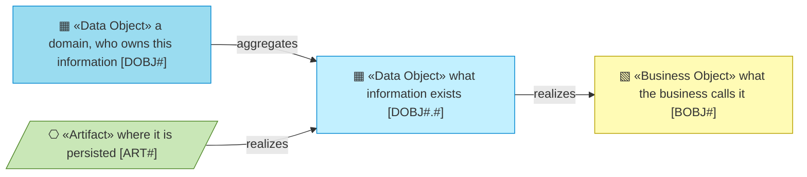
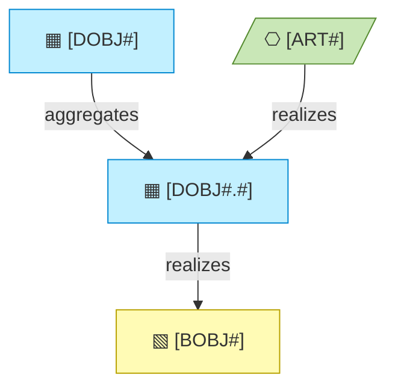

# Information Layer

_[← EA home](../README.md)_

The passive structure of the architecture: the data domains that own the
information, the data objects inside them that represent the business objects,
and how information flows, is represented and persists.

**ArchiMate viewpoint:** Information: Data Object, with the domain as its
level 1 and the object as its level 2, and Representation; the Business Object
each one stands for and the Artifact it lands in visit from their own layers.

<!--
  TEMPLATE — the author's notes: every data object belongs to a domain and the
  identifier carries it (`DOBJ1` the domain, with an owner; `DOBJ1.2` an
  object in it); a subdomain earns a level only where a domain genuinely
  splits. Classification and retention live in 4_data-architecture.md.
-->

## Documents

| #   | Document                                           | Elements                                              | Question it answers                                 |
| --- | ---------------------------------------------------| -------------------------------------------------------| ------------------------------------------------------ |
| 1   | [1_data-domains.md](./1_data-domains.md)           | Data domains and their owners — few boxes, one map    | Who owns which information?                          |
| 2   | [2_data-objects.md](./2_data-objects.md)           | Data Objects per domain, and their code locations     | What information exists, and in which domain?        |
| 3   | [3_data-flows.md](./3_data-flows.md)               | Representations, persistence and flow relationships   | How does it move between representations?            |
| 4   | [4_data-architecture.md](./4_data-architecture.md) | Schema, classification, retention                     | Where does it live, how sensitive is it, how long?   |

## Metamodel

<!--
  The notation of this layer, written once: every element type the layer's
  documents draw, with its glyph, shape, colour, stereotype and prefix, and
  how the types typically connect. Keep it in step with the documents below;
  they carry no legend of their own.
-->

The business object and the artifact are visitors from their own layers and
keep their own colour; the darker cyan marks a data domain.

## Layer view

<!--
  TEMPLATE — replace with the project's real data domain, its objects, the
  business object each one represents, and where it is persisted. Keep the
  label shape: glyph, name, identifier. The business object and the artifact
  are visitors from their own layers and keep their own colour.
-->

