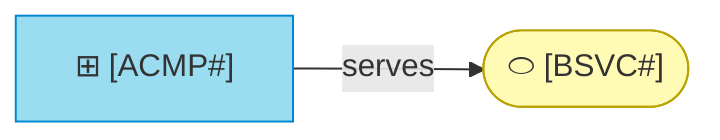

# Realization register

_[← Application layer](./README.md) · [EA home](../README.md)_

**ArchiMate viewpoint:** Application usage. Which software realizes each
business service and process, and where each one is specified.

**Status:** ○ Not started.

<!--
  TEMPLATE — one row per application component. The model says *that* it
  exists, *what* it serves and *where* it is specified; the specification
  says how it is built. A row whose code cannot be named is marked
  "Pending — future initiative", or "Pending — not located" in a sweep.
-->

## Components

| ID | Application component | Serves | Specification | Realized by |
| -- | --------------------- | ------ | ------------- | ----------- |
|    |                       |        |               |             |
