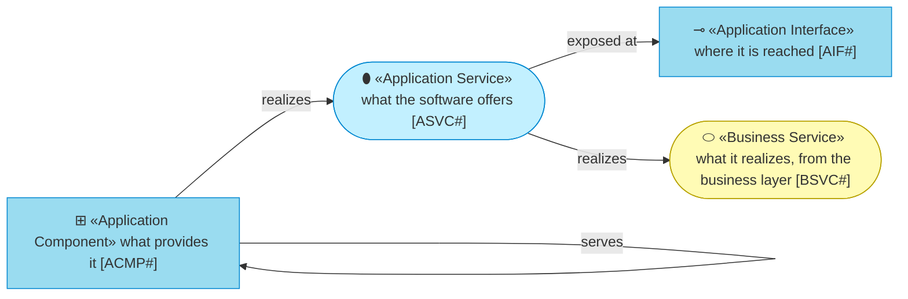
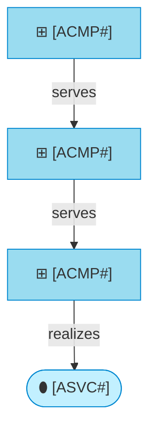

# Application Layer

_[← EA home](../README.md)_

The software that realizes the
[business services](../2_business/2_business-services.md): application
services, the components providing them, how the components collaborate,
and — at the finest grain — the solution design and the contracts of every
interface/port.

## Analysis order

Files are numbered in the order they are analyzed, from the coarsest view
(services offered to the business) down to the finest (per-method interface
contracts). A small project may only ever populate 1 and 2; add 3–5 when the
component count or the number of interchangeable adapters justifies the extra
grain.

| #   | Document                                                             | Elements                                                     | Question it answers                              |
| --- | -----------------------------------------------------------------------| --------------------------------------------------------------- | --------------------------------------------------- |
| 1   | [1_application-services.md](./1_application-services.md)             | Application Services and the business services they realize | What does the software offer the business layer? |
| 2   | [2_application-components.md](./2_application-components.md)         | Application Components, mapped to source files               | Which components provide those services?          |
| 3   | [3_application-collaborations.md](./3_application-collaborations.md) | Collaborations and interaction sequences                     | How do the components interact?                   |
| 4   | [4_solution-design.md](./4_solution-design.md)                       | Overall design, diagrams, patterns, tooling                  | How is the code structured, and why?               |
| 5   | [5_interface-contracts.md](./5_interface-contracts.md)               | Per-interface pre/postconditions, invariants, error behavior | What exactly does each interface promise?          |

`2_application-components.md` is where the **grounding rule** bites hardest:
every component row must point at the module or file that implements it.
`4_solution-design.md` is where "how to add a new X" recipes go — a new port, a
new adapter, a new platform — once the shape repeats.

## Metamodel

<!--
  The notation of this layer, written once: every element type the layer's
  documents draw, with its glyph, shape, colour, stereotype and prefix, and
  how the types typically connect. Keep it in step with the documents below;
  they carry no legend of their own.
-->

A single-layer view, so the cyan ramps from service to component; the
business service is a visitor and keeps its yellow.

## Layer view

<!--
  TEMPLATE — replace with the project's real service, components and how they
  depend on each other. Keep the label shape: glyph, name, identifier. This is
  a single-layer view, so the cyan ramps from service to component.
-->

