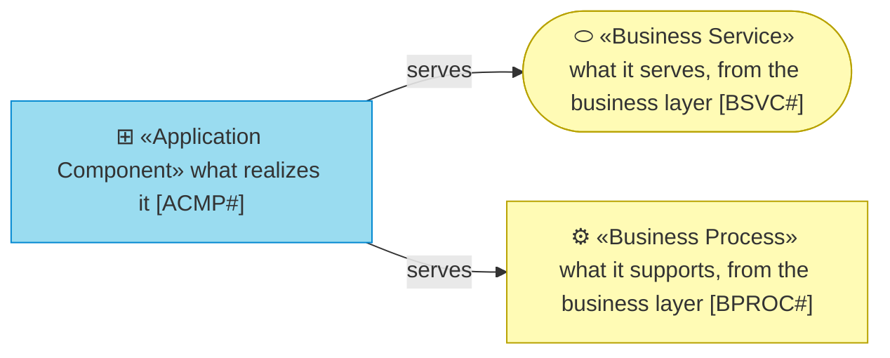
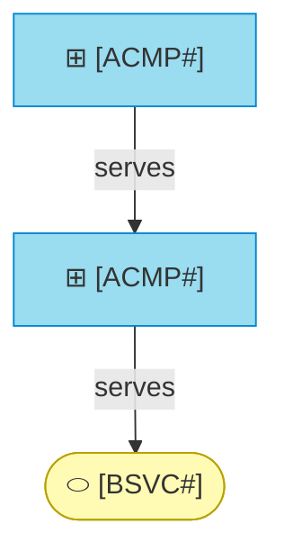

# Application Layer

_[← EA home](../README.md)_

Which software realizes each business service, and where its specification
lives. A register, not a design.

**ArchiMate viewpoint:** Application layer: Application Component, serving the
business layer.

<!--
  TEMPLATE — the author's notes: one row per application component, nothing
  more. How a component is designed inside, its interfaces and contracts, and
  how it is built belong to the delivery framework `AGENTS.md` § Delivery
  names; the Specification column links there. Every row names the code that
  realizes it (the grounding rule in `architecture-document-style`).
-->

## Documents

| #   | Document                                                     | Elements                                                                          | Question it answers                                        |
| --- | ------------------------------------------------------------ | --------------------------------------------------------------------------------- | ---------------------------------------------------------- |
| 1   | [1_realization-register.md](./1_realization-register.md)     | Application Components, the business services they serve, and their specification | Which software realizes the business, and where is it specified? |

## Metamodel

<!--
  The notation of this layer, written once: every element type the layer's
  documents draw, with its glyph, shape, colour, stereotype and prefix, and
  how the types typically connect. Keep it in step with the documents below;
  they carry no legend of their own.
-->

```mermaid
flowchart LR
  %% legend
  cmp["⊞ «Application Component» what realizes it [ACMP#]"]:::application
  bsvc(["⬭ «Business Service» what it serves, from the business layer [BSVC#]"]):::business
  bproc["⚙ «Business Process» what it supports, from the business layer [BPROC#]"]:::business

  cmp -->|serves| bsvc
  cmp -->|serves| bproc

  classDef application fill:#9adcf0,stroke:#0288d1,color:#333
  classDef business fill:#fffbb5,stroke:#b8a200,color:#333
```

The business elements are visitors and keep their yellow.

## Layer view

<!--
  TEMPLATE — replace with the project's real components and the business
  services they serve. Keep the label shape: glyph, name, identifier.
-->

```mermaid
flowchart TB
  bsvc(["⬭ <What the business offers> [BSVC#]"]):::business
  app["⊞ <The application that serves it> [ACMP#]"]:::application
  other["⊞ <An application it depends on> [ACMP#]"]:::application

  app -->|serves| bsvc
  other -->|serves| app

  classDef application fill:#9adcf0,stroke:#0288d1,color:#333
  classDef business fill:#fffbb5,stroke:#b8a200,color:#333
```
