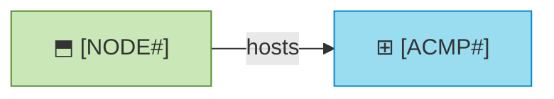

# Platforms

_[← Technology layer](./README.md) · [EA home](../README.md)_

**ArchiMate viewpoint:** Technology. Where something has to run, and the
business fact that makes it so.

**Status:** ○ Not started.

<!--
  TEMPLATE — a platform earns a row only when a business fact depends on it:
  a data residency, a hosting contract, a cost owner, a disclosure decision.
  The build, the pipeline and the deployment are the delivery framework's
  documents; link them from the Specification column rather than restating
  them.
-->

## Where this project lives

| | |
| --- | --- |
| **Repository** | `<host and path — e.g. GitHub, acme/widgets>` |
| **Visibility** | `<public · private · internal>` |
| **Where the model is read outside this repo** | `<a portal generated on request · handed over as briefs · nowhere yet>` |

**A model is published on purpose.** Where the portal is world-readable, that
is a disclosure decision about who may read the architecture — not a
consequence of the repository already being public. Record it with
`record-decision` where it is not obvious.

## Platforms a business fact depends on

| ID | Platform | The business fact it carries | Hosts | Specification |
| -- | -------- | ---------------------------- | ----- | ------------- |
|    |          |                              |       |               |
