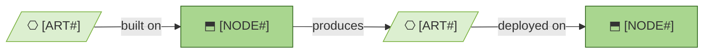

# Deployment

_[← Technology layer](./README.md) · [EA home](../README.md)_

**ArchiMate viewpoint:** Technology. Where this project lives, what runs on
every change, and how a built artifact reaches the place it is read from.

**Status:** ○ Not started.

<!--
  TEMPLATE — `establish-project` fills § Where this project lives from the
  Requester's answer. The rest is written the first time this layer is
  assessed, which is usually the first initiative that ships something.
-->

## Where this project lives

The answer bootstrap asked for, recorded once so that no later change has to
ask again. It decides what runs automatically and what has to be done by hand.

| | |
| --- | --- |
| **Repository** | `<host and path — e.g. GitHub, acme/widgets>` |
| **Visibility** | `<public · private · internal>` |
| **Checks on every change** | `<.github/workflows/checks.yml · run by hand · a pipeline on another host>` |
| **Where the model is read outside this repo** | `<a portal generated on request · handed over as briefs · nowhere yet>` |

**A model is published on purpose.** Where the portal is world-readable, that
is a disclosure decision about who may read the architecture — not a
consequence of the repository already being public. Record it with
`record-decision` where it is not obvious, and re-decide it if the model
later gains a layer that describes the estate's weaknesses.

Moving host is an ordinary change: update this table, and add or remove the
workflow it names. The plugin keeps a copy of both workflows in
`.github/workflows-available/`.

## What runs on every change

<!--
  TEMPLATE — replace with the project's real pipeline. Delete the rows that
  do not exist yet rather than describing an intention.
-->

| Trigger | What runs | Where it is defined |
| ------- | --------- | ------------------- |
| `<every pull request>` | `<check_links.py, check_model.py>` | `<.github/workflows/checks.yml>` |
| `<merge to the default branch>` | `<the project's own build and deploy>` | `<.github/workflows/deploy.yml>` |

## From build to runtime

<!--
  TEMPLATE — replace with the project's real artifacts and nodes. The
  identifiers below must exist in 1_technology-services.md before they can be
  cited here; check_model.py fails on one that does not.
-->

| ID | Artifact | What it is | Deployed on |
| -- | -------- | ---------- | ----------- |
|    |          |            |             |

## What is deployed by hand

<!--
  TEMPLATE — the steps nobody automated, and why. A manual step that is
  written down is a decision; one that is not is a thing somebody forgets.
-->

| Step | Why it is manual | Who does it |
| ---- | ---------------- | ----------- |
|      |                  |             |
