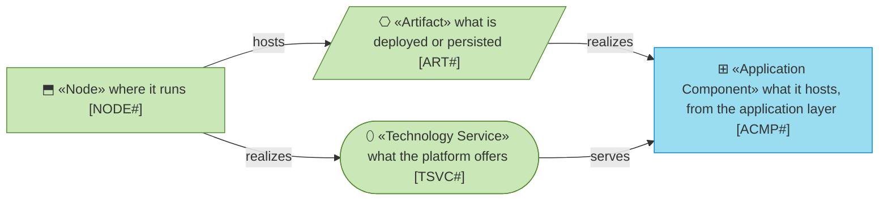
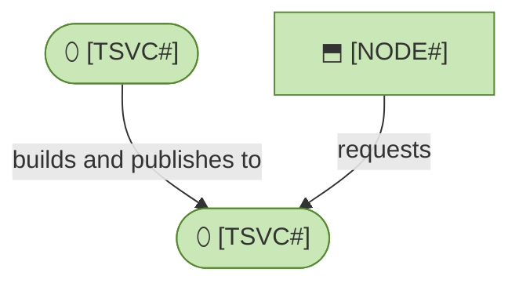

# Technology Layer

_[← EA home](../README.md)_

The runtimes, tooling, and infrastructure that the
[application layer](../4_application/README.md) executes on.

## Analysis order

Files are numbered in the order they are analyzed: first _which technology
services exist and what provides them_, then _how the built artifacts reach
their runtime nodes_.

| #   | Document                                               | Elements                                                          | Question it answers                       |
| --- | --------------------------------------------------------| --------------------------------------------------------------------| --------------------------------------------- |
| 1   | [1_technology-services.md](./1_technology-services.md) | Technology Services and the nodes/system software providing them | What infrastructure services are used?    |
| 2   | [2_deployment.md](./2_deployment.md)                   | Nodes, Artifacts, and the CI/CD deployment pipeline               | How does the build get to where it runs?  |

If no stack has been chosen yet, use the `stack-selection` skill for the
decision framework and the criteria to judge current options against, before
writing `1_technology-services.md`.

## Metamodel

<!--
  The notation of this layer, written once: every element type the layer's
  documents draw, with its glyph, shape, colour, stereotype and prefix, and
  how the types typically connect. Keep it in step with the documents below;
  they carry no legend of their own.
-->

Green is Technology; the application component is a visitor and keeps its
cyan.

## Layer view

<!--
  TEMPLATE — replace with the project's real runtimes, hosting, and CI/CD
  pipeline once known.
-->

