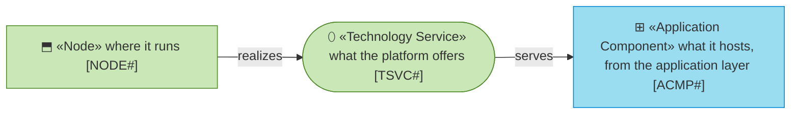
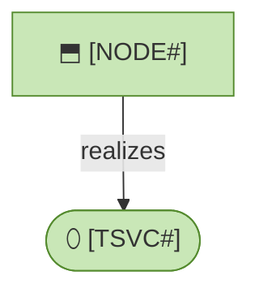

# Technology Layer

_[← EA home](../README.md)_

The platforms a business fact depends on — where something runs because a
contract, a residency rule or a cost owner says so. Everything else about
runtime and deployment belongs to the delivery framework.

**ArchiMate viewpoint:** Technology layer: Node, Technology Service.

<!--
  TEMPLATE — the author's note: a platform earns a row only when a business
  fact depends on it. A stack chosen for the first time is recorded with
  `record-decision`; its build and deployment are the delivery framework's
  documents, named in `AGENTS.md` § Delivery.
-->

## Documents

| #   | Document                           | Elements                                        | Question it answers                                  |
| --- | ---------------------------------- | ----------------------------------------------- | ---------------------------------------------------- |
| 1   | [1_platforms.md](./1_platforms.md) | Nodes and technology services, with the business fact each one carries | Where does something have to run, and why does the business care? |

## Metamodel

<!--
  The notation of this layer, written once: every element type the layer's
  documents draw, with its glyph, shape, colour, stereotype and prefix, and
  how the types typically connect. Keep it in step with the documents below;
  they carry no legend of their own.
-->

```mermaid
flowchart LR
  %% legend
  node["⬒ «Node» where it runs [NODE#]"]:::technology
  tsvc(["⬯ «Technology Service» what the platform offers [TSVC#]"]):::technology
  cmp["⊞ «Application Component» what it hosts, from the application layer [ACMP#]"]:::application

  node -->|realizes| tsvc
  tsvc -->|serves| cmp

  classDef technology fill:#c9e7b7,stroke:#558b2f,color:#333
  classDef application fill:#9adcf0,stroke:#0288d1,color:#333
```

Green is Technology; the application component is a visitor and keeps its
cyan.

## Layer view

<!--
  TEMPLATE — replace with the project's real platforms, only those a
  business fact depends on.
-->

```mermaid
flowchart TB
  platform["⬒ <Where it has to run> [NODE#]"]:::technology
  hosting(["⬯ <What that platform offers> [TSVC#]"]):::technology

  platform -->|realizes| hosting

  classDef technology fill:#c9e7b7,stroke:#558b2f,color:#333
```
