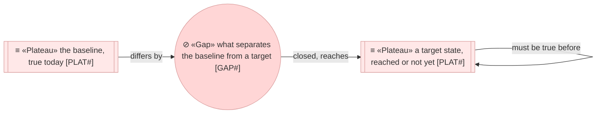

# Roadmap

_[← EA home](../README.md) · [Scope documents](../scope/README.md)_

Where this architecture is going, what stands between it and today, and the
order the distance is closed in.

**ArchiMate viewpoint:** Implementation & Migration: Plateau, Gap. The one
place in the model that describes a future; every numbered layer describes
today.

<!--
  TEMPLATE — emitted by `plan-the-transition` the first time a target state is
  described. Direction approves the destination and the order and approves no
  work; how the roadmap is kept current is the skill's. Keep this page in the
  layer README shape and nothing else.
-->

## Documents

| #   | Document | Elements | Question it answers |
| --- | -------- | -------- | ------------------- |
| 1   | [1_target-state.md](./1_target-state.md) | Plateaus, Gaps | Where should this be, and what is missing between here and there? |
| 2   | [2_sequence.md](./2_sequence.md) | — | In what order are the gaps closed, and what has to be true first? |

## Metamodel

Both element types take the Implementation & Migration rose, ramped from
plateau to gap. Edges are solid: the dependency between two plateaus is true
today whether or not either is reached, and what is not reached yet is a
plateau's own status, which its row carries in one of four words.

| Status | Means |
| ------ | ----- |
| **Planned** | Named and approved as intent. Nothing is in flight |
| **In flight** | An initiative is open against it. Its scope document names the gaps it closes |
| **Reached** | The state is true today. The row stays, naming the initiative that arrived at it |
| **Abandoned** | No longer the intent. The row stays, with why |
