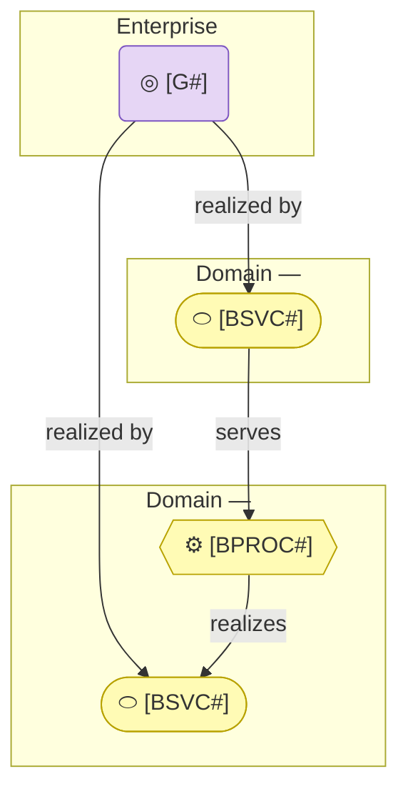

# Domains

_[← EA home](../README.md) · [Repository README](../../README.md)_

**This folder is used at [Depth 3 — Enterprise](../README.md#modeling-depth)
only.** A project modeling one application or one organization leaves it
empty and keeps everything in the layer folders above.

A **domain** is a part of the organization modeled as though it were an
organization in its own right: it has customers, it offers services, it owns
capabilities and resources, and it exists to serve a purpose larger than
itself. Some of its customers are outside the company; some are other domains.
The same model shape repeats at every level, so a business line is understood
on its own terms rather than flattened into the enterprise's.

## The tree

```
architecture/                     ← the enterprise level
  0_business-design/              ← the enterprise's canvases
  1_strategy/ … 5_technology/     ← what is true across all domains
  domains/
    README.md                     ← this file
    sales/
      README.md                   ← the domain charter — its contract
      0_business-design/          ← only if the domain has its own canvases
      1_strategy/ … 5_technology/ ← the domain's own model
      domains/                    ← subdomains, if it has grown that far
        emea/
          README.md
          1_strategy/ … 5_technology/
```

A domain fills in only the layers it actually has something to say about,
and marks the rest "not started" — the
[depth ladder](../README.md#modeling-depth) governs how much gets filled in,
not which folders exist.

**Three levels maximum**: enterprise → domain → subdomain. Past that, IDs stop
being readable and the thing being modeled is a team, not a domain. An
organization that needs more structure wants separate repositories federated by
contract, not a fourth level of nesting.

## When to split a domain out

Splitting is not free: every domain adds a charter to maintain, a boundary
to respect, and a set of Requesters to consult. Carve one out only when
**two or more** of these hold:

| Test | What it means |
| ---- | ------------- |
| **Its own customers** | It serves a customer segment the rest of the organization doesn't |
| **Its own economics** | It has a revenue stream or a cost base you would defend separately in a budget conversation |
| **Its own decision rights** | Someone inside it can say yes or no without escalating outside it |
| **Its own capabilities** | It owns capabilities and resources that other domains don't share |
| **A named interface** | Other parts of the organization consume it through named services, not ad-hoc collaboration |

One test alone is usually a team, a project, or a cost centre — not a
domain. If you can't name what the domain would expose to the rest of the
organization, it isn't one yet.

Splitting is a change to the business layer, so it goes through the normal
process and needs Understanding like anything else. The `model-domains` skill
walks it.

## The charter

Each domain's `README.md` **is** its charter — the contract between it and
the rest of the organization, and the only part of it other domains are
entitled to depend on. It carries:

| Section | Answers |
| ------- | ------- |
| **Purpose** | What this domain is for, and the larger purpose it serves |
| **Customers** | External segments and/or the domains it serves |
| **Exposed services** | The «Business Service» elements other domains may reference, with their IDs. This is the interface — nothing else is public |
| **Consumed services** | What it depends on from other domains, by qualified ID |
| **Decision rights and escalation** | What it decides alone, and who it escalates to |
| **Operated by** | Human, AI, or hybrid — with the autonomy level, decision rights, and escalation path from `architecture-document-style`'s actor notation, applied to the domain as a whole |

## The federation rule

**A domain's exposed services are its contract; everything else is
internal.**

- Referencing another domain's exposed service by its qualified identifier
  is normal and expected.
- Referencing another domain's *internal* process, resource, or data object
  reaches through the contract. That is a modeling error, not a shortcut —
  either the element belongs in the charter, or the dependency shouldn't
  exist.
- **Changing an exposed service requires the consuming domains' Requesters
  at Understanding**, not just the owning domain's. A contract has two sides.
- Changing anything a charter doesn't expose needs only the owning domain's
  Requester. This is the point of the boundary: most changes stay local.

## Element IDs

An identifier is written bare inside the domain that owns it, qualified by
that domain's name from outside, and bare at the enterprise level. Numbering is
per prefix **per domain**, so two domains may each own the same number and the
qualifier is what distinguishes them.

A leveled element extends its parent's identifier, so one identifier can
carry both qualifiers at once. Read outwards from the prefix: upper-case
segments before it are the domain path, numeric segments after it are the
levels.

The worked examples live in `architecture-document-style` § Element IDs and
not here: a specimen identifier in a template ships into every generated
project as a reference to an element nobody defined.

## Layer view

<!--
  TEMPLATE — replace with this organization's real domains and the services
  they exchange. Keep the shape: one subgraph per domain, exposed services
  only, and an ArchiMate relationship label on every edge.
-->



## Index

<!-- TEMPLATE — one row per domain. -->

| Domain | Purpose | Exposes | Operated by |
| ------ | ------- | ------- | ----------- |
|        |         |         |             |
