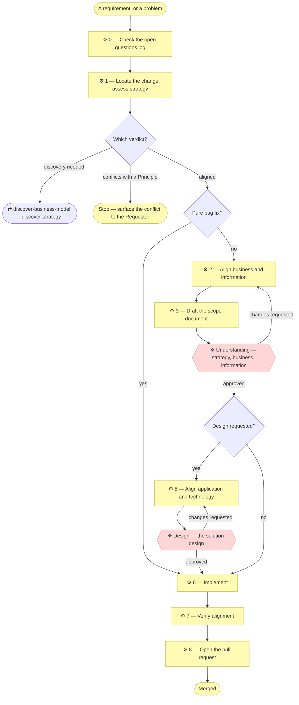

# ⚙ Align a change through the layers

**The spine.** Strategy and business architecture are validated before any
other layer is touched — and validated means the Requester explicitly approves
at named gates before development proceeds, the way a business reference group
signs off before building starts.

A requirement change is never implemented directly. It is aligned through the
documents in `architecture/`, approved at the gates below, captured in a scope
document, and only then coded. The folder numbers give the assessment order.

## ⊕ When to use this

| The situation | What it looks like |
| ------------- | ------------------ |
| A requirement changes | Someone asks for a feature, a behavior change, or reports a problem |
| A change to documented behavior | Anything that will produce code, or alter what a document claims |
| Work resumes after discovery | Discovery finished at Direction, and the original request is still unbuilt |

## ⊖ When not to

| The situation | Use instead |
| ------------- | ----------- |
| A pure bug fix changing no documented behavior | The bug-fix path — no gates, no scope document, but still update whatever the fix falsifies |
| The project was never bootstrapped | `establish-project` first. `AGENTS.md` declaring no depth is the signal |
| The model has drifted rather than the requirement | `restate-current-state` — its own initiative, with its own diff |
| The question is where to go rather than what to build | `plan-the-transition` — a target state, a gap register and a sequence, approved as direction and not as work |
| The subject already runs and the lower layers are empty | `discover-current-landscape` — there is nothing for a change to be aligned against yet |

## ⌖ Where this sits

Realizes `BPROC2.1`, `BPROC2.2` and `BPROC2.3` — the whole of the Operational
band's delivery. It owns **Understanding** and, at the Requester's option,
**Design**; the **Direction** gate belongs to the discovery it hands off to.



Every edge leaving a rhombus is a verdict the agent **states and records** — a
"no change" on a layer, a "pure bug fix, no scope document", an open question
logged. None of them is a silent skip, and that is the difference between a
branch and a shortcut.

## ⚓ Invariants

### Well-done less is more

Every step produces elements — goals, capabilities, services, rules, canvas
blocks. **At every one of them, consolidate before you enumerate.** Two
elements differing only in degree are one element with a severity column. A
list past one screen is asking which of its entries are the same thing seen
from two angles. The rules are in `document-style` § Consolidate
before you enumerate and are not restated here.

This applies to what is **proposed** as much as to what is written: a Requester
handed six overlapping options at a gate has been handed the analysis the
process exists to do for them. And to what is **presented**: a gate summary is
a consolidation, not a table of contents.

The reason is not brevity. The value of the model is in the relationships
between its elements, and a catalogue nobody can hold in their head has none
that anyone will trace.

### Every verdict is stated

A layer with no impact still gets a "no change" verdict, said out loud and
written down. Silence is not a decision, and a reader cannot tell an
unconsidered layer from an unaffected one.

## ❖ The gates

**Three gates, named for what the Requester approves.** The names are the ones
the method's front door already uses — you approve the direction, you approve
before any code exists, and you may ask to see the design first.

| Gate | When | The Requester approves |
| ---- | ---- | ----------------------- |
| **❖ Direction** | Only when the change moves *why* or *for whom* — Step 1 finds the initiative is modeling an organization, triggers strategy discovery, or the initiative is planning rather than building | Where the subject is an organization, the Value Proposition Canvas per customer segment and the Business Model Canvas per product, before anything is derived from them — see `discover-business-model`. Then the strategy layer itself (motivation, capabilities, value stream) and the key business elements discovered with it — see `discover-strategy`; or the target plateaus, the gap register and the sequence — see `plan-the-transition` |
| **❖ Understanding** | Every initiative that changes documented behavior, which is every initiative that will produce code. A docs-only initiative passes Direction instead | The changes, or explicit "no change" verdicts, to `1_strategy`, `2_business` and `3_information` |
| **❖ Design** | Only if the Requester opts in when asked at Understanding | The solution architecture and logical application components, with the good practices and design patterns applied called out |

**A Depth 1 project meets one gate, and one offer.** Understanding is
mandatory; Design is offered at it. Direction applies only where an
organization is being modeled or a direction is being settled, so an
application project never sees it — and it gets no row saying so, because a
gate that could not have applied is not a gate that was skipped.

**Direction may be granted in two sittings, and it is still one gate.** Where
the subject is an organization the canvases are approved first and the strategy
derived from them second, because deriving strategy from unapproved canvases is
the error the ordering exists to prevent. Two rows in the Approvals table, each
naming what was shown; one gate, because both are the same act — a Requester
settling where this is going. Splitting them into two named gates would add a
row to every Approvals table ever written to record a decision the other one
already names.

**Direction approving a roadmap approves no work.** Every initiative on a
sequence still arrives here, still walks the layers, and still stops at its own
Understanding gate. A roadmap read as pre-approval has removed every gate in
this table.

**A granted gate moves a status line, and that is what makes it visible.** An
element added or changed by this initiative sits in a document marked
`◐ Draft catalogue` until the gate covering its layer is granted; the moment it
is, the document says `● Validated at <gate>, <date>` and its `Notes` column is
emptied — `architecture-document-style` § Document status. Changing the marker
before the approval is the one edit that makes the model lie about its own
standing, and changing it afterwards is not optional: a layer that stays `◐`
after its gate tells every later reader not to rely on something a Requester
approved.

**This table is the single source for which gate applies when.** `AGENTS.md`,
`architecture/scope/README.md` and `write-scope-document` point here rather than
restating it.

Approval is granted by the **Requester** (see `AGENTS.md` § Who decides) and
recorded in the scope document's Approvals table — which gate, who approved,
when, and what was shown. **An approval that isn't recorded didn't happen.**

**Only a gate that could have applied and did not gets an `N/A — <why>` row** —
a Requester who declined Design, a Direction gate on an organization whose
strategy this initiative left alone. A gate the project's depth never had is
simply absent, because a row saying "not applicable, and never could be" is
ceremony that teaches a reader nothing.

### Unscheduled stops

The three gates are the stops you can see coming. Two things stop the work
between them, and the agent **names which one** rather than just asking a
question:

| Stop | It fires when |
| ---- | ------------- |
| **Material uncertainty** | Two readings of the request lead to materially different work, and nothing in the model settles which. Not "I would like confirmation" — a coin-flip whose two sides build different things |
| **Authorization** | The work would commit the Requester to something they have not agreed: spend, public exposure, publishing the model, a direction |

Naming the stop is what makes it answerable. "I need authorization before I
publish this" tells a Requester what kind of answer is wanted; "is this okay?"
does not. An unscheduled stop is recorded in the Approvals table like any
other, with the reason in place of a gate name.

### Where a gate happens

The skill says to *present* to the Requester; this says **where**, because for
a Requester who does not work in a terminal that surface is the entire
experience.

| Surface | Use it when | Why |
| ------- | ----------- | --- |
| **The conversation** | The Requester is in the session with you | Fastest; the discovery back-and-forth already lives here. Web and desktop need no terminal, so a non-technical Requester can use them |
| **A pull-request comment** | The Requester is not in the session, or the approval should be durable and reviewable by others | The reply *is* the record — it satisfies "an approval that isn't recorded didn't happen" without anyone editing a file |
| **A published view of the model** | Stakeholders need to read the model but will never open GitHub | Only worth it once the project publishes a site |

Whichever surface is used, the approval is transcribed into the Approvals table
with its date and what was shown. The table is the durable record; the surface
is where the conversation happened.

### Show the Requester what they are approving

**Every gate presentation carries full clickable links to the exact content
under review** — one per document, resolving to the branch the work is on, not
to the default branch:

```
https://github.com/<owner>/<repo>/blob/<branch>/<path>
```

Not a repository-relative path, not a file name, not "see the canvases". A
Requester approving a business model is usually not the person who knows how to
check out a branch, and on a hosted surface may have no working copy at all. A
summary they cannot verify against the document is not something they can
meaningfully approve — and an approval granted against a summary is an approval
of the summary.

Two rules follow. **Link the branch, never the default branch**, because the
work is not merged and the default-branch URL shows old content or a 404. And
**give one link per document**, not a link to a folder — the Requester should
land on the thing, not on a listing to navigate.

The same applies in a pull-request comment: GitHub renders relative links there
inconsistently, so write the full URLs.

## ⚙ Steps

### 0 — Check the open-questions log

If the project maintains `architecture/scope/open-questions.md`, read it: does
any row bear on the requested change? If the Requester answers one during this
conversation, record the answer there and in the originating scope document's
Resolved section in the same change, before continuing. Skip where the project
has no such log — it is optional.

**→ Produces** any resolved rows, recorded in both places.

### 1 — Locate the change, then assess strategy

**1a — Confirm the modeling depth, and say it out loud.** `AGENTS.md` records
the declared depth. Read it and check the request against it.

| Finding | What to do |
| ------- | ---------- |
| The request fits the declared depth | Say which depth you are working at, in one line, and continue |
| The request outgrows it | Say so, and what deepening would cost. A depth change is its own initiative, decided by the Requester, never absorbed quietly mid-change |
| `AGENTS.md` declares no depth | The project was never bootstrapped — run `establish-project` first |

Never let the depth go unstated. A Requester told "I'm treating this as Depth 1
— one application, light strategy layer; say the word if you want the
organization modeled properly" can correct you in one sentence. A Requester told
nothing finds out three initiatives later.

**1b — Locate the domain (Depth 3 only).** Name which domain owns this change,
and check whether it touches another domain's **exposed** services. If it does,
the consuming domains' Requesters approve at Understanding too, and `model-domains`
governs how the contract changes. At Depth 1 and 2, skip.

**1c — Assess strategy, and decide whether this is discovery.**

**⚖ Judgement.** Read `architecture/1_strategy/` against the change and reach
one of four verdicts, explicitly:

| Verdict | Triggered when | What happens |
| ------- | -------------- | ------------ |
| **Operating-model discovery** | The subject being modeled is an **organization** rather than a single application, and `0_business-design/` is empty or no longer matches | Switch to `discover-business-model`. The initiative becomes the canvases, ending at **Direction** |
| **Strategy discovery** | `1_strategy/` still holds placeholders, or the change adds or modifies a Stakeholder, Driver, Goal or Principle, or reshapes the value stream | Switch to `discover-strategy`. The initiative becomes a docs-only discovery ending at **Direction** |
| **Conflict** | The change contradicts an existing Principle | Stop and surface it to the Requester. Resolving it may amount to changing the Principle, which is the trigger above |
| **Aligned** | The change serves an existing goal and value-stream stage | Record which ones, and continue |

Tell the first two apart by the subject, not the size of the request: "several
products share one capability base and I need to model the business" is
operating-model discovery; "this app needs a new feature" is not.

**→ Produces** a stated depth, the owning domain at Depth 3, and one of four
recorded verdicts.

#### Handing off is not an exit

Both discovery verdicts switch skills, but neither leaves this process. A
discovery initiative is still an initiative: it gets the next numbered scope
document, indexed, created **before** its gate so the Requester approves
against a concrete document. Then it finishes at Step 7 and Step 8 like any
other.

What a discovery initiative skips is Steps 2, 4, 5 and 6 — no business or
information alignment beyond what discovery produces, no Understanding, no application
layer, no code. Its Approvals table records Direction, with Understanding and
Design marked `N/A`.

### 2 — Align business and information

For each layer, read the layer README and answer its question for the requested
change. Update the affected documents as you go — they are part of the same
change set, not an afterthought.

| Layer | The question |
| ----- | ------------ |
| `architecture/2_business/` | Which business services, processes or objects are added or changed? New business rules get a row in the rules table, with the *why*, before they get code. New terms go into the glossary, and code reuses glossary terms |
| `architecture/3_information/` | New or changed data objects, flows, representations, storage, classification, retention? |

At Depth 2 and above, processes are levelled and level 1 is classified into
four macro categories — use `process-and-capability-levels` rather than deciding
the shape per initiative. If the change adds an actor, or changes an existing
AI actor's autonomy level or decision rights, consider a `record-decision`
alongside the scope document explaining why.

A layer folder that does not exist yet is emitted from the plugin's assets
at the moment the change first fills it — `assets/layers/2_business/`,
`assets/layers/3_information/` — never created empty in advance.

**← Needs** the verdicts from Step 1.

**→ Produces** changed `2_business/` and `3_information/`, or explicit "no
change" verdicts.

### 3 — Draft the scope document

Create the next-numbered file in `architecture/scope/` with
`write-scope-document`. Do this **before Understanding**, so the Requester approves
against a concrete document; refine it as implementation proceeds.

**→ Produces** `architecture/scope/<n>_*.md`, and its row in the index.

### 4 — Understanding, before any code

**❖ Understanding — strategy, business, information.** The Requester approves.

Present, in one message: the changed or added strategy, business and
information documents — or their explicit "no change" verdicts — and the draft
scope document. Then ask two explicit questions:

1. **Do you approve these strategy, business and information changes**, so
   implementation can start?
2. **Do you also want to review the solution design before it is coded** —
   Design: the application architecture, logical components, good practices and
   design patterns? A per-initiative choice aimed at technically inclined
   Requesters; declining means layers 4–5 are covered by ordinary review.

Do not write application or technology documents, or code, until question 1 is
answered with an approval. Record it in the Approvals table; if changes are
requested, rework Steps 1–3 and present again.

**← Needs** the aligned layers and the scope document.

**→ Produces** the Understanding row, and the Requester's answer on Design.

### 5 — Align application and technology

| Layer | The question |
| ----- | ------------ |
| `architecture/4_application/` | Which application services or components change? New ports and interfaces follow `5_interface-contracts.md`; new platforms and adapters follow `4_solution-design.md` |
| `architecture/5_technology/` | Any impact on runtimes, build, CI or hosting? Where no stack has been chosen, use `stack-selection` rather than re-deriving one |

**❖ Design — the solution design**, where the Requester opted in at Understanding.
Present the affected application services and logical components, their ports
and interfaces, and name the good practices and design patterns applied — and,
where a pattern is load-bearing, why it is needed. Wait for approval and record
it before implementing; rework this step if changes are requested.

As in Step 2, a layer filled for the first time gets its README from the
plugin's assets — `assets/layers/4_application/`, `assets/layers/5_technology/`.

**← Needs** the granted Understanding.

**→ Produces** changed `4_application/` and `5_technology/`.

### 6 — Implement

**First, size the work.** If any work package is too large or long-running to
finish in one sitting — more than a handful of files, or spanning a break, a
session boundary, or a handoff — shard it with `shard-stories` before writing
code. A small work package needs no stories; an inline task list in the scope
document is the default.

Only now write code. Keep the architecture and scope documents true to what is
actually delivered. If implementation diverges from the plan, update them in
the same commit series; if the divergence touches what a gate approved, take
the delta back to the Requester instead of silently absorbing it.

**← Needs** the approved scope document.

**→ Produces** code, and documents still true of it.

### 7 — Verify alignment before finishing

- Every new or changed code artifact is named by some architecture document.
- Every element added names the code artifact that realizes it, or is marked
  "Pending — future initiative" with a link to the initiative that will deliver
  it.
- **Name every other model in the repository whose current state this change
  falsifies, and correct it in the same change** (`RULE12`). Grep for the paths,
  directory names and artifact names the change moved or renamed; every hit in
  another model's layer documents is a statement that was true before and may
  not be now.
- The scope document's in-scope/out-of-scope table matches the diff.
- Its Approvals table has a row for every gate this initiative reached, and
  for any that could have applied and did not — `N/A — <why>`.
- At Depth 3: every cross-domain ID reference points at a service the owning
  domain's charter actually exposes.
- Cross-links resolve, paths and anchors both.
- If the scope document gained or resolved an open question, the project's log
  reflects the same.

**Why the cross-model check is a step and not a nicety.** Neither validator can
find these. `check_model` verifies that an element *reference* resolves;
`check_links` verifies that a *link* resolves. Neither reads what a "Realized
by" cell claims about a path, so a cell naming a directory that no longer exists
passes both silently. The one time this was left to notice rather than to a
step, an initiative that moved a scaffold and renamed three trees falsified
seven statements in a second model and shipped them.

**If this was a discovery initiative, say what comes next.** Discovery ends at
Direction having delivered documents and no code — which is correct, but
a Requester who asked for a feature and received a merged docs-only PR will
reasonably think the process failed to build anything. Name the request that
triggered discovery and offer to open it as the next initiative.

### 8 — Open the pull request

Use `write-pr-description`: it fills the one template and covers the whole
branch (`main...HEAD`), not just the latest commit.

**→ Produces** a pull request a Reviewer can judge.

## ⇄ Hands off to

| Skill | When | What comes back |
| ----- | ---- | --------------- |
| `discover-business-model` | Step 1c returns operating-model discovery | Approved canvases at Direction, then the strategy derived from them |
| `discover-strategy` | Step 1c returns strategy discovery | A filled strategy layer at Direction. Implementation re-enters here as its own initiative |
| `model-domains` | Depth 3, and the change crosses a domain boundary | The contract change, with every consuming Requester at Understanding |
| `write-scope-document` | Step 3 | The document the gates are recorded in |
| `process-and-capability-levels` | Step 2 at Depth 2 or above | Levelled processes, shaped rather than decided per initiative |
| `stack-selection` | Step 5, and no stack chosen | A recorded choice in `5_technology/` |
| `shard-stories` | Step 6, and a work package is too large | Self-contained stories in build order |
| `write-pr-description` | Step 8 | The pull-request body |

## ✎ Worked example

> A Requester asks for an export feature. Step 1a states Depth 1. Step 1c finds
> the strategy filled and the change serving an existing goal — **aligned** —
> and records which goal. Step 2 adds one business service and one data object,
> and gives `1_strategy` an explicit "no change". Understanding is presented with
> branch links to three documents and the draft scope document; the Requester
> approves and declines Design. Steps 6–8 implement, verify and open the PR,
> and Step 7 catches that a renamed directory falsified two rows in a second
> model — which is the check nothing automated would have found.

## ⚠ Anti-patterns

- Writing code before Understanding is granted.
- Leaving a layer without a verdict because nothing changed there.
- Presenting a gate with a summary and no links, or links to the default branch.
- Treating a discovery verdict as an exit from this process rather than a
  handoff that returns.
- Absorbing a divergence from what a gate approved instead of taking it back.
- Deciding process decomposition depth per initiative rather than through
  `process-and-capability-levels`.
- Skipping the cross-model check because both validators are green.

## ☑ Done when

- The depth is stated, and at Depth 3 the owning domain is named.
- Step 1c's verdict is recorded, whichever of the four it was.
- Every layer has a verdict in the scope document's alignment table.
- Every gate reached has a row, and every gate that could have applied and
  did not says `N/A — <why>`.
- Every element added names what realizes it, or is marked Pending.
- Every other model this change falsifies has been corrected in the same change.
- The pull request covers the whole branch.
