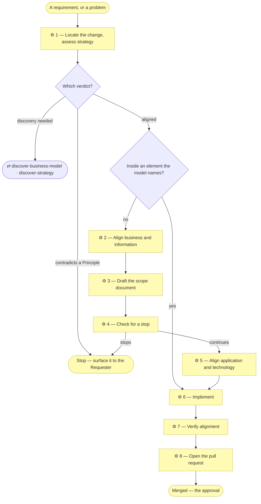

# ⚙ Align a change through the layers

**The spine.** A change to what the model claims is walked through the
layers before it is built — strategy and business architecture first — so
nothing is coded against a business fact nobody checked. The Requester's
approval is the pull request merging; nothing earlier claims to be one.

A change to what the model claims is aligned through the documents in
`architecture/`, captured in a scope document, and built directly from the
request. The folder numbers give the assessment order. A change inside an
element the model already names is coded directly — § When not to.

## ⊕ When to use this

| The situation | What it looks like |
| ------------- | ------------------ |
| A change reaches the model | It adds, removes or re-relates an element — an actor, a service, a process, a data object, a component, a runtime, an integration |
| A change to what a document claims | A business rule, a decision right, an autonomy level, a classification, a retention period, an interface contract |
| Work resumes after discovery | The discovery pull request has merged, and the original request is still unbuilt |

## ⊖ When not to

| The situation | Use instead |
| ------------- | ----------- |
| A change inside an element the model already names — a screen, a filter, a validation, an import format for an ingestion service that exists, a defect | Implement. Nothing is documented; the element's realizing artifact is where a reader looks |
| A change that only keeps the model true — a row's wording or realizing path, nothing added, removed or re-related, no rule contradicted | Implement, and edit the row in the same commit. No scope document; a `●` document stays `●`, because what was approved was the element, not its label |
| The project was never bootstrapped | `establish-project` first. `AGENTS.md` declaring no depth is the signal |
| The model has drifted rather than the requirement | `restate-current-state` — its own initiative, with its own diff |
| The question is where to go rather than what to build | `plan-the-transition` — a target state, a gap register and a sequence |
| The subject already runs and the lower layers are empty | `discover-current-landscape` — there is nothing for a change to be aligned against yet |

**A change reaches this process only if it makes a row false or missing.**
The noun test decides: does the request introduce a thing the model would
have to name, or change what an existing thing connects to, permits or is
classified as? If neither, it is inside an element. Either lighter path
checks one thing before the pull request: every file it touched sits under
an artifact some element names — `model.py --project . names <path>` says
which. A file nothing names is a new element in disguise, and this process
opens then, before merge.

## ⌖ Where this sits

Realizes `BPROC2.1`, `BPROC2.2` and `BPROC2.3` — the whole of the Operational
band's delivery. It builds directly from the request; the discovery it hands
off to does the same.

Every edge leaving a rhombus is a verdict the agent **states** — a "no change"
on a layer, an "inside an element, no scope document" in the pull request.
None of them is a silent skip.

## ⚓ Invariants

### Well-done less is more

Every step produces elements — goals, capabilities, services, rules, canvas
blocks. **At every one of them, consolidate before you enumerate.** Two
elements differing only in degree are one element with a severity column. A
list past one screen is asking which of its entries are the same thing seen
from two angles. The rules are in `document-style` § Consolidate
before you enumerate and are not restated here.

This applies to what is **proposed** as much as to what is written: a Requester
handed six overlapping options in a pull request has been handed the analysis
the process exists to do for them. And to what is **presented** when a stop
fires: a stop is named plainly, not laid out as a table of contents.

### Every verdict is recorded

A layer with no impact still gets a "no change" verdict, written into the
scope document's alignment table. A reader cannot tell an unconsidered layer
from an unaffected one.

### Ask only what blocks the work now

**Decide what you can decide.** A question reaches the Requester only when
both are true: the answer changes what gets built now, and nothing in the
model or the request settles it. Everything else is the agent's call — taken,
applied, and written into the document it affects with its `Source` cell
reading `adopted — <the call>`. That document stays `◐`, so a later word from
the Requester overrides it where a merged fact would not.

**Never ask about a state that does not exist yet.** A question about what
will be true after work nobody has scheduled is not a question; it is the
work, unstarted.

**Speak the subject's language, never the method's.** The Requester is shown
what changes about their business and asked whether it is right. They are not
asked to choose between the method's options.

## Where this stops

**The Requester's approval is the pull request merging.** Nothing before that
claims to be one, and nothing needs to: this skill builds directly from the
request, through the layers, and opens the result as a pull request for
review.

Three things stop the walk before that, and the agent **names which one**
rather than just asking a question:

| Stop | It fires when |
| ---- | ------------- |
| **Contradiction** | The change conflicts with a Principle, a decision already recorded, or a rule the model states |
| **Ambiguity** | Two readings of the request lead to materially different work, and nothing in the model settles which. Not "I would like confirmation" — a coin-flip whose two sides build different things |
| **Authorization** | The work would commit the Requester to something they have not agreed: spend, public exposure, publishing the model, a direction |

Naming the stop is what makes it answerable: "I need authorization before I
publish this" tells a Requester what kind of answer is wanted; "is this okay?"
does not. When a stop fires, name it in the conversation or a pull-request
comment, with a full link to the content under review — resolving to the
branch the work is on, never the default branch.

**A merged pull request moves a status line.** An element added or changed by
this initiative sits in a document marked `◐ Draft catalogue` until the
initiative's pull request merges; the moment it does, the document says
`● Validated, <date>` and its `Notes` column is emptied —
`architecture-document-style` § Document status.

**This is the whole of it.** `AGENTS.md`, `architecture/scope/README.md` and
`write-scope-document` point here rather than restating it.

## ⚙ Steps

### 1 — Locate the change, then assess strategy

**1a — Confirm the modeling depth, and say it out loud.** `AGENTS.md` records
the declared depth. Read it and check the request against it.

| Finding | What to do |
| ------- | ---------- |
| The request fits the declared depth | Say which depth you are working at, in one line, and continue |
| The request outgrows it | Say so, and what deepening would cost. A depth change is its own initiative, decided by the Requester, never absorbed quietly mid-change |
| `AGENTS.md` declares no depth | The project was never bootstrapped — run `establish-project` first |

Never let the depth go unstated. A Requester told "I'm treating this as Depth 1
— one application, light strategy layer; say the word if you want the
organization modeled properly" can correct you in one sentence. A Requester told
nothing finds out three initiatives later.

**1b — Locate the domain (Depth 3 only).** Name which domain owns this change,
and check whether it touches another domain's **exposed** services. If it does,
the consuming domains' Requesters are told at the pull request too, and
`model-domains` governs how the contract changes. At Depth 1 and 2, skip.

**1c — Assess strategy, and decide whether this is discovery.**

**⚖ Judgement.** Read `architecture/1_strategy/` against the change and reach
one of four verdicts, explicitly:

| Verdict | Triggered when | What happens |
| ------- | -------------- | ------------ |
| **Operating-model discovery** | The subject being modeled is an **organization** rather than a single application, and `0_business-design/` is empty or no longer matches | Switch to `discover-business-model`. The initiative becomes the canvases, built directly and opened as its own pull request |
| **Strategy discovery** | `1_strategy/` still holds placeholders, or the change adds or modifies a Stakeholder, Driver, Goal or Principle, or reshapes the value stream | Switch to `discover-strategy`. The initiative becomes a docs-only discovery, built directly and opened as its own pull request |
| **Conflict** | The change contradicts an existing Principle | Stop and surface it to the Requester. Resolving it may amount to changing the Principle, which is the trigger above |
| **Aligned** | The change serves an existing goal and value-stream stage | Record which ones, and continue |

Tell the first two apart by the subject, not the size of the request: "several
products share one capability base and I need to model the business" is
operating-model discovery; "this app needs a new feature" is not.

**→ Produces** a stated depth, the owning domain at Depth 3, and one of four
recorded verdicts.

#### Handing off is not an exit

Both discovery verdicts switch skills, but neither leaves this process. A
discovery initiative is still an initiative: it gets the next numbered scope
document, indexed and created as part of the same change, same as any
initiative. Then it finishes at Step 8 like any other.

What a discovery initiative skips is Steps 2, 5, 6 and 7 — no business or
information alignment beyond what discovery produces, no application layer,
no code. Its scope document records what the discovery delivered, same as
any initiative's.

### 2 — Align business and information

For each layer, read the layer README and answer its question for the requested
change. Update the affected documents as you go — they are part of the same
change set, not an afterthought.

| Layer | The question |
| ----- | ------------ |
| `architecture/2_business/` | Which business services, processes or objects are added or changed? New business rules get a row in the rules table, with the *why*, before they get code. New terms go into the glossary, and code reuses glossary terms |
| `architecture/3_information/` | New or changed data objects, flows, representations, storage, classification, retention? |

At Depth 2 and above, processes are levelled and level 1 is classified into
four macro categories — use `process-and-capability-levels` rather than deciding
the shape per initiative. If the change adds an actor, or changes an existing
AI actor's autonomy level or decision rights, consider a `record-decision`
alongside the scope document explaining why.

A layer folder that does not exist yet is emitted from the plugin's assets
at the moment the change first fills it — `assets/layers/2_business/`,
`assets/layers/3_information/` — never created empty in advance. The
relationship catalogue, `architecture/relationships.md`, is emitted from
`assets/layers/relationships.md` the first time a change declares a
relationship no catalogue column carries
(`architecture-document-style` § Relationships are declared, never only drawn).

**← Needs** the verdicts from Step 1.

**→ Produces** changed `2_business/` and `3_information/`, or explicit "no
change" verdicts.

### 3 — Draft the scope document

Create the next-numbered file in `architecture/scope/` with
`write-scope-document`. Do this **before implementing**, so what the pull
request builds is written down first; refine it as implementation proceeds.

**→ Produces** `architecture/scope/<n>_*.md`, and its row in the index.

### 4 — Check for a stop

Before touching application or technology, check the three stops in § Where
this stops: does anything here contradict a Principle or a decision already
written down? Do two readings of the request lead to different work? Would
this commit the Requester to spend, public exposure, publishing the model, or
a direction they have not agreed? If none fire, continue directly — nothing
here is presented for approval first.

**← Needs** the aligned layers and the scope document.

**→ Produces** a stated verdict: continue, or the named stop.

### 5 — Align application and technology

| Layer | The question |
| ----- | ------------ |
| `architecture/4_application/` | Which application services or components change? New ports and interfaces follow `5_interface-contracts.md`; new platforms and adapters follow `4_solution-design.md` |
| `architecture/5_technology/` | Any impact on runtimes, build, CI or hosting? Where no stack has been chosen, use `stack-selection` rather than deciding from memory |

As in Step 2, a layer filled for the first time gets its README from the
plugin's assets — `assets/layers/4_application/`, `assets/layers/5_technology/`.

**← Needs** the continue verdict from Step 4.

**→ Produces** changed `4_application/` and `5_technology/`.

### 6 — Implement

**First, size the work.** If any work package is too large or long-running to
finish in one sitting — more than a handful of files, or spanning a break, a
session boundary, or a handoff — shard it with `shard-stories` before writing
code. A small work package needs no stories; an inline task list in the scope
document is the default.

Only now write code. Keep the architecture and scope documents true to what is
actually delivered. If implementation diverges from the plan, update them in
the same commit series; if the divergence itself contradicts something already
decided or raises a fresh ambiguity, treat it as a new stop rather than
silently absorbing it.

**← Needs** the scope document.

**→ Produces** code, and documents still true of it.

### 7 — Verify alignment before finishing

- Every new or changed code artifact is named by some architecture document
  (`model.py --project . names <path>` says which, or that none does).
- Every element added names the code artifact that realizes it, or is marked
  "Pending — future initiative" with a link to the initiative that will deliver
  it.
- **Name every other model in the repository whose current state this change
  falsifies, and correct it in the same change** (`RULE12`). Grep for the paths,
  directory names and artifact names the change moved or renamed; every hit in
  another model's layer documents is a statement that was true before and may
  not be now.
- The scope document's in-scope/out-of-scope table matches the diff.
- At Depth 3: every cross-domain ID reference points at a service the owning
  domain's charter actually exposes.
- Cross-links resolve, paths and anchors both.

**Neither validator can find these.** `check_model` verifies that an element
*reference* resolves and `check_links` that a *link* resolves; neither reads
what a "Realized by" cell claims about a path.

**If this was a discovery initiative, say what comes next.** Discovery ends
having delivered documents and no code — which is correct, but a Requester
who asked for a feature and received a merged docs-only PR will reasonably
think the process failed to build anything. Name the request that triggered
discovery and offer to open it as the next initiative.

### 8 — Open the pull request

Use `write-pr-description`: it fills the one template and covers the whole
branch (`main...HEAD`), not just the latest commit.

**→ Produces** a pull request a Reviewer can judge.

## ⇄ Hands off to

Each is a file beside this one — `${CLAUDE_SKILL_DIR}/../<skill>/SKILL.md`
— read when it applies, never assumed loaded.

| Skill | When | What comes back |
| ----- | ---- | --------------- |
| `discover-business-model` | Step 1c returns operating-model discovery | Canvases, merged by the Requester, then the strategy derived from them |
| `discover-strategy` | Step 1c returns strategy discovery | A filled strategy layer, merged by the Requester. Implementation re-enters here as its own initiative |
| `model-domains` | Depth 3, and the change crosses a domain boundary | The contract change, with every consuming Requester told at the pull request |
| `write-scope-document` | Step 3 | The document that records what changed and why |
| `process-and-capability-levels` | Step 2 at Depth 2 or above | Levelled processes, shaped rather than decided per initiative |
| `stack-selection` | Step 5, and no stack chosen | A recorded choice in `5_technology/` |
| `shard-stories` | Step 6, and a work package is too large | Self-contained stories in build order |
| `write-pr-description` | Step 8 | The pull-request body |
| `run-retrospective` | The pull request merged and judgement was exercised — the method was silent somewhere and someone improvised | A pattern note in the organization's own records; each proposal becomes its own initiative |

## ✎ Worked example

> A Requester asks for an export feature. Step 1a states Depth 1. Step 1c finds
> the strategy filled and the change serving an existing goal — **aligned** —
> and records which goal. Step 2 adds one business service and one data object,
> and gives `1_strategy` an explicit "no change". Step 4 finds nothing that
> contradicts, is ambiguous, or needs authorization, so Steps 5–8 implement,
> verify and open the PR, and Step 7 catches that a renamed directory falsified
> two rows in a second model — which is the check nothing automated would have
> found.

## ⚠ Anti-patterns

- Leaving a layer without a verdict because nothing changed there.
- Naming a stop with no link to the content under review, or a link to the
  default branch.
- Treating a discovery verdict as an exit from this process rather than a
  handoff that returns.
- Absorbing a divergence that contradicts something already decided instead
  of treating it as a new stop.
- Deciding process decomposition depth per initiative rather than through
  `process-and-capability-levels`.
- Skipping the cross-model check because the validators are green.
- Asking the Requester something the model already settles, or something about
  a state that does not exist yet.

## ☑ Done when

- The depth is stated, and at Depth 3 the owning domain is named.
- Step 1c's verdict is recorded, whichever of the four it was.
- Every layer has a verdict in the scope document's alignment table.
- No stop was silently absorbed; each one that fired was named.
- Every element added names what realizes it, or is marked Pending.
- Every other model this change falsifies has been corrected in the same change.
- The pull request covers the whole branch.
