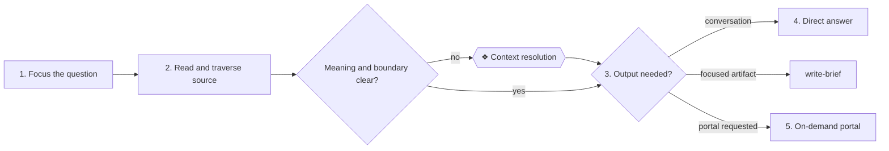

# ⚙ Answer a context question

Start with the reader's question, ground it in canonical context and provide
the smallest useful answer or reading artifact.

## ⊕ When to use this

- A reader asks about an architecture element, relationship, domain, solution,
  impact or decision.
- A reader requests a decision, impact or understanding brief.
- A reader explicitly requests the architecture portal or a brief PDF.

## ⊖ When not to

- For implementation, use `deliver-change`.
- For a target, material gaps and change sequence, use `plan-roadmap`.
- For missing or stale current context, use `model-context`.
- Do not create a brief or portal when a direct answer is sufficient and no
  artifact was requested.

## ⌖ Where this sits

Realizes Answer a context question [BPROC2.1]. **Context resolution** applies
only when a material ambiguity prevents a grounded answer.

## ⚓ Invariants

- Canonical Markdown is the authority. A brief, portal, PDF or generated graph
  is only a view.
- Resolve explicit relationships in both directions and distinguish modeled
  fact, supported inference and unavailable context.
- Match depth and terminology to the reader: guide a builder in business
  language and retain identifiers, ArchiMate semantics and source links for an
  enterprise architect.
- Briefs and portal output are disposable under `.archreator/work/`.
- Generate the portal or an individual brief PDF only when requested; never
  publish the whole model as a PDF.

## ⚙ Steps

### 1. Focus the reader's question

**← Needs.** The question, known reader viewpoint and requested output format.

**⚖ Judgement.** Identify the subject, decision or change being asked about.
Ask one clarifying question only when different interpretations would
materially change the answer. Default to a direct response rather than an
artifact.

**→ Produces.** A focused question, reader viewpoint, provisional model anchor
and output mode.

### 2. Ground and traverse the context

**← Needs.** The focused question, `architecture/README.md` and relevant
canonical files.

**⚖ Judgement.** Resolve names to stable identifiers and follow explicit
relationships in both directions. Read only the files bearing on the question.
If the question crosses an ownership boundary, hand that boundary to
`federate-context`; do not invent unavailable external facts.

**→ Produces.** Relevant modeled facts, relationship paths, sources, inferences
and explicit unavailable context.

### 3. Resolve material ambiguity and choose the response

**← Needs.** The grounded evidence, reader viewpoint and requested format.

**⚖ Judgement.** Decide whether the reader needs a direct answer, a focused
decision, impact or understanding brief, or the broader portal. A decision
brief frames one choice; an impact brief traces a proposed change; an
understanding brief teaches what exists.

**❖ Gate — Context resolution.** Stop only when a material gap, inconsistency or
ambiguous model anchor prevents a trustworthy answer. Present the minimum
facts, interpretations, consequences and recommendation.

**→ Produces.** A resolved answer boundary and one selected response form.

### 4. Answer directly or create one focused brief

**← Needs.** The selected response form, grounded facts, sources and boundary.

**⚖ Judgement.** Answer directly when the conversation is enough. For a
reviewable artifact, hand the selected brief type, reader, question, facts and
sources to `write-brief`. Do not turn one question into a general architecture
summary.

**→ Produces.** A plain-language answer or one temporary brief under
`.archreator/work/<run>/`, carrying its source revision and unavailable
context.

### 5. Deliver only the requested reading surface and route changed truth

**← Needs.** The answer or brief and any explicit PDF or portal request.

**⚖ Judgement.** Export only an individual brief to PDF. Generate or refresh
the portal under `.archreator/work/portal/` only on request, preserving source
links, standard navigation and model boundaries. If a resolved answer changes
canonical truth, hand it to `deliver-change`; if only its consequential
rationale must endure, hand it to `record-decision`.

**→ Produces.** The requested response or disposable reading surface, plus a
clear handoff for any canonical update.

## ⇄ Hands off to

- `federate-context` receives a cross-model question and returns accessible
  source context, authority boundaries and unresolved external context.
- `write-brief` receives one decision, impact or understanding need and returns
  the corresponding focused temporary document.
- `deliver-change` receives a newly resolved fact that changes the model and
  returns updated canonical context through `document-style` and
  `architecture-document-style`.
- `record-decision` receives an accepted consequential choice and returns one
  durable rationale when current context alone would not explain it.

## ⚠ Anti-patterns

- Beginning with an architecture layer rather than the reader's question.
- Loading the whole repository when a few canonical sources answer the issue.
- Presenting an inference as modeled fact or treating missing external context
  as an absent relationship.
- Generating a brief, PDF or portal by default.
- Promoting a temporary brief into `architecture/` or maintaining a derived
  graph as authority.
- Hiding identifiers and sources from expert readers or forcing specialist
  terminology on builders.

## ☑ Done when

- The answer is grounded, bounded and appropriate to the reader.
- Facts, inferences and unavailable context are distinguishable and sources
  are reachable.
- At most one necessary response artifact was created in the correct temporary
  location.
- Any changed canonical truth or durable rationale has an explicit handoff.
