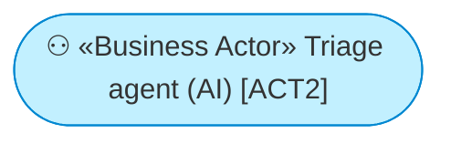
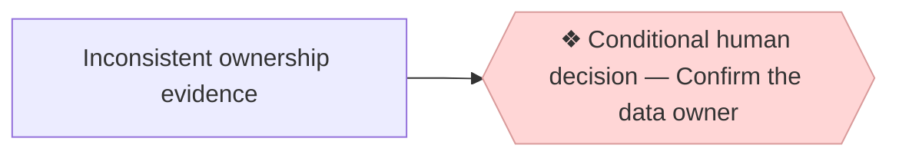

# ArchiMate on Mermaid

Use this reference when an architecture document needs a Mermaid view. It is
the single source for labels, glyphs, shapes and colours. Do not copy it into a
“How to read” section on every document; link here only when a reader actually
needs the notation explained.

ArchiMate has no native Mermaid profile. This convention makes the human name
the most visible part of a node while carrying the canonical type and stable
machine anchor explicitly.

## Node labels

Use one line in this order:

```text
<glyph> «ArchiMate type» Human name [ID]
```

For example:

```text
✦ «Capability» Order fulfilment [CAP1]
```

- The human name leads the identity; the ID is secondary and always last.
- Use the canonical ArchiMate stereotype, not a local category or layer name.
- Never show a bare ID. A modeled element is always `Human name [ID]` in
  prose, relationship endpoints and diagrams.
- Keep the label on one line. Do not rely on HTML breaks that render
  differently across Mermaid hosts.
- An AI or hybrid actor keeps its actor kind in the human label, for example
  `⚇ «Business Actor» Triage agent (AI) [ACT2]`.

## Element glyphs and default shapes

The glyph and shape make type recognition faster; the explicit stereotype
keeps the meaning unambiguous when colour or shape is reused.

| Layer | Glyph | Canonical ArchiMate type | Default Mermaid shape |
| --- | --- | --- | --- |
| Motivation | `◍` | Stakeholder | Stadium `id(["…"])` |
| Motivation | `✳` | Driver | Hexagon `id{{"…"}}` |
| Motivation | `⌕` | Assessment | Flag `id>"…"]` |
| Motivation | `◎` | Goal | Rounded rectangle `id("…")` |
| Motivation | `◉` | Outcome | Subroutine `id[["…"]]` |
| Motivation | `⚑` | Principle | Parallelogram `id[/"…"/]` |
| Strategy | `✦` | Capability | Rectangle `id["…"]` |
| Strategy | `▤` | Resource | Cylinder `id[("…")]` |
| Strategy | `◈` | Value | Trapezoid `id[/"…"\]` |
| Strategy | `➤` | Course of Action | Hexagon `id{{"…"}}` |
| Strategy | `⇉` | Value Stream | Subroutine `id[["…"]]` |
| Business | `⚇` | Business Actor | Stadium `id(["…"])` |
| Business | `⚉` | Business Role | Rectangle `id["…"]` |
| Business | `⧉` | Business Collaboration | Hexagon `id{{"…"}}` |
| Business | `▣` | Product | Rectangle `id["…"]` |
| Business | `⬭` | Business Service | Stadium `id(["…"])` |
| Business | `⊸` | Business Interface | Rectangle `id["…"]` |
| Business | `❒` | Contract | Parallelogram `id[/"…"/]` |
| Business | `⚙` | Business Process | Rectangle `id["…"]` |
| Business | `▧` | Business Object | Rectangle `id["…"]` |
| Application | `⊞` | Application Component | Rectangle `id["…"]` |
| Application | `⬮` | Application Service | Stadium `id(["…"])` |
| Application | `⊸` | Application Interface | Rectangle `id["…"]` |
| Application | `▦` | Data Object | Rectangle `id["…"]` |
| Technology | `⬒` | Node | Rectangle `id["…"]` |
| Technology | `⬯` | Technology Service | Stadium `id(["…"])` |
| Technology | `⎔` | Artifact | Parallelogram `id[/"…"/]` |
| Implementation & Migration | `≡` | Plateau | Subroutine `id[["…"]]` |
| Implementation & Migration | `⊘` | Gap | Circle `id(("…"))` |

The method's `3_information/` area is a documentation concern, not an
additional ArchiMate layer. A Business Object uses the Business convention; a
Data Object uses the Application convention.

Value Proposition Canvas and Business Model Canvas blocks are not ArchiMate
elements. Where a canvas view is useful, keep their explicit canvas block
type in guillemets and use the established glyphs: `◍` Customer Segment, `⚙`
Job or Key Activity, `✖` Pain, `✔` Gain, `▣` Product, `⊖` Pain Reliever, `⊕`
Gain Creator, `⧉` Key Partner, `▤` Key Resource, `⊸` Channel, `⇄` Customer
Relationship, `▲` Revenue Stream and `▼` Cost. Do not mislabel a canvas block
as an ArchiMate type merely to fit the element-table schema.

## Layer palette

Use the standard layer fill even in a single-layer view. The explicit
stereotype and type glyph now carry the finer distinction, so a separate tone
ramp is unnecessary.

| Layer | Mermaid class | Fill | Stroke |
| --- | --- | --- | --- |
| Motivation | `motivation` | violet `#e6d6f5` | `#7e57c2` |
| Strategy | `strategy` | sand `#f5deaa` | `#c8a24a` |
| Business | `business` | yellow `#fffbb5` | `#b8a200` |
| Application | `application` | cyan `#c2f0ff` | `#0288d1` |
| Technology | `technology` | green `#c9e7b7` | `#558b2f` |
| Implementation & Migration | `implementation` | rose `#ffd6d6` | `#d99b9b` |

Text is `#333` on every layer:

```mermaid
flowchart LR
  motivation("◎ «Goal» Faster fulfilment [G1]"):::motivation
  strategy["✦ «Capability» Order fulfilment [CAP1]"]:::strategy
  business["⚙ «Business Process» Fulfil an order [BPROC1]"]:::business
  application(["⬮ «Application Service» Order automation [ASVC1]"]):::application
  technology(["⬯ «Technology Service» Managed runtime [TSVC1]"]):::technology

  strategy -->|Influence| motivation
  business -->|Realization| strategy
  application -->|Serving| business
  technology -->|Serving| application

  classDef motivation fill:#e6d6f5,stroke:#7e57c2,color:#333
  classDef strategy fill:#f5deaa,stroke:#c8a24a,color:#333
  classDef business fill:#fffbb5,stroke:#b8a200,color:#333
  classDef application fill:#c2f0ff,stroke:#0288d1,color:#333
  classDef technology fill:#c9e7b7,stroke:#558b2f,color:#333
  classDef implementation fill:#ffd6d6,stroke:#d99b9b,color:#333
```



An AI or hybrid actor with delegated authority may use a cyan accent to make
that delegation visible:



The accent does not change the element's layer or type. The explicit
`«Business Actor»` stereotype prevents the cyan fill from turning it into an
Application element. Use the override only when delegated authority is
material to the view, not as decoration for every automated component.

## Relationships

Every edge is labeled. Use the same direction and relationship declared in
the relationship table, or in a nested element's canonical `Parent` column for
same-type Composition: **Composition**, **Aggregation**, **Assignment**,
**Realization**, **Serving**, **Access**, **Influence**, **Association**,
**Triggering**, **Flow** or **Specialization**. Mermaid arrowheads do not carry
ArchiMate semantics reliably; the label is authoritative in the view and the
table remains the canonical declaration.

Do not invent an unlabeled edge for layout. Do not use a dashed edge as an
undocumented synonym for “future” or “uncertain.” Current views show current
facts; accepted target relationships belong in `6_transition/`; uncertainty
is written beside the affected fact.

## Conditional human decisions

A conditional human decision is workflow notation, not an ArchiMate element.
Draw it as a rose hexagon with no element ID or stereotype:



Use it only when a material gap, inconsistency, authorization or requested
acceptance requires a person. It never becomes an element-table row or a
relationship-table endpoint.

## Drawing rules

- A diagram renders facts declared in the model; it does not introduce them.
- Keep one view focused on one question, relationship chain or flow. Split a
  view that cannot be understood without zooming or hunting.
- Place a useful view close to the section it explains, before the detailed
  table or prose when that helps the reader form the whole first.
- Preserve an element's home-layer colour, type glyph, stereotype and shape
  when it appears as context in another layer's view.
- Do not add a mandatory local legend or “How to read” section. The explicit
  stereotype makes every node self-describing; this reference holds the
  notation once.
