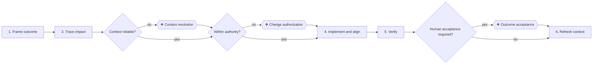

# ⚙ Deliver a change

Use current context to make a change safer and clearer, then leave the
implementation and canonical model telling the same truth.

## ⊕ When to use this

- A user requests a business, product or technical behavior change.
- Implementation and architecture context must move together.
- A delivered outcome must be verified and reconciled into current context.

## ⊖ When not to

- For explanation or analysis without implementation, use
  `answer-context-question`.
- For a target state and sequence of initiatives, use `plan-roadmap`.
- For missing or stale context without a requested change, use `model-context`.
- For a defect that changes no documented behavior, fix and verify it without
  inventing architecture work.

## ⌖ Where this sits

Realizes Frame and assess a change [BPROC3.1], Implement and verify
[BPROC3.2] and Refresh current context [BPROC3.3]. Its three human gates
appear only when the named decision is materially necessary.

## ⚓ Invariants

- Architecture supports delivery; it does not impose blanket approval
  ceremonies.
- Current Markdown and implementation evidence are authoritative. Derived
  views, briefs and portals are not.
- Trace relevant impact in both relationship directions and make unavailable
  cross-model context explicit.
- Working artifacts stay under `.archreator/work/<run>/`; routine changes do
  not require a permanent scope document.
- Update only canonical facts changed by the outcome. Create no empty area or
  placeholder and preserve stable identifiers for surviving elements.

## ⚙ Steps

### 1. Frame the requested outcome

**← Needs.** The user's request, stated problem and available acceptance
evidence.

**⚖ Judgement.** Separate the observable outcome and constraints from a proposed
solution. Confirm this is a delivery change rather than a context question or
roadmap request.

**→ Produces.** A bounded outcome, observable acceptance conditions and the
implementation and model boundary to inspect.

### 2. Ground the change and trace impact

**← Needs.** The framed outcome, `architecture/README.md`, relevant canonical
files and implementation evidence.

**⚖ Judgement.** If useful current context is missing, hand the exact gap to
`model-context`. Traverse element and relationship tables in both directions;
identify what changes, what remains unchanged, affected owners and
repositories, risks and required model edits. Never fill unavailable context
by assumption or consult a persisted graph as authority.

**❖ Gate — Context resolution.** Stop only when a material gap or inconsistency
would change the solution or its impact. Present the minimum facts, options,
consequences and recommendation.

**→ Produces.** A supported impact boundary with known changes, unaffected
boundaries, risks, owners and unresolved external context.

### 3. Choose the delivery route and obtain necessary authority

**← Needs.** The impact boundary, user authority and acceptance conditions.

**⚖ Judgement.** Continue directly for a small, clear and authorized change.
When a focused scope, impact or decision artifact improves coordination, hand
its facts and question to `write-brief`; keep the result disposable. When an
accepted rationale must outlive the work, hand it to `record-decision`.

**❖ Gate — Change authorization.** Stop only before a consequential action that
is materially outside the authority already granted. Do not turn ordinary
review or engineering judgement into authorization.

**→ Produces.** An authorized delivery route, plus only the temporary brief or
durable decision the change genuinely needs.

### 4. Implement and align canonical context

**← Needs.** The authorized route, impact boundary and acceptance conditions.

**⚖ Judgement.** Implement in the order suited to the repository. For every
architecture edit, apply `document-style` and `architecture-document-style`;
also apply `process-and-capability-levels` when processes or capabilities
change.

**→ Produces.** Working implementation and only the canonical files whose
current facts, relationships or navigation changed.

### 5. Verify the outcome

**← Needs.** The implementation, acceptance conditions and changed canonical
context.

**⚖ Judgement.** Run verification proportionate to behavior and risk. Check
implementation behavior, links, identifiers, relationship targets and claimed
unchanged boundaries.

**❖ Gate — Outcome acceptance.** Stop only when acceptance by a responsible
person was explicitly required or cannot be established mechanically. Automated
and engineering verification still run for every change.

**→ Produces.** Verification evidence, an accepted outcome when required and a
precise list of remaining gaps.

### 6. Refresh current context and finish

**← Needs.** The verified outcome, canonical edits and any resolved decisions.

**⚖ Judgement.** Remove superseded facts, resolved questions and delivery
narrative. A consequential rationale belongs in `record-decision`; routine
history belongs in git.

**→ Produces.** Delivered work, current navigable context and a concise handoff
stating evidence, material boundaries and unresolved gaps.

## ⇄ Hands off to

- `model-context` receives a specific missing or stale context boundary and
  returns reliable facts and navigation.
- `write-brief` receives a focused decision, impact or scope need and returns a
  temporary artifact under `.archreator/work/<run>/`.
- `record-decision` receives an accepted consequential choice and returns its
  durable rationale under `architecture/decisions/`.
- `document-style` and `architecture-document-style` receive every canonical
  architecture edit and return clear, standard, traversable Markdown.
- `process-and-capability-levels` receives changed business process or
  capability scope and returns proportionate decomposition.
- `federate-context` receives a real cross-model impact and returns resolvable
  ownership boundaries and relationships.

## ⚠ Anti-patterns

- Treating every change as a gated architecture initiative.
- Implementing before reading relevant current context and inbound impact.
- Using a brief, portal or persisted graph as the source of truth.
- Creating permanent working scopes, empty layer files or speculative future
  catalogues.
- Updating documents that the outcome did not change.
- Calling automated verification a human acceptance gate.

## ☑ Done when

- The requested observable outcome is implemented and proportionately verified.
- Required human decisions are resolved; unnecessary gates were not introduced.
- Canonical context describes the delivered state and all changed links,
  identifiers and relationships validate.
- Temporary artifacts remain disposable and any durable rationale is recorded
  once.
