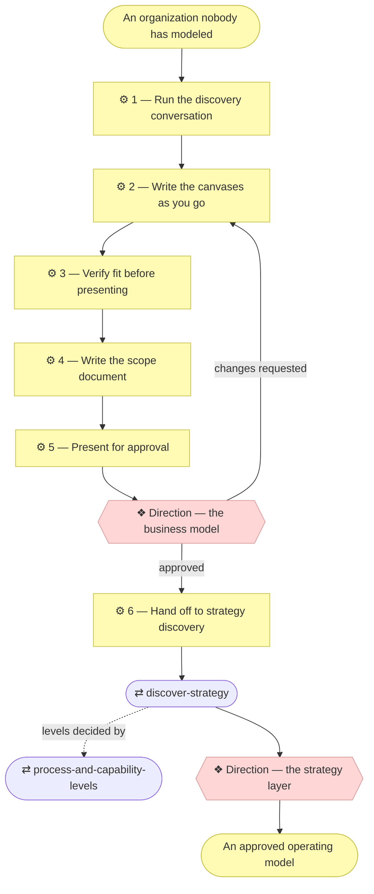

# ⚙ Discover the business model

The company track. When this skill applies, **the product is the
architecture**: the deliverable is a documented business model and the
operating model derived from it — no application design, no stack decisions,
no code. Whatever gets built later is a separate initiative that runs the
ordinary `align-change-through-layers` process and finds the organization
already modeled.

## ⊕ When to use this

| The situation | What it looks like |
| ------------- | ------------------ |
| The subject is a business | The Requester describes customers, offerings, revenue, partners, staff — not a feature |
| Shared capabilities | Several products or services share one capability base, and "who does what" has an answer bigger than one team |
| Meant to outlive an app | Other projects will consume the model as the organization's shared source of truth |
| Reached from elsewhere | `align-change-through-layers` Step 1 returned an operating-model discovery verdict, or `establish-project` declared Depth 2 or 3 |

## ⊖ When not to

| The situation | Use instead |
| ------------- | ----------- |
| The subject is a single application | `discover-strategy` directly |
| The canvases exist and still hold | `align-change-through-layers` — this is an ordinary change |

The two are not alternatives for the same subject. This skill **runs first and
hands off**, because a company's strategy layer is a consequence of its
business model rather than an independent statement.

## ⌖ Where this sits

Realizes `BPROC1.2`, and owns **Direction** — the first approval any organization
model receives. Nothing is derived until it is granted.

Direction is one gate granted in two sittings, and this skill owns only the
first — the business model. The second sitting, the strategy layer, is
`discover-strategy`'s. One scope document covers both: the same file gains its
second Direction row at the handoff, so don't open a second.

## ⚓ Invariants

- **Ask, don't assume.** Every block comes from a Requester answer, an
  existing document, or observable fact — never from what a business of this
  kind "usually" looks like. Generic canvas filler is worse than a blank: it
  reads as agreed when nobody agreed it. What the Requester cannot answer yet
  is marked **"Pending — future initiative"** or logged as an open question
  with the interpretation adopted.
- **Small batches, one theme at a time.** Three to five questions per round,
  in theme order, in business language rather than canvas jargon — "what do
  they try that doesn't work today?" beats "enumerate the pains".
- **Consolidate as you go, not at the end.** A round about pains easily yields
  twelve. Merge the ones that are the same pain at different severity, or the
  same job seen from two segments, and give the survivor a per-segment column.
  `document-style` § Consolidate before you enumerate has the
  rules. Consolidating at the end means renumbering everything.
- **One segment and one product at a time.** Canvases filled in parallel drift
  into each other.
- **Revision, not amnesia.** Where canvases already exist, start from them:
  confirm what still holds, and focus on what the new requirement bends.

## ⚙ Steps

### 1 — Run the discovery conversation

Themes 1–6 fill one Value Proposition Canvas per customer segment. Theme 7
fills one Business Model Canvas per product.

| # | Theme | The questions that open it |
| - | ----- | -------------------------- |
| 1 | **Customer segments** | Who pays, who uses, and who decides — often three different people? Which would notice first if the business stopped? Which segment is the business actually built around, if it had to pick one? |
| 2 | **Jobs** | What is each segment trying to get done — the functional job, the social one (how it makes them look), the emotional one (what it stops them worrying about)? What are they doing about it today, including nothing? |
| 3 | **Pains** | What goes wrong today — cost, delay, risk, effort, the outcome simply not arriving? What have they tried that didn't work? What would they call unacceptable rather than merely annoying? |
| 4 | **Gains** | What would they call a win — required, expected, or a delight? How would they measure it? What would make them recommend it? |
| 5 | **Products and services** | What is actually sold, as a customer would name it? Which segment is each for? One product with tiers, or genuinely separate products with separate economics — this decides how many canvases theme 7 needs |
| 6 | **Pain relievers and gain creators** | For each pain, what specifically removes it; for each gain, what produces it? |
| 7 | **Business model, per product** | The nine blocks in Osterwalder's order. Probes: how does a customer first hear about this, and how do they buy? What is billed — time, seats, usage, outcome? What would stop the business tomorrow if a supplier vanished? Which single cost line dominates? |

**⚖ Judgement.** Theme 6 is where fit gets tested. An unaddressed pain means
either a missing capability or a customer the business has decided not to
serve — and the Requester should say which out loud, rather than the gap
being left for a reader to find.

Ask at theme 7, and again while deriving, whether any activity or role is
performed or assisted by an **AI system** — at what autonomy level, with what
decision rights, escalating to which role. An organization with AI in its
delivery or its products should say so in the model rather than leave it
implicit.

**→ Produces** the answers, per segment and per product.

### 2 — Write the canvases as you go

Update the canvas documents after each round and reflect a short summary back,
so a misread segment surfaces in minutes rather than at the gate.

**← Needs** the answers from Step 1.

**→ Produces** `architecture/0_business-design/1_value-proposition-canvas.md`,
`architecture/0_business-design/2_business-model-canvas.md`.

`architecture/0_business-design/` does not exist until now — emit its README
from the plugin's `assets/layers/0_business-design/` before the first canvas,
and the first filed source does the same with `assets/layers/reference/`.

The canvases open `◐ Draft catalogue` and carry `Source` and `Notes` until
Direction grants them — `architecture-document-style` § Document status. A canvas
is the most tempting document in the model to read as settled, because it
looks finished the moment it is drawn; the marker is what says it is not.
Anything the Requester provided is filed in `architecture/reference/` first,
and the `Source` column points there.

Lead the Business Model Canvas with the products at a glance — one column
per product: segments, channels, relationship, revenue, dominant cost,
whether it scales — before any block catalogue, and open each canvas with
the generic how-to-read legend rather than a nine-block overview
(`architecture-document-style` § What is here, and what is one file away —
the canvases reference).

### 3 — Verify fit before presenting

Check, and fix or flag — never quietly present an unfit canvas:

| Check | Every… |
| ----- | ------ |
| Pain relief | Pain has a Pain Reliever |
| Gain creation | Gain has a Gain Creator |
| Coverage | Product has its own Business Model Canvas |

**← Needs** the canvases.

**→ Produces** a fit verdict, and any gaps named.

### 4 — Write the scope document

Discovery is a full initiative, not a detour. Create the scope document with
`write-scope-document` **before** presenting Direction, so the Requester approves
against a concrete document and the approval has somewhere to be recorded the
moment it is granted.

**→ Produces** `architecture/scope/<n>_*.md`, and its row in the index.

### 5 — Present for approval

**❖ Direction — the business model.** The Requester approves.

Present one compact summary — segments, their jobs, the sharpest pains and
gains, the products, and per product the blocks that distinguish it (revenue,
channels, dominant cost) — with **full branch links to each canvas document**
(`align-change-through-layers` § Show the Requester what they are approving).
Then ask explicitly for approval of the business model.

Name the consolidation in the summary: how many elements each catalogue holds,
and what was merged to get there. A Requester who can see that twelve pains
became five is being shown a modeling decision they can overturn — usually
more consequential than any single element in the list.

**In the summary and the scope document, not in the canvas.** The canvas
describes the business; how many elements it took to describe it is a fact
about the modeling (`document-style` § What the document contains).

Record the approval in the Approvals table — who, when, what was shown. If
changes are requested, revise from Step 2 and present again.

**← Needs** the canvases, the fit verdict, the scope document.

**→ Produces** the Approvals table's Direction row.

### 6 — Hand off to strategy discovery

**Nothing is derived until Direction is granted.** The strategy layer is a
consequence of an approved business model; deriving from an unapproved canvas
means redoing layers 1 and 2 when the canvas moves.

Then run `discover-strategy`, which finds the canvases filled and **derives
rather than re-asks**. Its themes map onto the canvas blocks; the only theme
with no canvas source is **Principles**, still discovered directly.

**← Needs** the granted Direction.

## ⇄ Hands off to

| Skill | When | What comes back |
| ----- | ---- | --------------- |
| `discover-strategy` | Direction's first sitting is granted | The strategy and key business layers derived from the canvases, approved at **Direction's second sitting** — recorded in the same scope document |
| `process-and-capability-levels` | While deriving, to decide how far down capabilities and processes go | Levels 1 and 2 complete, level 3 only where a Pain on the approved canvas justifies it |

## ✎ Worked example

> **"We're a three-person consultancy and I want to document how we actually work."**
>
> Depth 2, so this track rather than `discover-strategy`. Theme 3 yields
> twelve pains; consolidation merges them to five with a per-segment severity
> column, and the Direction summary says so — the Requester overturns one merge,
> which is exactly what naming the consolidation is for.
>
> Two offerings turn out to have separate economics at theme 5, so theme 7
> produces two Business Model Canvases rather than one. Direction is granted
> against branch links to both canvas documents, and only then does
> `discover-strategy` derive the capability map.

## ⚠ Anti-patterns

- Filling a canvas block from what a business of this kind usually looks like,
  rather than from an answer.
- Deriving the strategy layer before Direction is granted.
- Presenting a canvas whose pains have no relievers, without flagging it.
- Consolidating at the end, which renumbers everything the Requester has
  already read.
- Writing the consolidation counts into the canvas, where they describe the
  modeling rather than the business.
- Opening a second scope document at the handoff to `discover-strategy`.

## ☑ Done when

- One Value Proposition Canvas per customer segment, and one Business Model
  Canvas per product, both with their fit check.
- Every element names the team, role or written procedure that realizes it, or
  is marked "Pending — future initiative". An organization's processes are
  realized by people and procedures, not source files.
- The scope document's EA-alignment table records the impact on layers 0–2 and
  an explicit "not started" verdict for the rest.
- Its Approvals table records **Direction** for the canvases, and gains a
  second **Direction** row for the strategy at the handoff.
- Open questions are logged for everything adopted but unconfirmed.
- `python3 scripts/check_links.py` and `python3 scripts/check_model.py` pass.
