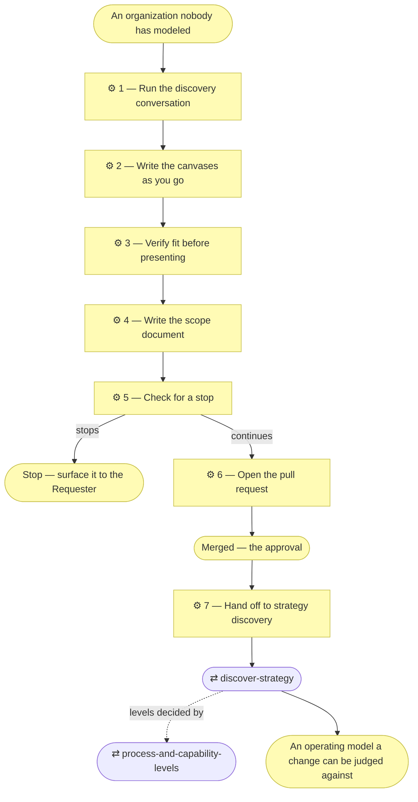

# ⚙ Discover the business model

The company track. When this skill applies, **the product is the
architecture**: the deliverable is a documented business model and the
operating model derived from it — no application design, no stack decisions, no
code. Whatever gets built later is a separate initiative through
`align-change-through-layers`.

## ⊕ When to use this

| The situation | What it looks like |
| ------------- | ------------------ |
| The subject is a business | The Requester describes customers, offerings, revenue, partners, staff — not a feature |
| Shared capabilities | Several products or services share one capability base, and "who does what" has an answer bigger than one team |
| Meant to outlive an app | Other projects will consume the model as the organization's shared source of truth |
| Reached from elsewhere | `align-change-through-layers` Step 1 returned an operating-model discovery verdict, or `establish-project` declared Depth 2 or 3 |

## ⊖ When not to

| The situation | Use instead |
| ------------- | ----------- |
| The subject is a single application | `discover-strategy` directly |
| The canvases exist and still hold | `align-change-through-layers` — this is an ordinary change |

The two are not alternatives for the same subject: on an organization this
skill **runs first and hands off**.

## ⌖ Where this sits

Realizes `BPROC1.2`. It builds the canvases directly from the Requester's
answers, checks for a stop, and opens them as a pull request — its merge is
the approval. Nothing is derived from the business model until that pull
request has merged.

This skill and `discover-strategy` are two separate initiatives, not two
sittings of one: this one merges first, then `discover-strategy` runs as its
own initiative — its own scope document, its own pull request — and derives
from what merged here.

## ⚓ Invariants

- **A block comes from a Requester answer, an existing document, or an
  observable fact** — never from what a business of this kind "usually" looks
  like. What no source settles is the agent's call — adopted, applied, and
  recorded with its `Source` cell reading `adopted — <the call>`
  (`align-change-through-layers` § Ask only what blocks the work now). What
  nobody can answer yet is marked **"Pending — future initiative"**.
- **One theme at a time, in theme order, in business language rather than
  canvas jargon** — "what do they try that doesn't work today?" beats
  "enumerate the pains".
- **Consolidate as you go, not at the end.** A round about pains easily yields
  twelve. Merge the ones that are the same pain at different severity, or the
  same job seen from two segments, and give the survivor a per-segment column.
  `document-style` § Consolidate before you enumerate has the rules.
- **One segment and one product at a time.** Canvases filled in parallel drift
  into each other.
- **Revision, not amnesia.** Where canvases already exist, start from them:
  confirm what still holds, and focus on what the new requirement bends.

## ⚙ Steps

### 1 — Run the discovery conversation

Themes 1–6 fill one Value Proposition Canvas per customer segment. Theme 7
fills one Business Model Canvas per product.

| # | Theme | The questions that open it |
| - | ----- | -------------------------- |
| 1 | **Customer segments** | Who pays, who uses, and who decides — often three different people? Which would notice first if the business stopped? Which segment is the business actually built around, if it had to pick one? |
| 2 | **Jobs** | What is each segment trying to get done — the functional job, the social one (how it makes them look), the emotional one (what it stops them worrying about)? What are they doing about it today, including nothing? |
| 3 | **Pains** | What goes wrong today — cost, delay, risk, effort, the outcome simply not arriving? What have they tried that didn't work? What would they call unacceptable rather than merely annoying? |
| 4 | **Gains** | What would they call a win — required, expected, or a delight? How would they measure it? What would make them recommend it? |
| 5 | **Products and services** | What is actually sold, as a customer would name it? Which segment is each for? One product with tiers, or genuinely separate products with separate economics — this decides how many canvases theme 7 needs |
| 6 | **Pain relievers and gain creators** | For each pain, what specifically removes it; for each gain, what produces it? |
| 7 | **Business model, per product** | The nine blocks in Osterwalder's order. Probes: how does a customer first hear about this, and how do they buy? What is billed — time, seats, usage, outcome? What would stop the business tomorrow if a supplier vanished? Which single cost line dominates? |

**⚖ Judgement.** Theme 6 is where fit gets tested. An unaddressed pain means
either a missing capability or a customer the business has decided not to
serve, and the Requester says which rather than leaving the gap for a reader.

Ask at theme 7, and again while deriving, whether any activity or role is
performed or assisted by an **AI system** — at what autonomy level, with what
decision rights, escalating to which role.

**→ Produces** the answers, per segment and per product.

### 2 — Write the canvases as you go

Update the canvas documents after each round and reflect a short summary back,
so a misread segment surfaces immediately.

**← Needs** the answers from Step 1.

**→ Produces** `architecture/0_business-design/1_value-proposition-canvas.md`,
`architecture/0_business-design/2_business-model-canvas.md`.

`architecture/0_business-design/` does not exist until now — emit its README
from the plugin's `assets/layers/0_business-design/` before the first canvas,
and the first filed source does the same with `assets/layers/reference/`.

The canvases open `◐ Draft catalogue` and carry `Source` and `Notes` until
this initiative's pull request merges — `architecture-document-style` §
Document status. Anything the Requester provided is filed in
`architecture/reference/` first, and the `Source` column points there.

Lead the Business Model Canvas with the products at a glance — one column per
product: segments, channels, relationship, revenue, dominant cost, whether it
scales — before any block catalogue, and open a canvas with neither a legend
nor a nine-block overview
(`architecture-document-style` § What is here, and what is one file away — the
canvases reference).

### 3 — Verify fit before presenting

Check, and fix or flag — never quietly present an unfit canvas:

| Check | Every… |
| ----- | ------ |
| Pain relief | Pain has a Pain Reliever |
| Gain creation | Gain has a Gain Creator |
| Traceability | Pain Reliever and Gain Creator traces to a Capability |
| Coverage | Product has its own Business Model Canvas |

An unaddressed pain is a missing capability or a customer the business
decided not to serve, and the verdict says which. It is written in the value
proposition canvas under its own heading, never in the layer README
(`architecture-document-style` § The layer README).

**← Needs** the canvases.

**→ Produces** a fit verdict, and any gaps named.

### 4 — Write the scope document

Create the scope document with `write-scope-document` **before** opening the
pull request, so what merges is written down first.

**→ Produces** `architecture/scope/<n>_*.md`, and its row in the index.

### 5 — Check for a stop

Before opening the pull request, check the three stops in
`align-change-through-layers` § Where this stops: does anything here
contradict a Principle or a decision already written down? Do two readings of
the request lead to different work? Would this commit the Requester to spend,
public exposure, publishing the model, or a direction they have not agreed?
If none fire, continue directly — nothing here is presented for approval
first.

**← Needs** the canvases, the fit verdict, the scope document.

**→ Produces** a stated verdict: continue, or the named stop.

### 6 — Open the pull request

Use `write-pr-description`. Present one compact summary — segments, their
jobs, the sharpest pains and gains, the products, and per product the blocks
that distinguish it (revenue, channels, dominant cost) — with **full branch
links to each canvas document** (`align-change-through-layers` § Where this
stops — the same link hygiene applies to anything put in front of the
Requester, not only a stop).

Name the consolidation in the description: how many elements each catalogue
holds, and what was merged to get there — a merge the Requester can overturn
in review. It goes in the pull-request description and the scope document,
never in the canvas (`document-style` § What the document contains).

**← Needs** the continue verdict from Step 5.

**→ Produces** a pull request a Reviewer can judge.

### 7 — Hand off to strategy discovery

**Nothing is derived until this pull request has merged.**

Then run `discover-strategy`, as its own initiative: it finds the canvases
filled and **derives rather than re-asks**. Its themes map onto the canvas
blocks; the only theme with no canvas source is **Principles**, still
discovered directly.

**← Needs** the merged pull request.

## ⇄ Hands off to

Each is a file beside this one — `${CLAUDE_SKILL_DIR}/../<skill>/SKILL.md`
— read when it applies, never assumed loaded.

| Skill | When | What comes back |
| ----- | ---- | --------------- |
| `discover-strategy` | This initiative's pull request has merged | The strategy and key business layers derived from the canvases, built directly and opened as its own pull request — its own scope document, next-numbered |
| `process-and-capability-levels` | While deriving, to decide how far down capabilities and processes go | Levels 1 and 2 complete, level 3 only where a Pain on the merged canvas justifies it |

## ✎ Worked example

> **"We're a three-person consultancy and I want to document how we work."**
>
> Depth 2, so this track rather than `discover-strategy`. Theme 3 yields twelve
> pains; consolidation merges them to five with a per-segment severity column,
> the pull-request description says so, and the Requester overturns one merge
> in review.
>
> Two offerings turn out to have separate economics at theme 5, so theme 7
> produces two Business Model Canvases rather than one. The pull request links
> both canvas documents, and only once it merges does `discover-strategy` run,
> as its own initiative, to derive the capability map.

## ⚠ Anti-patterns

- Filling a canvas block from what a business of this kind usually looks like,
  rather than from an answer.
- Deriving the strategy layer before this pull request has merged.
- Presenting a canvas whose pains have no relievers, without flagging it.
- Consolidating at the end, which renumbers everything already read.
- Writing the consolidation counts into the canvas rather than the
  pull-request description.
- Folding the handoff to `discover-strategy` into this scope document instead
  of giving it its own.

## ☑ Done when

- One Value Proposition Canvas per customer segment, and one Business Model
  Canvas per product, both with their fit check.
- Every element names the team, role or written procedure that realizes it —
  an organization's processes are realized by people, not source files — or is
  marked "Pending — future initiative".
- The scope document's EA-alignment table records the impact on layers 0–2 and
  an explicit "not started" verdict for the rest.
- Every stop that fired was named in the pull request, and none was silently
  absorbed.
- Every call the agent adopted is recorded on a canvas still marked `◐`.
- `python3 scripts/check_links.py`, `python3 scripts/check_model.py` and
  `python3 scripts/check_prose.py` pass.
