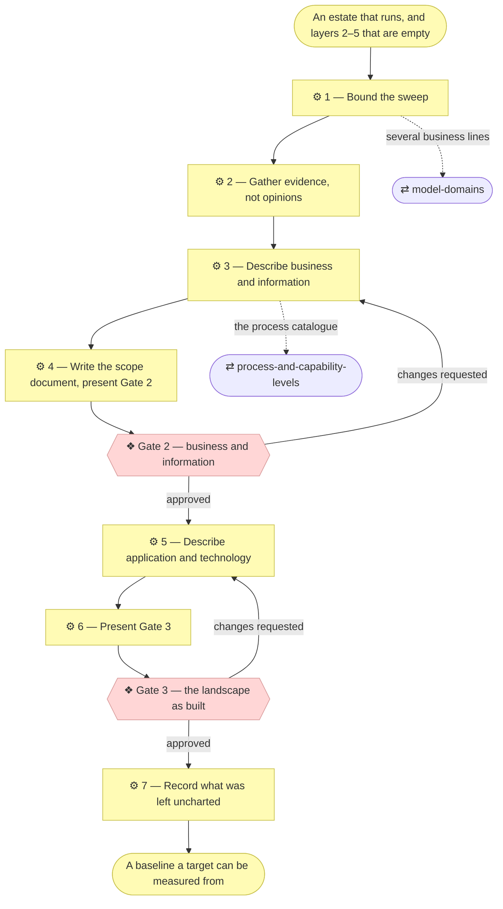

# ⚙ Discover the current landscape

**Discovery, not change.** The estate already runs. This skill describes it —
who does what, which information moves, what software and infrastructure it
runs on — so that later changes have something to be judged against. Nothing
here designs, improves or rationalizes anything: the deliverable is a
described baseline, and the improvement is a separate initiative.

Every other route into layers 2–5 starts from a requirement. This one starts
from the estate, which is the only honest way to model an organization that
was there before the model was.

## ⊕ When to use this

| The situation | What it looks like |
| ------------- | ------------------ |
| The lower layers are empty | `1_strategy/` is filled and approved; `2_business/` through `5_technology/` hold their READMEs and no elements |
| An inherited landscape | The subject has processes, applications and infrastructure nobody wrote down, and the architect is new to it |
| A baseline is needed | The Requester wants a target state or a roadmap, and there is nothing to measure the distance from |
| A depth change exposed the gap | `establish-project` or a deepening initiative moved the subject from one application to an organization, and the estate around it was never described |

## ⊖ When not to

| The situation | Use instead |
| ------------- | ----------- |
| The strategy layer is unfilled or placeholder | `discover-strategy` first — a landscape with nothing to judge it against is an inventory, not an architecture |
| The subject is an organization with no canvases | `discover-business-model` first, then the strategy, then this |
| A requirement wants something changed | `align-change-through-layers` — that is an ordinary change, and it aligns the layers it touches |
| Nothing exists yet to sweep | Nothing. A greenfield subject fills its lower layers one initiative at a time, through the spine |
| The layers hold elements that have gone stale | `restate-current-state` — the model drifted, it was not missing |
| The sweep found several business lines with separate owners | `model-domains` — the split comes before the description, or the description is written twice |

## ⌖ Where this sits

Realizes `BPROC1.5`, the last process of establishing a model. It reuses
**Gate 2** and **Gate 3** rather than inventing gates of its own — what is
approved here is the same kind of thing the spine gets approved, and a
Requester should not have to learn a second vocabulary to confirm a
description of their own organization.

## ⚓ Invariants

- **Evidence or Pending — never plausibility.** Every element names where it
  was read from: a repository, a running system, an invoice, a named person's
  answer. An estate is exactly the subject where a confident guess is
  indistinguishable from a fact, and an application nobody could name the
  owner of is recorded as **"Pending — owner unknown"** rather than assigned
  to the team that probably has it. This is the
  `architecture-document-style` § Grounding rule doing the work it was written
  for.
- **What a sweep produces is a draft catalogue, and it says so on every
  document.** Elements gathered from a licence list and a Tuesday conversation
  are things somebody said exist, not an architecture anybody has agreed. Each
  document opens `◐ Draft catalogue` and its tables carry `Source` and `Notes`
  columns until the gate that validates them —
  `architecture-document-style` § Document status. A sweep that produces
  documents indistinguishable from approved layers has done the opposite of
  its job: it has made the model less trustworthy while appearing to fill it.
- **Describe what runs, not what should run.** The estate includes things
  nobody would design that way. They go in as they are, without commentary.
  Judgement about the gap between this and a sane target belongs to
  `plan-the-transition`, and mixing the two produces a document that is
  neither a baseline nor a plan.
- **Coverage is declared, never implied.** A sweep of an estate is never
  finished; it is stopped somewhere on purpose. What was left out is written
  down in the same document that says what was covered, so a reader can tell a
  boundary from an omission.
- **Breadth first, depth on pain.** Level 2 across the whole estate before
  level 3 anywhere, and level 3 only where the Requester names a pain that
  justifies it — `process-and-capability-levels` § Breadth first, depth on
  pain holds the rule, and this skill is its largest application.
- **Consolidate as you go.** Three applications that are one system with three
  names are one component. Two services differing only in the department that
  says them are one service. `document-style` § Consolidate before you
  enumerate holds the rules, and an estate sweep is where they are hardest to
  keep and most worth keeping.

## ⚙ Steps

### 1 — Bound the sweep

Before any element is written, agree with the Requester what is in the sweep
and what is not. An estate has no natural edge, so the edge is a decision,
and it is cheaper to make it now than to discover halfway through that two
weeks went into a subsidiary nobody meant to include.

Draft the boundary as a table and confirm it — legal entities, business
lines, geographies, acquired systems still running on their own contracts,
anything outsourced. Where the Requester is unsure, include it and mark the
uncertainty rather than silently dropping it.

**⚖ Judgement.** If the boundary conversation produces several business lines
with different customers, different economics and different approvers, stop
and hand to `model-domains`. Describing one estate that is really three
produces a model that has to be split later, and splitting a described model
costs more than splitting an empty one.

**→ Produces** the coverage declaration, as a draft table.

### 2 — Gather evidence, not opinions

Collect what already exists before asking anyone to remember anything. In an
organization that has run for years, most of layers 4 and 5 is already
written down somewhere nobody calls documentation.

| Where to look | What it yields |
| ------------- | -------------- |
| Repositories, their READMEs and their deploy configuration | Application components, artifacts, runtimes, and what talks to what |
| The invoice and licence list | Every SaaS application in the estate, including the ones IT does not know about |
| Identity provider and single sign-on entries | The same list again, from a different angle — the two rarely agree, and the disagreement is a finding |
| Runbooks, on-call rotas and incident history | Which components are load-bearing, and who owns them |
| Whatever the organization calls its process documentation | A first draft of layer 2, usually at the wrong level |
| Reports and dashboards people actually open | The business objects and data objects that matter, as opposed to the ones that exist |

Interviews come after this, and they are for what the evidence cannot answer:
ownership, intent, and which of two contradictory sources is the live one.

**Anything you are handed is filed before it is read.** A deck, a transcript,
an inventory spreadsheet, an architecture document from a previous attempt —
each goes into `architecture/reference/` under its dated name, with its row in
that folder's index, *then* gets read. Filing afterwards means filing what you
remembered to keep; the source that turns out to matter is usually the one
nobody expected to need again.

That folder is also what makes the rest of this skill honest. Every element
written in Step 3 or Step 5 names its source, and a source that is a document
has somewhere to point.

**← Needs** the boundary from Step 1.

**→ Produces** `architecture/reference/`, filled and indexed, and an evidence
list.

### 3 — Describe business and information

Fill `architecture/2_business/` and `architecture/3_information/` in their own
analysis order — who acts, what is offered, how it is delivered, what is
handled, then the vocabulary and rules; then the data objects behind the
business objects, where they live and how they move.

Two things are specific to a landscape sweep rather than a change:

**The process catalogue is the hard part, and it is levelled.** Hand to
`process-and-capability-levels` for the four macro categories, the level
definitions and the focus table. An estate sweep that skips this produces
either an org chart or a list of four hundred activities, and both are
unusable.

**Actors include the AI ones.** An organization that has been running for a
while has agents and assistants embedded in processes without anyone modeling
them as actors holding roles. Record each one with its autonomy level and
decision rights the way any other actor is recorded — this is the moment they
are most likely to be found, and the moment they are most likely to be missed.

Every element carries its `Source` — the reference document, or the person and
the conversation — and its `Notes`: two names that may be one thing, a figure
nobody could stand behind, a process nobody could describe the same way twice.
The notes are the most valuable thing a sweep produces, because they are what
the gate is actually for.

**← Needs** the evidence from Step 2.

**→ Produces** `architecture/2_business/` and `architecture/3_information/`,
each document opening `◐ Draft catalogue`.

### 4 — Write the scope document, present Gate 2

The sweep is a full initiative. Create the scope document with
`write-scope-document` before presenting anything, so the Requester approves
against a document rather than a conversation.

The alignment table records layers 2 and 3 as described and layers 4 and 5 as
in progress; layers 0 and 1 get an explicit "no change" verdict, because a
sweep that quietly rewrites the approved strategy is doing something other
than describing.

**❖ Gate 2 — business and information.** The Requester approves.

Present a compact summary — the boundary, the actor and service catalogues,
the process map at level 2, the data objects and where they live — with full
branch links to every document behind it
(`align-change-through-layers` § Show the Requester what they are approving).
Name the counts, and name what was consolidated into what: a Requester who
recognises their organization in forty elements will tell you so, and one who
does not will say which forty are wrong.

Record the approval in the Approvals table. **Then change the status line of
every document it covered from `◐` to `● Validated at Gate 2`, on that date,
and empty the `Notes` column** — each note is now a fact that goes into the
model, a question that goes into the open-questions log, or something nobody
cared about. `Source` stays; provenance does not expire.

If changes are requested, revise from Step 3 and present again — the documents
stay `◐` until they are actually approved, and moving a status line early is
the one edit in this skill that would make the model lie.

**← Needs** the layers from Step 3.

**→ Produces** `architecture/scope/<n>_*.md`, its row in the index, and the
Approvals table's Gate 2 row.

### 5 — Describe application and technology

Fill `architecture/4_application/` and `architecture/5_technology/`, grounding
every component in the repository, tenant or server it actually is. A
component whose grounding cell cannot be filled is the finding, not the
failure: record it as **"Pending — not located"** and it becomes a row in the
gap register the next skill builds.

Keep the two layers honest about what they are describing. A component that
three teams each run their own copy of is three nodes and one component, and
saying so is most of the value an estate model has.

**← Needs** the evidence from Step 2, and Gate 2.

**→ Produces** `architecture/4_application/` and `architecture/5_technology/`,
each document opening `◐ Draft catalogue` until Step 6 grants Gate 3.

### 6 — Present Gate 3

**❖ Gate 3 — the landscape as built.** The Requester approves.

Unlike the spine, Gate 3 is **not optional here.** In an ordinary change Gate
3 asks whether a solution design should be reviewed before it is coded, and a
Requester may reasonably decline. Here it is the approval of a description of
their own estate — the layer they are least likely to have seen written down
and most likely to be able to correct. Declining it would leave the half of
the model that carries the most guesses unconfirmed.

Present the component and node catalogues, what each is grounded in, and — as
its own list — everything marked Pending, because that list is what the
Requester is uniquely able to resolve.

**← Needs** the layers from Step 5.

**→ Produces** the Approvals table's Gate 3 row.

### 7 — Record what was left uncharted

Turn the boundary from Step 1 into the durable coverage table, and put it in
the model rather than the scope document — a reader of `2_business/` needs to
know what the sweep did not reach, and a merged scope document is not where
they will look.

Each layer README gets a **Coverage** section saying how far the sweep went
and what it deliberately did not reach. The process catalogue gets the focus
table `process-and-capability-levels` § The focus table turns a partial model
into a deliberate one already prescribes, and the other layers get its
equivalent in prose.

Then name what comes next. A described baseline with no target is half a
sentence, so close by offering `plan-the-transition` — and say plainly that
the sweep found the estate, not the ambition.

**← Needs** the granted gates.

**→ Produces** a Coverage section in each swept layer's README.

## ⇄ Hands off to

| Skill | When | What comes back |
| ----- | ---- | --------------- |
| `model-domains` | Step 1 finds several business lines with separate owners | A domain split, after which each domain is swept on its own |
| `process-and-capability-levels` | Step 3, always, for the process catalogue | Levelled processes in four categories, with a focus table saying what was left at level 2 |
| `write-scope-document` | Step 4 | The initiative's record, and the Approvals table the gates are written in |
| `plan-the-transition` | Step 7, once the baseline is approved | A target state, a gap register and a sequence — the thing the baseline exists to make possible |
| `align-change-through-layers` | Afterwards, for every ordinary change | The spine, which now finds the lower layers populated instead of empty |

## ✎ Worked example

> A company approved its strategy layer a quarter ago and never filled
> anything below it. Step 1 bounds the sweep to the operating company and
> excludes a recently acquired subsidiary still on its own contracts, which is
> written down rather than assumed. Step 2's licence list yields nineteen SaaS
> applications; the identity provider yields twenty-three, and the four-way
> difference turns out to be three abandoned tools and one nobody in IT had
> heard of. Gate 3 is where the Requester recognises that last one as a
> department's own purchase, names its owner, and turns a Pending row into a
> grounded element. The sweep closes with a Coverage section saying the
> subsidiary is out, and hands to `plan-the-transition`.

## ⚠ Anti-patterns

- **Writing down a reading of a person.** A transcript summary records
  decisions, constraints, numbers and names — never who seemed frustrated or
  whose team is difficult. A repository keeps a sentence long after anyone can
  correct it. See `architecture-document-style` § A summary of a meeting
  records facts, not judgements.

- Inventing a requirement so that the spine has something to align, when what
  is actually wanted is a description of what exists.
- Recording the org chart as the process catalogue. Departments are not
  processes, and an estate model that confuses them cannot survive a
  reorganization.
- Fixing the estate while describing it — rationalizing duplicate systems,
  renaming things to what they should have been called, quietly leaving out
  the embarrassing parts.
- Handing over documents that look like approved architecture and are a list
  of things three people mentioned.
- Reading a document somebody sent and not filing it, so the model's only
  record of where a claim came from is that an agent once read something.
- Assigning an owner to an application because some team probably has it.
- Sweeping until the questions run out, rather than to the boundary that was
  agreed.
- Level 3 everywhere, because the evidence happened to be detailed there.
- Treating Gate 3 as optional because the spine does.

## ☑ Done when

- The boundary is written down, and every layer README swept carries a
  Coverage section saying what was not reached.
- Every element names what it was read from, or is marked Pending with what is
  missing, and every document handed over carries a source in
  `architecture/reference/` or names the conversation instead.
- Every document opened `◐ Draft catalogue` and now says `●` with the gate and
  the date it was granted, with `Notes` emptied and `Source` kept.
- The process catalogue is levelled, with a focus table.
- AI actors found in the estate are modeled as actors holding roles, with
  autonomy levels and decision rights.
- The scope document's alignment table covers every layer, and its Approvals
  table records Gate 2 and Gate 3 as granted, with what was shown.
- Everything still Pending is listed in one place the Requester can work
  through.
- `plan-the-transition` has been named and offered as the next initiative.
