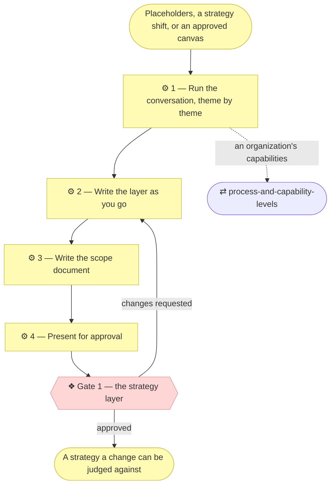

# ⚙ Discover the strategy

When this skill applies, **the entire initiative is discovery**: no code, no
application design, no stack decisions. The deliverables are the strategy
layer, the key business elements it implies, and a scope document recording
**Gate 1**. Whatever request triggered the discovery follows as a separate
initiative, which re-enters `align-change-through-layers` and finds the
strategy filled in and current.

## ⊕ When to use this

| The situation | What it looks like |
| ------------- | ------------------ |
| Placeholders | `architecture/1_strategy/` still holds template text — the project's first real initiative |
| The change shifts strategy | It adds or modifies a Stakeholder, Driver, Goal or Principle, or reshapes the value stream |
| Handed over from the canvases | `discover-business-model` granted Gate 0, and the strategy is derived from what it approved |

## ⊖ When not to

| The situation | Use instead |
| ------------- | ----------- |
| The subject is an organization and no canvases exist | `discover-business-model` first — a company's strategy is a consequence of its business model |
| The strategy is filled in and the change serves it | `align-change-through-layers` — this is an ordinary change |

## ⌖ Where this sits

Realizes `BPROC1.3`, and owns **Gate 1** — the approval every later
initiative is judged against.

## ⚓ Invariants

- **Ask, don't assume.** Every element comes from a Requester answer, an
  existing document, or observable fact — never from what a project like this
  "usually" wants. What cannot be answered yet is marked **"Pending — future
  initiative"** or logged as an open question with the interpretation adopted.
- **Small batches, one theme at a time.** Three to five questions per round in
  the Requester's business language, not ArchiMate vocabulary — "who would be
  upset if this didn't exist?" beats "enumerate your stakeholders".
- **Consolidate as you go.** Goals differing only in wording are one goal; a
  capability named twice at different granularity is one capability. A
  strategy layer with six load-bearing goals is worth more than one with
  twenty, because every later initiative gets checked against it and nobody
  checks against twenty. `architecture-document-style` § Consolidate before you
  enumerate holds the rules.
- **Revision, not amnesia.** Where the layer already has real content, start
  from it: confirm what still holds, and focus on what the new requirement
  bends.
- **Derive, don't re-ask.** Where the canvases are filled, the Requester has
  already answered most of themes 1, 2, 4 and 5 in business language and had
  them approved at Gate 0. Start each theme from the blocks it derives from,
  draft the elements, and ask only what the canvases leave genuinely open.
  Re-asking a question already answered on an approved canvas is how a gated
  process loses trust. Note the source block on each derived element.

## ⚙ Steps

### 1 — Run the conversation, theme by theme

The order matches the strategy layer's own analysis order: who wants what and
why, then what the project must be able to do, then how value flows — and only
then the key business elements underneath.

| # | Theme | Document | The questions that open it |
| - | ----- | -------- | -------------------------- |
| 1 | **Stakeholders and drivers** | `1_motivation.md` | Who cares whether this exists — users, owners, payers, regulators? What pressures them: cost, time, risk, obligation, opportunity? Who can veto, or must sign off? |
| 2 | **Goals and outcomes** | `1_motivation.md` | What must become true for this to be worth building? How would the Requester recognise success — what observable outcome, by when? What is explicitly *not* a goal? |
| 3 | **Principles** | `1_motivation.md` | What must always, or never, be true regardless of feature? Few, load-bearing, testable — "role determines access", not "be secure" |
| 4 | **Capabilities and resources** | `2_capabilities-and-resources.md` | What must the project be able to do to reach those goals? With what — people, systems, data, budget — and what is missing today? |
| 5 | **Value stream** | `3_value-stream.md` | From the first stakeholder need to value delivered, what are the stages? Which capability serves each stage? |
| 6 | **Key business elements** | `architecture/2_business/` | Who are the actors and roles — and is any role performed or assisted by an AI, at what autonomy level and decision rights? What core services are offered, what main business objects are handled, and which terms and rules came up repeatedly? |

**⚖ Judgement.** Two themes behave differently depending on the subject.

**Theme 3 has no canvas source.** Principles are discovered directly with the
Requester on both tracks, so ask these questions even where the canvases are
filled and every other theme is being derived.

**Theme 4, on an organization, runs through `process-and-capability-levels`.**
Capabilities are levelled, seeded from a named industry reference as a
proposal the Requester confirms, and detailed below level 2 only where a pain
justifies it. Asking an organization to recall its capabilities from a blank
page is the version of this theme that produces an org chart.

Theme 6 discovers the **key** business elements — enough for the strategy to
be judged coherent and for Gate 1 to mean something. Full business and
information alignment still happens per initiative.

**→ Produces** the answers, theme by theme.

### 2 — Write the layer as you go

Update the affected documents after each round and reflect a short summary
back, so a misunderstanding surfaces immediately. The documents are the record
of the conversation, not a transcript kept elsewhere.

**← Needs** the answers from Step 1.

**→ Produces** `architecture/1_strategy/`, and the key elements in
`architecture/2_business/`.

### 3 — Write the scope document

Discovery is a full initiative, not a detour. Create it with
`write-scope-document` **before** presenting Gate 1, so the Requester approves
against a concrete document.

The alignment table records the impact on layers 1–2 with an explicit "not
started" verdict for the rest. The Approvals table carries a Gate 1 row, plus
`N/A` rows for Gate 2 and Gate 3 always — and for Gate 0 unless
`discover-business-model` handed over, in which case it is already recorded.

**→ Produces** `architecture/scope/<n>_*.md`, and its row in the index.

### 4 — Present for approval

**❖ Gate 1 — the strategy layer.** The Requester approves.

Present one compact summary — stakeholders, drivers, goals, principles, value
stream, key business elements — with **full branch links to each document
behind it** (`align-change-through-layers` § Show the Requester what they are
approving), and ask explicitly for approval of the strategy.

Record the approval in the Approvals table: who, when, what was shown. Only
after Gate 1 is granted may an implementation initiative build on this
strategy. If changes are requested, revise from Step 2 and present again.

**← Needs** the strategy layer, the scope document.

**→ Produces** the Approvals table's Gate 1 row.

## ⇄ Hands off to

| Skill | When | What comes back |
| ----- | ---- | --------------- |
| `process-and-capability-levels` | Theme 4, on an organization | Levelled capabilities seeded from a named reference model, detailed below level 2 only where a pain justifies it |
| `align-change-through-layers` | Gate 1 is granted, and the original request is still unbuilt | The implementation initiative, which now finds the strategy current |

## ✎ Worked example

> A project created from the scaffold gets its first feature request. Step 1c
> of the spine finds placeholders, so the initiative becomes discovery. Theme
> 2 yields eleven goals; consolidation leaves six, and the Gate 1 summary says
> so. Gate 1 is granted against branch links to three documents — and the
> feature that triggered all this is then opened as its own initiative, which
> is the thing the closing step has to say out loud.

## ⚠ Anti-patterns

- Filling an element from what a project like this usually wants.
- Re-asking a question the Requester already answered on an approved canvas.
- Twenty goals, because nobody checks a change against twenty.
- Writing principles that cannot be tested — "be secure" rather than "role
  determines access".
- Building an implementation on a strategy whose Gate 1 has not been granted.

## ☑ Done when

- `architecture/1_strategy/` holds no template placeholders.
- Every element names what realizes it, or is marked "Pending — future initiative".
- Derived elements note the canvas block they came from.
- The scope document's alignment table covers every layer, and its Approvals
  table has a row for every gate — granted or `N/A` with a reason.
- Open questions are logged for everything adopted but unconfirmed.
- The request that triggered discovery has been named, and offered as the next initiative.
