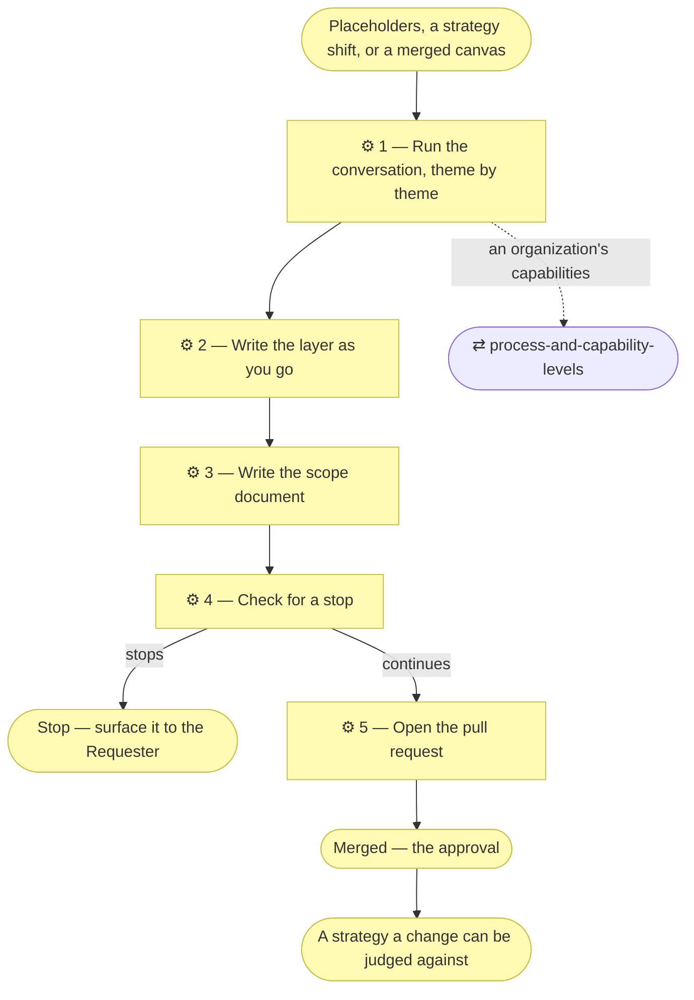

# ⚙ Discover the strategy

When this skill applies, **the entire initiative is discovery**: no code, no
application design, no stack decisions. The deliverables are the strategy
layer, the key business elements it implies, and a scope document — built
directly and opened as a pull request whose merge is the approval. The
request that triggered it follows as a separate initiative through
`align-change-through-layers`.

## ⊕ When to use this

| The situation | What it looks like |
| ------------- | ------------------ |
| Missing or placeholder | `architecture/1_strategy/` does not exist yet, or still holds template text — the project's first real initiative |
| The change shifts strategy | It adds or modifies a Stakeholder, Driver, Goal or Principle, or reshapes the value stream |
| Handed over from the canvases | `discover-business-model`'s pull request has merged, and the strategy is derived from what it merged |

## ⊖ When not to

| The situation | Use instead |
| ------------- | ----------- |
| The subject is an organization and no canvases exist | `discover-business-model` first — a company's strategy is a consequence of its business model |
| The strategy is filled in and the change serves it | `align-change-through-layers` — this is an ordinary change |

## ⌖ Where this sits

Realizes `BPROC1.3`. It builds the strategy layer directly from the
Requester's answers, checks for a stop, and opens it as a pull request — its
merge is the approval.

## ⚓ Invariants

- **An element comes from a Requester answer, an existing document, or an
  observable fact.** What no source settles is the agent's call — adopted,
  applied, and recorded with its `Source` cell reading `adopted — <the call>`
  (`align-change-through-layers` § Ask only what blocks the work now). What
  nobody can answer yet is marked **"Pending — future initiative"**.
- **One theme at a time, in the Requester's business language, not ArchiMate
  vocabulary** — "who would be upset if this didn't exist?" beats "enumerate
  your stakeholders".
- **Consolidate as you go.** Goals differing only in wording are one goal; a
  capability named twice at different granularity is one capability.
  `document-style` § Consolidate before you enumerate holds the rules.
- **Revision, not amnesia.** Where the layer already has real content, start
  from it: confirm what still holds, and focus on what the new requirement
  bends.
- **Derive, don't re-ask.** Where the canvases are filled, the Requester has
  already answered most of themes 1, 2, 4 and 5 and had them approved when
  `discover-business-model`'s pull request merged. Start each theme from the
  blocks it derives from, draft the elements, and ask only what the canvases
  leave genuinely open. Note the source block on each derived element.

## ⚙ Steps

### 1 — Run the conversation, theme by theme

Themes run in order: who wants what and why, then what the project must be able
to do, then how value flows, then the key business elements underneath.

| # | Theme | Document | The questions that open it |
| - | ----- | -------- | -------------------------- |
| 1 | **Stakeholders and drivers** | `1_motivation.md` | Who cares whether this exists — users, owners, payers, regulators? What pressures them: cost, time, risk, obligation, opportunity? Who can veto, or must sign off? |
| 2 | **Goals and outcomes** | `1_motivation.md` | What must become true for this to be worth building? How would the Requester recognise success — what observable outcome, by when? What is explicitly *not* a goal? |
| 3 | **Principles** | `1_motivation.md` | What must always, or never, be true regardless of feature? Few, load-bearing, testable — "role determines access", not "be secure" |
| 4 | **Capabilities and resources** | `2_capabilities-and-resources.md` | What must the project be able to do to reach those goals? With what — people, systems, data, budget — and what is missing today? |
| 5 | **Value stream** | `3_value-stream.md` | From the first stakeholder need to value delivered, what are the stages? Which capability serves each stage? |
| 6 | **Key business elements** | `architecture/2_business/` | Who are the actors and roles — and is any role performed or assisted by an AI, at what autonomy level and decision rights? What core services are offered, what main business objects are handled, and which terms and rules came up repeatedly? |

**⚖ Judgement. Theme 3 has no canvas source.** Principles are discovered directly with the
Requester on both tracks, so ask these questions even where the canvases are
filled and every other theme is being derived.

**Theme 4, on an organization, runs through `process-and-capability-levels`.**
Capabilities are levelled, seeded from a named industry reference as a proposal
the Requester confirms, and detailed below level 2 only where a pain justifies
it.

**The capability areas are the subject's own.** An organization that builds a
product will recite the product's abilities, and those belong in the product's
model, not here. Take one area per key activity on the canvas; if an area reads
true with the product's name substituted for the organization's, it is the
product's.

Theme 6 discovers the **key** business elements — enough for the strategy to be
judged coherent. Full alignment still happens per initiative.

**→ Produces** the answers, theme by theme.

### 2 — Write the layer as you go

Update the affected documents after each round and reflect a short summary
back, so a misunderstanding surfaces immediately.

**← Needs** the answers from Step 1.

A folder that does not exist yet is created now, from the plugin's assets:
`assets/layers/1_strategy/` gives the layer its README, the first business
elements `assets/layers/2_business/`, the first filed source
`assets/layers/reference/`.

Each document opens `◐ Draft catalogue` and its tables carry `Source` and
`Notes` until this initiative's pull request merges —
`architecture-document-style` § Document status. Where the Requester provided
anything to work from, it is filed in `architecture/reference/` and the
`Source` column points there.

**Render the relationships as each theme settles.** A catalogue records the
whole inventory; a diagram selects the relationships that explain the
strategy. Declare each relationship in a catalogue column or
`architecture/relationships.md`, then draw its projection in the section that
defines its source. At minimum, assess these views:

| Theme | View that commonly earns its place |
| ----- | ---------------------------------- |
| Stakeholders, drivers, goals, outcomes | A selected influence chain showing why the strategy exists |
| Capabilities and resources | The capability or resource chain that explains how a goal is achieved, especially a boundary or dependency a table hides |
| Value stream | The end-to-end stage flow, including any feedback loop |
| Key business elements | Actors assigned to roles, services serving external roles, or the contract/product boundary |

Do not draw a catalogue as a picture. A view earns its place only when it
shows convergence, a boundary, a sequence, or another relationship the table
cannot make as clear. `architecture-document-style` § Document skeleton and
[the Mermaid notation reference](../architecture-document-style/references/archimate-on-mermaid.md)
govern placement and notation.

**→ Produces** `architecture/1_strategy/`, and the key elements in
`architecture/2_business/`.

### 3 — Write the scope document

Create it with `write-scope-document` **before** opening the pull request, so
what merges is written down first.

The alignment table records the impact on layers 1–2 with an explicit "not
started" verdict for the rest. This is its own initiative's scope document,
next-numbered — not a second row added to `discover-business-model`'s.

**→ Produces** `architecture/scope/<n>_*.md`, and its row in the index.

### 4 — Check for a stop

Before opening the pull request, check the three stops in
`align-change-through-layers` § Where this stops: does anything here
contradict a Principle or a decision already written down? Do two readings of
the request lead to different work? Would this commit the Requester to spend,
public exposure, publishing the model, or a direction they have not agreed?
If none fire, continue directly — nothing here is presented for approval
first.

**← Needs** the strategy layer, the scope document.

**→ Produces** a stated verdict: continue, or the named stop.

### 5 — Open the pull request

Use `write-pr-description`. Present one compact summary — stakeholders,
drivers, goals, principles, value stream, key business elements — with **full
branch links to each document behind it** (`align-change-through-layers` §
Where this stops — the same link hygiene applies to anything put in front of
the Requester, not only a stop).

Its merge is what promotes every document it covers
(`architecture-document-style` § Document status). Only after this pull
request has merged may an implementation initiative build on this strategy.

**← Needs** the continue verdict from Step 4.

**→ Produces** a pull request a Reviewer can judge.

## ⇄ Hands off to

Each is a file beside this one — `${CLAUDE_SKILL_DIR}/../<skill>/SKILL.md`
— read when it applies, never assumed loaded.

| Skill | When | What comes back |
| ----- | ---- | --------------- |
| `process-and-capability-levels` | Theme 4, on an organization | Levelled capabilities seeded from a named reference model, detailed below level 2 only where a pain justifies it |
| `discover-current-landscape` | This pull request has merged and the subject already runs — an organization with processes, applications and infrastructure nobody has written down | A described baseline in layers 2–5, which is what a later change is actually aligned against |
| `align-change-through-layers` | This pull request has merged, and the original request is still unbuilt | The implementation initiative, which now finds the strategy current |

## ✎ Worked example

> A project created from the scaffold gets its first feature request. Step 1c of
> the spine finds placeholders, so the initiative becomes discovery. Theme 2
> yields eleven goals; consolidation leaves six, and the pull-request
> description says so. It merges against branch links to three documents, and
> the feature that triggered it is opened as its own initiative.

## ⚠ Anti-patterns

- **Writing down a reading of a person.** A transcript summary records
  decisions, constraints, numbers and names, never who seemed frustrated
  (`architecture-document-style` § A summary of a meeting records facts, not
  judgements).
- Filling an element from what a project like this usually wants.
- Re-asking a question the Requester already answered on a merged canvas.
- Twenty goals, because nobody checks a change against twenty.
- Writing principles that cannot be tested — "be secure" rather than "role
  determines access".
- Building an implementation on a strategy whose pull request has not merged.

## ☑ Done when

- `architecture/1_strategy/` exists and holds no template placeholders.
- Every element names what realizes it, or is marked "Pending — future initiative".
- Derived elements note the canvas block they came from.
- The scope document's alignment table covers every layer.
- No stop was silently absorbed; each one that fired was named in the pull
  request.
- Every call the agent adopted is recorded where it applies, still marked `◐`.
- The request that triggered discovery has been named, and offered as the next initiative.
