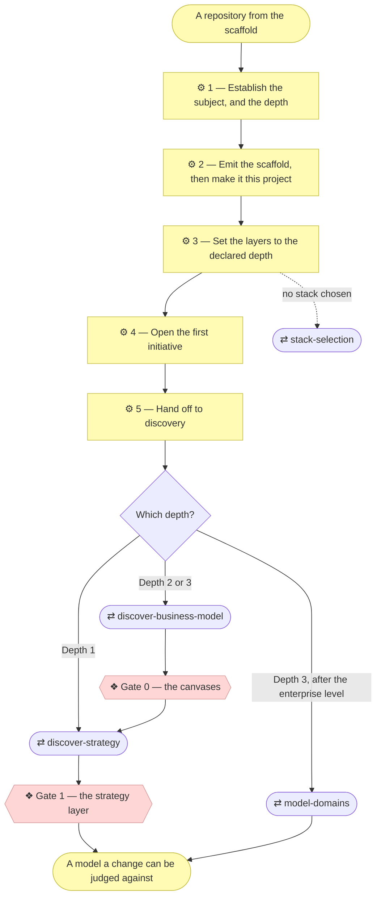

# ⚙ Establish a project

The bridge between an installed method and a modeled project: emit the
scaffold, turn it into *this* project, declare how deeply the project intends
to model itself, and hand off to discovery. Everything after that is the
ordinary `align-change-through-layers` process — there is no separate
"template mode" to graduate out of.

## ⊕ When to use this

| The situation | What it looks like |
| ------------- | ------------------ |
| No model yet | The project has the method available but no `architecture/` folder |
| Untouched scaffold | `CLAUDE.md` or `README.md` still contain `<placeholder>` markers |
| Empty model | `architecture/` holds only layer READMEs and no elements |
| Said out loud | The user just installed the plugin, cloned or generated the repository, and wants to start |

## ⊖ When not to

| The situation | Use instead |
| ------------- | ----------- |
| `CLAUDE.md` already declares a modeling depth | `align-change-through-layers` — the project is bootstrapped |
| The request changes an existing model | `align-change-through-layers` |

## ⌖ Where this sits

Realizes `BPROC1.1`. It carries **no gate of its own** — bootstrapping writes
into a project where nothing was ever approved, so there is nothing to approve
against. The first approval belongs to the discovery this hands off to.

The numbered boxes are this skill's steps, and the unfilled ones are the other
skills it reaches. Both gates belong to those, not to this: where bootstrap
ends is the thing readers most often get wrong.

## ⚓ Invariants

Hold at every step below.

- **Run this before anything else on a fresh project.** An agent that skips
  straight to `align-change-through-layers` finds placeholder strategy,
  triggers discovery, and produces a strategy layer for a project with no
  name, no declared language and no declared depth.
- **Ask, don't infer.** The two questions in Step 1 are answered by the
  Requester in their own words, never guessed from the repository.
- **The scaffold is the only thing that lands.** The method stays where the
  plugin installed it, which is why there is nothing of archreator's to delete
  afterwards.

## ⚙ Steps

### 1 — Establish the subject, and the depth

Ask two questions. **What is this project?** — one or two sentences in the
Requester's own words. **Is the subject an application or an organization?** —
something being built, or the way a business works?

**⚖ Judgement.** Pick the depth from the answers:

| The Requester describes | Depth |
| ----------------------- | ----- |
| An app, a tool, a site, a service they're building | **1 — Application** |
| A company, a department, or a service line whose way of working is the deliverable | **2 — Organization** |
| Several business lines that need to be understood separately | **3 — Enterprise** |

Depth is about the subject, not the effort — a large application is still
Depth 1. *When in doubt, go shallower:* deepening is a normal initiative,
while unwinding an over-modeled project throws away documents the Requester
already approved.

**Then say it out loud, with the reason and the exit.** Never pick silently. A
Requester who is told can correct you in one sentence; a Requester who is told
nothing finds out three initiatives later.

**→ Produces** the declared depth and the project description, both carried
into every step below.

### 2 — Emit the scaffold, then make it this project

Copy the scaffold whole from `scaffold/` in the plugin into the project root.
It holds `CLAUDE.md`, `README.md`, `CONTRIBUTING.md`, `architecture/` — with
`scope/` and `decisions/` inside it — and `scripts/`, the two validators with
their own README.

Then, in one pass, so the first commit is coherent:

| File | Fill in |
| ---- | ------- |
| `CLAUDE.md` | The real name and description, the layout, the commands, and the **declared depth** — `align-change-through-layers` Step 1a reads it on every later change. This is the agent entry point; placeholders left here are what make later sessions guess |
| `README.md` | The project's own front door, not archreator's with names swapped |
| `CONTRIBUTING.md` | Leave § Development workflow as its TEMPLATE comment until a stack exists, rather than inventing commands |
| Documentation language | Decide once, record it in `CLAUDE.md`. If it is not English, `document-style` sets the rule and `architecture-document-style` requires a stereotype-correspondence table in `architecture/README.md` |

**⚖ Judgement.** The optional files are a decision, not a default:

| File | Keep it when | Otherwise |
| ---- | ------------ | --------- |
| `architecture/scope/open-questions.md` | A stakeholder cannot be consulted synchronously | Delete — it can come back later |
| `architecture/decisions/` | The project will make enough architecture-significant calls to justify a log | Delete — it can come back later |

**← Needs** the declared depth, the project description.

**→ Produces** `CLAUDE.md`, `README.md`, `CONTRIBUTING.md`, `architecture/`, `scripts/`.

### 3 — Set the layers to the declared depth

All six layer folders stay, at every depth. What changes is their **declared
state**: a layer the project is not filling in yet gets "not started" in its
README table, not a deletion. An unfilled layer is a known gap; a missing
folder is an unknown one.

| Depth | `0_business-design/` | `domains/` |
| ----- | -------------------- | ---------- |
| **1 — Application** | Empty, and said so | Empty, and said so |
| **2 — Organization** | Filled by discovery | Empty |
| **3 — Enterprise** | Filled by discovery | One per business line, after the enterprise level is modeled |

If no stack is chosen yet and this is a small application, use
`stack-selection` rather than re-deriving one, and record the choice in
`architecture/5_technology/1_technology-services.md`.

**← Needs** the declared depth.

**→ Produces** `architecture/`.

### 4 — Open the first initiative

Create scope document `1_*.md` in `architecture/scope/` with
`write-scope-document`, and index it in `architecture/scope/README.md`.
Discovery is a full initiative, and this is the project's first — which is why
the index is not empty on day one.

**← Needs** the project description.

**→ Produces** `architecture/scope/1_*.md`, and its row in the index.

### 5 — Hand off to discovery

Bootstrap does not write the strategy; discovery does, with the Requester,
against gates. Then close the loop: the request that started all this — "build
me X" — is still unbuilt. Say so, and offer to open it as the next initiative.

**← Needs** the declared depth, the first scope document.

## ⇄ Hands off to

| Skill | When | What comes back |
| ----- | ---- | --------------- |
| `discover-strategy` | Depth 1 | Stakeholders, drivers, goals and the Principles that gate every later change, approved at **Gate 1** |
| `discover-business-model` | Depth 2 or 3 | The canvases, approved at **Gate 0** before anything is derived from them; `discover-strategy` then derives the strategy layer |
| `model-domains` | Depth 3, after the enterprise level | One charter per business line, with its exposed and consumed services |
| `stack-selection` | No stack chosen, small application | A recorded choice in `5_technology/` |

## ✎ Worked example

> **"I want to build a small tool that reformats our export files."**
>
> Depth 1, announced as: *"You're building one application, so I'll treat this
> as Depth 1 — a light strategy layer (goals and principles, enough to judge
> changes against), no business-model canvases, and one approval gate before
> code. If this turns into modelling how the business works, say so and we'll
> deepen it — that's a normal change, not a restart."*
>
> Then hand off to `discover-strategy`. The Requester could have corrected the
> depth in one sentence, and the tool itself is still unbuilt — which Step 5
> says out loud rather than leaving them to notice.

## ⚠ Anti-patterns

- Inferring the subject or the depth from the repository instead of asking.
- Picking a depth without saying which, why, and how to change it later.
- Writing the strategy here. Bootstrap hands off to discovery, which does it
  with the Requester against gates.
- Deleting a layer folder the project is not filling in yet, rather than
  marking it "not started".
- Leaving the Requester's original request unmentioned once discovery
  finishes, so a docs-only PR reads as the process having failed to build
  anything.

## ☑ Done when

- `CLAUDE.md` and `README.md` contain no `<placeholder>` markers, and
  `CLAUDE.md` declares the modeling depth.
- The documentation language is decided and recorded.
- The scaffold has been copied out of the plugin's `scaffold/`, and the
  optional files are kept or deleted deliberately.
- Every layer README's table says either what exists or "not started".
- Scope document `1_*.md` exists and is indexed.
- `python3 scripts/check_links.py` and `python3 scripts/check_model.py` both
  pass. They came with the scaffold, so every project has them from its first
  commit.
