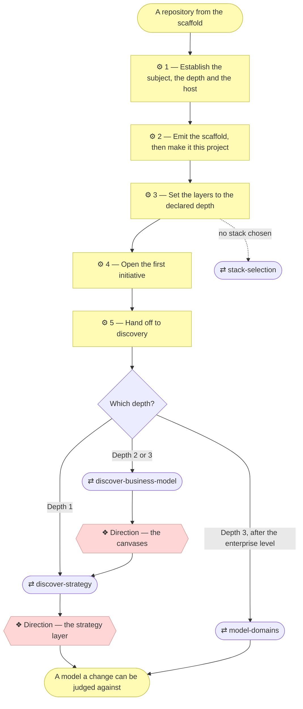

# ⚙ Establish a project

The bridge between an installed method and a modeled project: emit the
scaffold, turn it into *this* project, declare how deeply the project intends
to model itself, say where it lives, and hand off to discovery. Everything after that is the
ordinary `align-change-through-layers` process — there is no separate
"template mode" to graduate out of.

## ⊕ When to use this

| The situation | What it looks like |
| ------------- | ------------------ |
| No model yet | The project has the method available but no `architecture/` folder |
| Untouched scaffold | `AGENTS.md` or `README.md` still contain `<placeholder>` markers |
| Empty model | `architecture/` holds only layer READMEs and no elements |
| Said out loud | The user just installed the plugin, cloned or generated the repository, and wants to start |

## ⊖ When not to

| The situation | Use instead |
| ------------- | ----------- |
| `AGENTS.md` already declares a modeling depth | `align-change-through-layers` — the project is bootstrapped |
| The request changes an existing model | `align-change-through-layers` |

## ⌖ Where this sits

Realizes `BPROC1.1`. It carries **no gate of its own** — bootstrapping writes
into a project where nothing was ever approved, so there is nothing to approve
against. The first approval belongs to the discovery this hands off to.



The numbered boxes are this skill's steps, and the unfilled ones are the other
skills it reaches. Both gates belong to those, not to this: where bootstrap
ends is the thing readers most often get wrong.

## ⚓ Invariants

Hold at every step below.

- **Run this before anything else on a fresh project.** An agent that skips
  straight to `align-change-through-layers` finds placeholder strategy,
  triggers discovery, and produces a strategy layer for a project with no
  name, no declared language and no declared depth.
- **Ask, don't infer.** The three questions in Step 1 are answered by the
  Requester in their own words, never guessed from the repository. The third
  is the one most often guessed wrong: a repository with no remote yet, or one
  generated from a template, tells you nothing reliable about where the
  project will actually live.
- **The scaffold is the only thing that lands.** The method stays where the
  plugin installed it, which is why there is nothing of archreator's to delete
  afterwards.

## ⚙ Steps

### 1 — Establish the subject, the depth and the host

Ask three questions. **What is this project?** — one or two sentences in the
Requester's own words. **Is the subject an application or an organization?** —
something being built, or the way a business works? **Where does this project
live?** — which repository host, and is it public or private?

**⚖ Judgement.** Pick the depth from the answers:

| The Requester describes | Depth |
| ----------------------- | ----- |
| An app, a tool, a site, a service they're building | **1 — Application** |
| A company, a department, or a service line whose way of working is the deliverable | **2 — Organization** |
| Several business lines that need to be understood separately | **3 — Enterprise** |

Depth is about the subject, not the effort — a large application is still
Depth 1. *When in doubt, go shallower:* deepening is a normal initiative,
while unwinding an over-modeled project throws away documents the Requester
already approved.

**Then say it out loud, with the reason and the exit.** Never pick silently. A
Requester who is told can correct you in one sentence; a Requester who is told
nothing finds out three initiatives later.

**⚖ Judgement.** The third answer decides what the scaffold's GitHub-shaped
files are for, and nothing else. It is not a question about tooling
preference:

| The answer | What it activates |
| ---------- | ----------------- |
| A **public** GitHub repository | Both workflows, and the comment wiring in `mkdocs.yml` |
| Any **other** GitHub repository | The checks workflow. Publishing needs Pages, which the free plan does not offer a private repository, and on the plans that do, publishing a private model is a disclosure decision rather than a default |
| **Anything else**, or not decided yet | Nothing. `build_docs.py` writes a folder and where it goes is the organization's call, exactly as for a project that never answered |

*When the answer is unclear, take the last row.* An unactivated workflow is
one `git mv` away; a pipeline that publishes a model nobody agreed to publish
is not undoable.

**→ Produces** the declared depth, the project description and the recorded
host, all carried into every step below.

### 2 — Emit the scaffold, then make it this project

Copy the scaffold whole from `scaffold/` in the plugin into the project root.
It holds `AGENTS.md`, `README.md`, `CONTRIBUTING.md`, `.gitignore`,
`architecture/` — with `scope/`, `decisions/`, `6_transition/` and `reference/`
inside it — and `scripts/`, the two validators and the five tools with their
own README. It also holds
`mkdocs.yml` and `overrides/`, which render the model as a website, and
`.github/`, which carries the pull-request template a change is described in,
the issue form a reader of that website raises a question through, and
`workflows-available/` — two workflow files that do not run where they sit,
because the automation host reads `.github/workflows/` and nothing else. `CLAUDE.md`
and `GEMINI.md` come with it too, each holding nothing but an `@AGENTS.md`
import so the host that reads only its own filename still finds the entry
point. Copy them as they are and leave them alone; content in one of them is
content the other hosts never see.

**Copy the dotfiles too.** `.gitignore` is the one the project cannot do
without: it keeps bytecode, machine-local settings and everything regenerated —
the projection and the published copy — out of the history. `.github/` is the
other one a glob copy drops silently, which is only noticed later, in a commit
that should not have contained what it did.

Then, in one pass, so the first commit is coherent:

| File | Fill in |
| ---- | ------- |
| `AGENTS.md` | The real name and description, the layout, the commands, and the **declared depth** — `align-change-through-layers` Step 1a reads it on every later change. This is the agent entry point, whichever host is running; placeholders left here are what make later sessions guess |
| `README.md` | The project's own front door, not archreator's with names swapped |
| `CONTRIBUTING.md` | Leave § Development workflow as its TEMPLATE comment until a stack exists, rather than inventing commands |
| `mkdocs.yml` | The site name, the description, the repository URL — so every published page carries a link back to the file that produced it — and `theme.language` when the project documents in something other than English. Translate the `extra.diagram_zoom` labels in that case too; the viewer is part of the page, while the Markdown remains unchanged. Left as it ships, the portal still builds — without the repository links. On a **public** repository the `extra.giscus` values belong here too, which is what turns the comment box on; anywhere else leave them unset, and the "Discuss this page" link in `overrides/main.html` is what a reader gets instead |
| `architecture/5_technology/2_deployment.md` | § Where this project lives, from Step 1's third answer. This is the one place a later change reads instead of asking again. Leave the rest of the document as its TEMPLATE comments until the layer is first assessed |
| `overrides/main.html`, `.github/` | Only on a non-GitHub host: the question link builds a GitHub `issues/new` URL, so remove it with the form it points at |
| Documentation language | Decide once, record it in `AGENTS.md`. If it is not English, `document-style` sets the rule and `architecture-document-style` requires a stereotype-correspondence table in `architecture/README.md` |

**⚖ Judgement.** The optional files are a decision, not a default:

| File | Keep it when | Otherwise |
| ---- | ------------ | --------- |
| `architecture/scope/open-questions.md` | A stakeholder cannot be consulted synchronously | Delete — it can come back later |
| `architecture/decisions/` | The project will make enough architecture-significant calls to justify a log | Delete — it can come back later |
| `.github/` | The project is on GitHub | Delete the directory whole. The template, the form and both workflows are GitHub-shaped; the model, the validators and the portal are not |

**Then activate what Step 1's third answer selected**, by moving it — never by
writing a new file:

```bash
mkdir -p .github/workflows
git mv .github/workflows-available/checks.yml .github/workflows/
```

| The answer | Move to `.github/workflows/` | Delete |
| ---------- | ---------------------------- | ------ |
| Public GitHub repository | `checks.yml`, `publish-docs.yml` | — |
| Other GitHub repository | `checks.yml` | `publish-docs.yml` |
| Not GitHub, or undecided | — | `.github/` whole |

`.github/workflows-available/` is empty by the end of bootstrap either way, so
delete it and its README. A directory of files that look like they run, and do
not, is worse than no directory.

**Say what the publishing workflow needs before it works.** Pages has to be
switched on — Settings → Pages → Source: GitHub Actions — and until it is, the
deploy step fails. Do it in the same sitting, or leave `publish-docs.yml` out
and let the Requester add it when they mean to. A red first push teaches a team
that the checks are noise.

**← Needs** the declared depth, the project description.

**→ Produces** `AGENTS.md`, its `CLAUDE.md` and `GEMINI.md` imports, `README.md`, `CONTRIBUTING.md`, `.gitignore`, `architecture/` — including `5_technology/2_deployment.md` — `scripts/`, `mkdocs.yml`, `overrides/`, and `.github/` with whatever workflows the answer activated.

### 3 — Set the layers to the declared depth

All seven layer folders stay, at every depth. What changes is their **declared
state**: a layer the project is not filling in yet gets "not started" in its
README table, not a deletion. An unfilled layer is a known gap; a missing
folder is an unknown one.

| Depth | `0_business-design/` | `domains/` |
| ----- | -------------------- | ---------- |
| **1 — Application** | Empty, and said so | Empty, and said so |
| **2 — Organization** | Filled by discovery | Empty |
| **3 — Enterprise** | Filled by discovery | One per business line, after the enterprise level is modeled |

If no stack is chosen yet and this is a small application, use
`stack-selection` rather than re-deriving one, and record the choice in
`architecture/5_technology/1_technology-services.md`.

**← Needs** the declared depth.

**→ Produces** `architecture/`.

### 4 — Open the first initiative

Create scope document `1_*.md` in `architecture/scope/` with
`write-scope-document`, and index it in `architecture/scope/README.md`.
Discovery is a full initiative, and this is the project's first — which is why
the index is not empty on day one.

**← Needs** the project description.

**→ Produces** `architecture/scope/1_*.md`, and its row in the index.

### 5 — Hand off to discovery

Bootstrap does not write the strategy; discovery does, with the Requester,
against gates. Then close the loop: the request that started all this — "build
me X" — is still unbuilt. Say so, and offer to open it as the next initiative.

**← Needs** the declared depth, the first scope document.

## ⇄ Hands off to

| Skill | When | What comes back |
| ----- | ---- | --------------- |
| `discover-strategy` | Depth 1 | Stakeholders, drivers, goals and the Principles that gate every later change, approved at **Direction** |
| `discover-business-model` | Depth 2 or 3 | The canvases, approved at **Direction** before anything is derived from them; `discover-strategy` then derives the strategy layer |
| `model-domains` | Depth 3, after the enterprise level | One charter per business line, with its exposed and consumed services |
| `discover-current-landscape` | The subject was already running before it was modeled | The lower layers described from evidence, with a declared coverage, approved at **Understanding** and **Design** |
| `stack-selection` | No stack chosen, small application | A recorded choice in `5_technology/` |

## ✎ Worked example

> **"I want to build a small tool that reformats our export files."**
>
> Depth 1, announced as: *"You're building one application, so I'll treat this
> as Depth 1 — a light strategy layer (goals and principles, enough to judge
> changes against), no business-model canvases, and one approval gate before
> code. If this turns into modelling how the business works, say so and we'll
> deepen it — that's a normal change, not a restart."*
>
> Then hand off to `discover-strategy`. The Requester could have corrected the
> depth in one sentence, and the tool itself is still unbuilt — which Step 5
> says out loud rather than leaving them to notice.

## ⚠ Anti-patterns

- Inferring the subject, the depth or the host from the repository instead of
  asking. A remote that exists today is not a statement about where the
  project will live.
- Activating `publish-docs.yml` without enabling Pages in the same sitting, so
  the project's first push is red for a reason nobody wrote down.
- Leaving `.github/workflows-available/` behind after bootstrap, so the
  project carries two files that look like they run and do not.
- Writing a workflow from scratch instead of moving the one that shipped.
- Picking a depth without saying which, why, and how to change it later.
- Writing the strategy here. Bootstrap hands off to discovery, which does it
  with the Requester against gates.
- Deleting a layer folder the project is not filling in yet, rather than
  marking it "not started".
- Leaving the Requester's original request unmentioned once discovery
  finishes, so a docs-only PR reads as the process having failed to build
  anything.

## ☑ Done when

- `AGENTS.md` and `README.md` contain no `<placeholder>` markers, and
  `AGENTS.md` declares the modeling depth.
- `CLAUDE.md` and `GEMINI.md` sit beside it, each still nothing but
  `@AGENTS.md`.
- The documentation language is decided and recorded.
- The scaffold has been copied out of the plugin's `scaffold/`, and the
  optional files are kept or deleted deliberately.
- Where the project lives is recorded in
  `architecture/5_technology/2_deployment.md`, and `.github/workflows-available/`
  no longer exists — every file in it was moved or deleted on that answer.
- Every layer README's table says either what exists or "not started".
- Scope document `1_*.md` exists and is indexed.
- `python3 scripts/check_links.py` and `python3 scripts/check_model.py` both
  pass. They came with the scaffold, so every project has them from its first
  commit.
