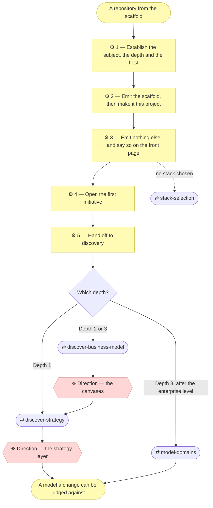

# ⚙ Establish a project

The bridge between an installed method and a modeled project: emit the
scaffold, turn it into *this* project, declare how deeply the project intends
to model itself, say where it lives, and hand off to discovery. Everything
after that is the ordinary `align-change-through-layers` process.

## ⊕ When to use this

| The situation | What it looks like |
| ------------- | ------------------ |
| No model yet | The project has the method available but no `architecture/` folder |
| Untouched scaffold | `AGENTS.md` or `README.md` still contain `<placeholder>` markers |
| Empty model | `architecture/` holds only layer READMEs and no elements |
| Said out loud | The user just installed the plugin, cloned or generated the repository, and wants to start |

## ⊖ When not to

| The situation | Use instead |
| ------------- | ----------- |
| `AGENTS.md` already declares a modeling depth | `align-change-through-layers` — the project is bootstrapped |
| The request changes an existing model | `align-change-through-layers` |

## ⌖ Where this sits

Realizes `BPROC1.1`. It carries **no gate of its own** — bootstrapping writes
into a project where nothing was ever approved, so there is nothing to approve
against. The first approval belongs to the discovery this hands off to.

The numbered boxes are this skill's steps, and the unfilled ones are the other
skills it reaches. Both gates belong to those, not to this.

## ⚓ Invariants

Hold at every step below.

- **Run this before anything else on a fresh project.** An agent that skips
  straight to `align-change-through-layers` produces a strategy layer for a
  project with no name, no declared language and no declared depth.
- **Nothing lands that the project does not use.** The scaffold is eleven
  files, all of them live from the first commit. Everything else — layer
  templates, the pull-request template, the workflows — waits in the plugin's
  `assets/` until a skill has something to put in it.

## ⚙ Steps

### 1 — Establish the subject, the depth and the host

Ask three questions. **What is this project?** — one or two sentences in the
Requester's own words. **Is the subject an application or an organization?** —
something being built, or the way a business works? **Where does this project
live?** — which repository host, and is it public or private?

**⚖ Judgement.** Pick the depth from the answers:

| The Requester describes | Depth |
| ----------------------- | ----- |
| An app, a tool, a site, a service they're building | **1 — Application** |
| A company, a department, or a service line whose way of working is the deliverable | **2 — Organization** |
| Several business lines that need to be understood separately | **3 — Enterprise** |

Depth is about the subject, not the effort — a large application is still
Depth 1. *When in doubt, go shallower:* deepening is a normal initiative,
while unwinding an over-modeled project throws away approved documents.

**⚖ Judgement.** The third answer decides what the scaffold's GitHub-shaped
files are for, and nothing else:

| The answer | What it activates |
| ---------- | ----------------- |
| A **public** GitHub repository | The checks workflow, and the pull-request template |
| Any **other** GitHub repository | The same. Publishing stays a separate decision |
| **Anything else**, or not decided yet | Nothing. `.github/` is GitHub-shaped; the model and the validators are not |

*When the answer is unclear, take the last row.* A pipeline that publishes a
model nobody agreed to publish is not undoable.

**→ Produces** the declared depth, the project description and the recorded
host, all carried into every step below.

### 2 — Emit the scaffold, then make it this project

Copy `scaffold/` from the plugin into the project root. **It is eleven files,
and every one of them is used on the first commit** — `AGENTS.md`, `README.md`,
`CLAUDE.md`, `GEMINI.md`, `.gitignore`, `architecture/README.md`, and
`scripts/` with the two validators, the parse they share, its prefix data and
their own README.

**Copy the dotfiles too** — `.gitignore` keeps bytecode, machine-local
settings and everything regenerated out of the history.

**If the project will take contributions from more than its owner**, also emit
`assets/CONTRIBUTING.md` and fill in its placeholders. For a single owner it
can arrive later with the first contributor.

Then, in one pass, so the first commit is coherent:

| File | Fill in |
| ---- | ------- |
| `AGENTS.md` | The real name and description, the layout, the commands, and the **declared depth** — `align-change-through-layers` Step 1a reads it on every later change. This is the agent entry point, whichever host is running |
| `README.md` | The project's own front door, not archreator's with names swapped |
| `architecture/README.md` | The status table — one row per layer, each saying `Local`, `External`, `Out of scope` or a named `Gap`. On a fresh project most rows are `Gap — not yet started`, and layer 0 is `Out of scope` unless the subject is an organization |
| Documentation language | Decide once, record it in `AGENTS.md`. If it is not English, `document-style` sets the rule and `architecture-document-style` requires a stereotype-correspondence table in `architecture/README.md` |

**⚖ Judgement.** Step 1 already made this call — its host table is the single
home of the rule. Emit what it activated: for a GitHub repository,
`pull_request_template.md` and `workflows/checks.yml` into
`.github/workflows/`, both from `assets/github/`; for anything else, nothing.

**→ Produces** a project whose first commit is about the project.

### 3 — Emit nothing else, and say so on the front page

**No layer folder is created until it has something to hold.** The templates
for all of them are in the plugin's `assets/layers/`, and the skill that first
fills a layer emits its README at that moment. What the project gets on day one
is one row per layer in `architecture/README.md`, saying whether this model
owns the layer, another model does, it is out of scope, or it is a gap.

| Depth | Layer 0 row | Domains |
| ----- | ----------- | ------- |
| **1 — Application** | `Out of scope` — an application has no business model of its own | Not mentioned |
| **2 — Organization** | `Gap` until `discover-business-model` fills it | Not mentioned |
| **3 — Enterprise** | `Gap` until `discover-business-model` fills it | A row per business line, added by `model-domains` |

If no stack is chosen yet and this is a small application, use
`stack-selection` rather than re-deriving one, and record the choice when
`5_technology/` is first emitted.

**← Needs** the declared depth.

**→ Produces** `architecture/README.md`, filled in.

### 4 — Open the first initiative

Create scope document `1_*.md` in `architecture/scope/` with
`write-scope-document`, and index it in `architecture/scope/README.md`.
Discovery is a full initiative, and this is the project's first.

**← Needs** the project description.

**→ Produces** `architecture/scope/1_*.md`, and its row in the index.

### 5 — Hand off to discovery

Bootstrap does not write the strategy; discovery does, with the Requester,
against gates. Then close the loop: the request that started all this — "build
me X" — is still unbuilt. Say so, and offer to open it as the next initiative.

**← Needs** the declared depth, the first scope document.

## ⇄ Hands off to

| Skill | When | What comes back |
| ----- | ---- | --------------- |
| `discover-strategy` | Depth 1 | Stakeholders, drivers, goals and the Principles that gate every later change, approved at **Direction** |
| `discover-business-model` | Depth 2 or 3 | The canvases, approved at **Direction** before anything is derived from them; `discover-strategy` then derives the strategy layer |
| `model-domains` | Depth 3, after the enterprise level | One charter per business line, with its exposed and consumed services |
| `discover-current-landscape` | The subject was already running before it was modeled | The lower layers described from evidence, with a declared coverage, approved at **Understanding** |
| `stack-selection` | No stack chosen, small application | A recorded choice in `5_technology/` |

## ✎ Worked example

> **"I want to build a small tool that reformats our export files."**
>
> One application, so Depth 1: a light strategy layer, no business-model
> canvases, layer 0 `Out of scope` in the status table. Scaffold emitted and
> filled, scope document `1_*.md` opened, then hand off to
> `discover-strategy`. The tool itself is still unbuilt, which Step 5 says
> rather than leaving the Requester to notice.

## ⚠ Anti-patterns

- Inferring the subject, the depth or the host from the repository instead of
  asking. A remote that exists today is not a statement about where the
  project will live.
- Emitting `assets/github/` onto a project that is not on GitHub.
- Writing a workflow from scratch instead of emitting the one in `assets/`.
- Writing the strategy here. Bootstrap hands off to discovery, which does it
  with the Requester against gates.
- Creating a layer folder before it has anything to hold.
- Leaving the Requester's original request unmentioned once discovery
  finishes, so a docs-only PR reads as the process having failed to build
  anything.

## ☑ Done when

- `AGENTS.md` and `README.md` contain no `<placeholder>` markers, and
  `AGENTS.md` declares the modeling depth.
- `CLAUDE.md` and `GEMINI.md` sit beside it, each still nothing but
  `@AGENTS.md`.
- The documentation language is decided and recorded.
- The scaffold has been copied out of the plugin's `scaffold/` — all eleven
  files, and nothing was deleted afterwards, because nothing arrived that the
  project does not use.
- Where the project lives is recorded in `AGENTS.md`, and anything emitted from
  `assets/github/` was emitted deliberately on that answer.
- `architecture/README.md`'s status table has a row per layer, and **no row says
  nothing** — every one is `Local`, `External`, `Out of scope`, or a named
  `Gap`.
- No empty layer folder exists.
- Scope document `1_*.md` exists and is indexed.
- `python3 scripts/check_links.py` and `python3 scripts/check_model.py` both
  pass.
