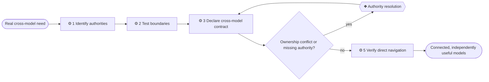

# ⚙ Federate context

Connect independently useful models without turning one into a copy of the
others. Establish semantic authority and resolvable contracts now; let the
first real operational use case determine any future transport machinery.

## ⊕ When to use this

| Situation | Observable condition |
| --- | --- |
| A question crosses ownership | Required facts live in more than one model or repository |
| A contract crosses levels | Enterprise, Domain or Solution context must reference another level |
| One solution serves several domains | Each model needs a resolvable relationship without duplicate definitions |
| A model boundary is unclear | Two repositories appear to claim the same fact or contract |

## ⊖ When not to

| Situation | Use instead |
| --- | --- |
| All relevant facts are owned in one model | `model-context` |
| Several folders in one repository share one accountable model | Keep one model and direct links |
| A central registry or synchronization system is merely anticipated | Wait for a real use case |
| Someone wants a combined reading surface only | Generate the portal from accessible sources on request |

## ⌖ Where this sits

Realizes optional process Connect cross-model context [BPROC1.2].

## ⚓ Invariants

- A fact has one authoritative model; another model links to and refines the
  exposed contract instead of restating its definition.
- Each repository remains understandable and directly navigable on its own.
- The source model owns outgoing relationships it asserts. Incoming views are
  derived when the source is available.
- Cross-model references identify both model and stable local element ID.
- Missing or inaccessible context is explicit; absence of access is not
  evidence that a relationship is absent.
- No central graph, cloning, registry, fetching, caching or synchronization is
  introduced without a proven operational need.

## ⚙ Steps

### 1 — Identify participating authorities

Read each accessible `architecture/README.md`. Name the stable model, level,
subject, accountable owner, facts it owns, relevant source revision and known
parent, child or peer relationship.

**← Needs** the cross-model question and accessible canonical sources.

**→ Produces** a participating-model list and unavailable-source boundary.

### 2 — Test the ownership boundaries

Read `references/domain-boundaries.md` when the issue involves splitting a
large enterprise model or defining a domain. For each needed fact, identify
the one model authorized to define it and what contract another model consumes.

**⚖ Judgement.** A lower model may add implementation-specific behavior,
representation or constraints. If it must repeat its parent's element to make
sense, strengthen the exposed contract or keep the detail with the parent.

**← Needs** participating models and the needed facts.

**→ Produces** authoritative ownership and any real conflict.

### 3 — Declare resolvable cross-model contracts

In the source model, declare the local element and outgoing relationship. In a
consumer, refer to an external element as `Name [model-name::ID]`, preserve
the canonical ArchiMate relationship and direction, explain its meaning in
plain language and link the defining source. Use a qualified reference such as
Order service [SALES.BSVC1] only when several domains share one physical
model.

Do not copy the target element's catalogue row. Keep source revision or
availability metadata only where it helps a reader judge freshness.

**← Needs** settled authority and local stable identifiers.

**→ Produces** directly navigable cross-model references and contracts.

### 4 — Resolve authority only when evidence cannot

If two credible models define the same fact differently, or no accountable
owner can be determined, use `write-brief` to isolate the conflict and its
consequences.

**← Needs** the ownership conflict, supporting evidence and affected contracts.

**❖ Authority resolution.** The accountable owners choose the authoritative
model, contract meaning or explicitly accepted temporary boundary. No gate runs
when ownership and sources already agree.

**→ Produces** one authority per fact, or an explicit unresolved boundary.

### 5 — Verify independent and connected navigation

Confirm every qualified reference resolves when its source is accessible,
every authority boundary is visible from the front doors and no local model
depends on copied external descriptions. Report unavailable models and last
known revisions rather than silently omitting them.

**← Needs** declared contracts and any authority resolution.

**→ Produces** a source-grounded connected view without transport machinery.

## ⇄ Hands off to

| Skill | When | What comes back |
| --- | --- | --- |
| `model-context` | A participating model lacks a clear front door or boundary | A locally useful authoritative model |
| `architecture-document-style` | IDs, model levels, relationships or ownership are written | Consistent cross-model semantics and navigation |
| `write-brief` | Step 4 needs a focused human choice | A minimal temporary authority decision brief |
| `record-decision` | A settled boundary needs durable rationale | A linked decision without copied facts |
| `answer-context-question` | A reader wants a combined explanation | A bounded reading with unavailable sources stated |

## ⚠ Anti-patterns

- Treating Enterprise → Domain → Solution as a strict tree when peers or one
  solution serving several domains form a graph.
- Copying external catalogue rows so a repository appears self-contained.
- Maintaining incoming relationships as a second canonical copy.
- Interpreting an inaccessible source as proof that no dependency exists.
- Designing a registry, transport or synchronization protocol before one real
  cross-model workflow requires it.
- Publishing raw reference material through a combined portal by default.

## ☑ Done when

- Every participating model names its subject, level, owner and authoritative
  boundary.
- Each cross-model fact has one owner and resolvable qualified references.
- Relationship direction, ArchiMate meaning and plain-language meaning agree.
- Conflicts and unavailable context are explicit.
- Each model remains useful by direct repository navigation.
- No federation machinery was added beyond what the concrete use case proved.
