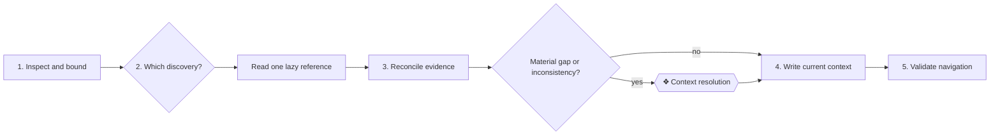

# ⚙ Model context

Create the smallest current model that a builder can validate and an enterprise
architect can navigate without relying on an agent to explain it.

## ⊕ When to use this

- `architecture/README.md` is absent or does not describe the subject now.
- Relevant context is missing, stale, contradictory or hidden in operational
  evidence.
- The user asks to model an initiative, application, domain or enterprise.
- A delivered change has made canonical context stale.

## ⊖ When not to

- For one requested change, use `deliver-change`.
- For a target and sequence, use `plan-roadmap`.
- For a focused explanation, impact or decision question, use
  `answer-context-question`.
- For a real cross-model relationship, use `federate-context` and its
  [domain-boundary reference](../federate-context/references/domain-boundaries.md).

## ⌖ Where this sits

Realizes Model current context [BPROC1.1] and the current-context refresh in
Refresh current context [BPROC3.3]. **Context resolution** is conditional:
clear, consistent evidence does not stop for approval.

## ⚓ Invariants

- Canonical context is Markdown under `architecture/`; generated views are not
  evidence.
- Plain business language is primary. Stable identifiers and ArchiMate types
  and relationships remain available for expert navigation and traversal.
- Model current truth, not delivery history. Create no empty area, catalogue or
  placeholder.
- The repository owns each fact once. Name external ownership rather than
  copying a parent, child or peer model.
- Traverse current Markdown directly; do not create a persisted graph or
  SQLite projection.

## ⚙ Steps

### 1. Inspect the subject and set the boundary

**← Needs.** The user's purpose, repository evidence and any existing
`architecture/README.md`.

**⚖ Judgement.** Choose **enterprise**, **domain** or **solution** depth. State
what this repository owns, excludes and obtains from another model. Include
business design only when the business or operating model is itself in scope.

**→ Produces.** A working boundary, intended reader need and list of evidence
or context that must be reconciled.

### 2. Load only the discovery guidance the need requires

**← Needs.** The boundary and the unresolved part of the context.

**⚖ Judgement.** Read one or more references only when its subject is in scope:

- [business-model discovery](./references/business-model-discovery.md) for
  customers, value and the operating model;
- [strategy discovery](./references/strategy-discovery.md) for direction,
  outcomes, drivers and constraints; or
- [landscape discovery](./references/landscape-discovery.md) for an existing
  business, information, application and technology estate.

**→ Produces.** A focused evidence and question route, without loading
irrelevant discovery material.

### 3. Reconcile facts and uncertainty

**← Needs.** In-scope evidence, existing canonical context and the selected
discovery guidance.

**⚖ Judgement.** Separate supported facts, reasonable inferences, external or
unavailable context and material uncertainty. When modeling processes or
capabilities, apply `process-and-capability-levels` so decomposition follows
the need rather than filling a hierarchy.

**❖ Gate — Context resolution.** Stop only when a material gap, inconsistency or
ambiguity would change the model. Give the responsible person the minimum
facts, choices, consequences and recommendation. Continue directly when the
evidence is clear.

**→ Produces.** Resolved current facts plus explicit boundaries or genuinely
unresolved gaps.

### 4. Write the smallest useful canonical model

**← Needs.** The resolved facts, model boundary and relevant ownership.

**⚖ Judgement.** Apply `document-style` to every document and
`architecture-document-style` to locations, identifiers, relationships and
navigation. Apply `process-and-capability-levels` only where a process or
capability catalogue is needed.

**→ Produces.** A current `architecture/README.md` and only the area files that
carry useful content. The front door states available context, real gaps,
outside scope and ownership elsewhere, and reaches every canonical file.

### 5. Validate and compact current context

**← Needs.** The complete set of canonical files changed or relied upon.

**⚖ Judgement.** Remove obsolete statements and resolved questions. Preserve
stable identifiers for surviving elements.

**→ Produces.** Resolved links, unique identifiers, valid relationship targets
or explicit external references, and navigation that describes the model now.

## ⇄ Hands off to

- `document-style` receives the subject and facts and returns plain language,
  focused content and valid links.
- `architecture-document-style` receives the model boundary and facts and
  returns the standard structure, identifiers and relationship notation.
- `process-and-capability-levels` receives a process or capability boundary and
  returns proportionate levels and identifiers.
- `federate-context` receives a real cross-model need and returns resolvable
  references and authority boundaries.
- `deliver-change`, `plan-roadmap` and `answer-context-question` consume the
  reliable current context produced here.

## ⚠ Anti-patterns

- Starting with an architecture questionnaire instead of available evidence.
- Loading every discovery reference for every subject.
- Creating the standard folder tree before any area has content.
- Treating an inference, generated portal or brief as canonical evidence.
- Copying context owned by another model or preserving obsolete facts as
  history.
- Asking for approval when consistent evidence already answers the question.

## ☑ Done when

- `architecture/README.md` states the subject, level, ownership and real status.
- Every canonical file is reachable and every existing area contains useful
  content.
- Facts, identifiers, relationships and external boundaries validate.
- A builder can understand the model and an enterprise architect can navigate
  it directly.
