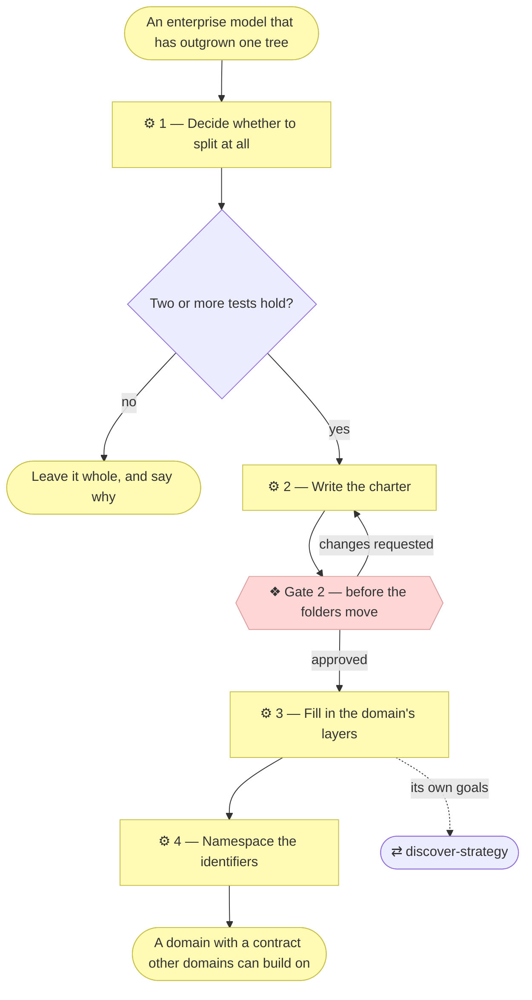

# ⚙ Model domains

A **domain** is a part of the organization modeled as though it were an
organization in its own right — customers, services, capabilities, and a
purpose larger than itself. Some of its customers are external; some are other
domains. The model shape repeats at every level, so a business line can be
understood on its own terms.

Reaching for this is a decision, not a default. At Depth 2 the whole
organization shares one `architecture/` tree, and that is correct until it
isn't.

## ⊕ When to use this

| The situation | What it looks like |
| ------------- | ------------------ |
| The tree has outgrown itself | An enterprise model where several business lines are tangled in one set of layers |
| A new business line | An existing enterprise model gains a domain |
| A change crosses a boundary | `align-change-through-layers` Step 1b found the change touches another domain's exposed services |

## ⊖ When not to

| The situation | Use instead |
| ------------- | ----------- |
| The subject is one application | Nothing — a Depth 1 project has no domains |
| The subject is one organization | Nothing — Depth 2 shares one tree, and that is correct |
| Fewer than two split tests hold | Leave it whole. A team everyone reaches into ad hoc is a team, not a domain |

## ⌖ Where this sits

Realizes `BPROC1.4`, and only at Depth 3. Splitting is a business-layer
change, so it goes through the ordinary process: a scope document, and
**Gate 2** before any folder moves.



## ⚓ Invariants

- **Exposed means exposed.** A service in the charter's table is a promise. If
  you would not want another domain building on it, do not list it.
- **The grounding rule still applies.** Every exposed service names the team,
  written procedure or component that realizes it, or is marked "Pending —
  future initiative". A charter full of aspirations is how a federated model
  rots.
- **A domain's exposed services are its contract; everything else is
  internal.** Referencing another domain's internal element is a modeling
  error, not a shortcut.
- **Say the verdict out loud, with its reason.** "Three of the five tests hold
  — own customers, own economics, own decision rights — so I would model
  Advisory as a domain" is a sentence the Requester can disagree with.
  Silently restructuring the tree is not.

## ⚙ Steps

### 1 — Decide whether to split at all

Splitting costs a charter to maintain, a boundary to respect, and a set of
Requesters to consult on every contract change.

**⚖ Judgement.** Carve a domain out only when **two or more** hold: its own
customers, its own economics, its own decision rights, its own capabilities, a
named interface. Two questions settle most cases:

| Question | What a "no" means |
| -------- | ----------------- |
| **What would this domain expose?** | If you cannot name the services other parts of the organization would consume, it is not a domain yet |
| **Who says yes inside it?** | If every meaningful decision escalates out, the boundary is organizational fiction and the charter will not be honored |

**→ Produces** a stated verdict, with the tests that carried it.

### 2 — Write the charter

The domain's `README.md` **is** its charter — the contract between it and the
rest of the organization, and the only part other domains may depend on. Write
it before filling in any layer: the charter is what the split is *for*, and
writing it first is what catches a domain that turns out to have nothing to
expose.

```markdown
# Domain — <Name>

_[← Domains](../README.md) · [Model home](../../README.md)_

**Purpose.** <What this domain is for, and the larger purpose it serves.>

## Customers

| Customer | Kind | What they need from this domain |
| -------- | ---- | -------------------------------- |
| <segment or domain> | external / internal | <…> |

## Exposed services

The interface. Other domains may reference these IDs and nothing else.

| ID | Service | Serves | Realized by |
| -- | ------- | ------ | ----------- |
| `BSVC1` | <name> | <customer or domain> | <team, procedure, or component — or "Pending"> |

## Consumed services

| Qualified ID | From | What this domain relies on it for |
| ------------- | ---- | ---------------------------------- |
| `OTHER.BSVC2` | <domain> | <…> |

## Decision rights and escalation

- **Decides alone:** <concrete decisions this domain makes without asking>
- **Escalates to:** <a named role, not "a human">

## Operated by

<Human / AI / Hybrid>, at <autonomy level>. <Decision rights and escalation
path, per `architecture-document-style` § Actors — applied to the domain as a whole.>
```

**← Needs** the split verdict.

**→ Produces** `architecture/domains/<name>/README.md`.

### 3 — Fill in the domain's layers

The same numbered layers as the enterprise, and the same skills. Fill in only
the layers the domain has something to say about, and mark the rest "not
started".

**⚖ Judgement.** A domain gets its own `1_strategy/` when it has goals
distinct from the enterprise's — not merely a share of them. Most domains do;
a purely internal shared-services domain often does not, and inherits the
enterprise strategy instead. Say which. It gets its own `0_business-design/`
canvases only when it sells to a segment the enterprise canvases do not
already cover.

**← Needs** the charter.

**→ Produces** `architecture/domains/<name>/`.

### 4 — Namespace the identifiers

Bare inside the owning domain (`BSVC3`), qualified from outside
(`SALES.BSVC3`), bare at the enterprise level (`G1`). Numbering is per prefix
**per domain**, so two domains may each own a `BSVC3`. Full rules in
`architecture-document-style` § Element IDs.

The qualifier is the folder name upper-cased, so renaming a domain folder
rewrites every inbound reference. Pick the name once, and prefer the
business's own word for the domain over an invented one.

**→ Produces** namespaced identifiers across the domain's documents.

## ⇄ Hands off to

| Skill | When | What comes back |
| ----- | ---- | --------------- |
| `discover-strategy` | The domain has goals distinct from the enterprise's | Its own `1_strategy/`, approved at Gate 1 |
| `align-change-through-layers` | The split itself, and every later change | A scope document and Gate 2 before the folders move |
| `write-scope-document` | The split needs recording | One document naming every domain touched |

## ✎ Worked example

> An advisory line has its own clients, its own margin and its own hiring
> decisions — three tests — but nobody can name what it exposes. The verdict
> is stated as a "not yet", with the reason. Six months later it publishes a
> referral service other lines consume, the fifth test holds, and the split
> proceeds with that service as the first row of its charter.

## ⚠ Anti-patterns

- Restructuring the tree without stating the verdict and its tests.
- Writing the layers before the charter, so a domain with nothing to expose is
  discovered late.
- Listing a service as exposed that you would not want built on.
- Referencing another domain's internal element rather than taking it up with
  the charter.
- Splitting a cross-domain change into one initiative per domain, which loses
  the thing that made it a contract change.

## ☑ Done when

- The split verdict is stated with the tests that carried it.
- The charter names customers, exposed services, consumed services, decision
  rights and who operates it.
- Every exposed service names what realizes it, or is marked Pending.
- Every layer says either what exists or "not started".
- Identifiers are namespaced, and every cross-domain reference points at a
  service the owning charter actually exposes.
- Where the change altered or removed an exposed service, the scope document
  names every consuming domain and its Approvals table carries a Gate 2 row
  per Requester.

## Cross-domain changes

A contract has two sides, and that yields four rules.

| Situation | What it requires |
| --------- | ---------------- |
| A change inside a domain touching nothing exposed | The owning domain's Requester only. Most changes |
| Adding a new exposed service | The owning domain's Requester. Nobody depends on it yet |
| Changing or removing an exposed service | **The consuming domains' Requesters at Gate 2 too.** Name every consumer in the scope document |
| Referencing another domain's internal element | A modeling error. Either it belongs in that domain's charter, or the dependency should not exist |

A change spanning domains is still **one** initiative with one scope document
— its alignment table names each domain touched, and its Approvals table
carries a Gate 2 row per Requester.

## Not yet: parallel work

Domain boundaries are what would make parallel work by several agents safe —
one agent per domain, coordinating only on charters. That is not set up. Doing
it well needs a queryable projection of the model so agents can see each
other's work (`stack-selection` § A persisted projection needs one of four
triggers). Until then, work domains one at a time.
