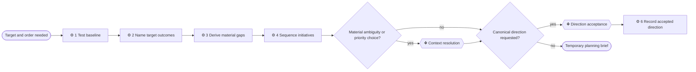

# ⚙ Plan a roadmap

Turn a reliable view of today into a small number of meaningful target states,
the material distance to them and a sequence people can use. A roadmap explains
why order matters; it is not a backlog of speculative architecture.

## ⊕ When to use this

| Situation | Observable condition |
| --- | --- |
| Set a destination | The requester asks what the architecture should become |
| Compare current and target | A gap analysis or target state is needed |
| Choose order | Several initiatives compete or depend on one another |
| Create a planning spine | Repeated changes have no accepted direction to test against |

## ⊖ When not to

| Situation | Use instead |
| --- | --- |
| Deliver one bounded change | `deliver-change` |
| Current context is not reliable enough for comparison | `model-context` |
| Explain the existing model | `answer-context-question` |
| Produce a detailed project backlog | Use the project's delivery planning practice after the roadmap |

## ⌖ Where this sits

Realizes Plan a roadmap [BPROC2.2].

## ⚓ Invariants

- Measure every gap from a named current baseline to a named target outcome.
- Describe targets as states and outcomes, not as project or product names.
- Keep target and transition content out of current-state areas.
- Use few plateaus or outcome groups that a decision owner can understand.
- Sequence dependencies before preferences; record the decisive reason for a
  priority choice.
- Do not model detailed future catalogues merely to make every area complete.
- A draft is not accepted direction and remains under `.archreator/work/`.

## ⚙ Steps

### 1 — Test the planning baseline

Read `architecture/README.md` and the current facts inside the planning
boundary. Confirm their evidence, coverage and known gaps. If the baseline is
missing or stale, hand it to `model-context` before comparing it with a target.

**⚖ Judgement.** Partial coverage can support a bounded roadmap when the
boundary is explicit. Contradictory or invented current state cannot.

**← Needs** the planning question and accessible current model.

**→ Produces** a named baseline, planning boundary and evidence limitations.

### 2 — Name the target outcomes

Work backwards from business outcomes, strategy and constraints. Ask what must
be observably true for the outcome to exist, without assuming a particular
initiative or implementation. Group compatible outcomes into the fewest useful
target plateaus.

Each target names why it matters, what would evidence it and which goal or
stakeholder outcome it serves.

**← Needs** the baseline and target intent.

**→ Produces** a small set of target states and measures.

### 3 — Derive the material gaps

Compare each target with the baseline across the context that can actually
change: capability, process, information ownership, application behavior,
technology condition, accountability and cross-model contract. Name absence,
removal, changed ownership, duplication or relocation only when it affects the
target.

Record a deliberately tolerated current condition as a decision or constraint,
not as a gap inviting future work.

**← Needs** the baseline and target states.

**→ Produces** gaps linked to both their current evidence and closing target.

### 4 — Group and sequence initiatives

Group gaps into the fewest coherent initiatives. Order hard dependencies
first; then weigh outcome value, risk reduction, learning, reversibility and
organizational capacity. Show cross-repository ownership and what must be true
before each initiative starts. Prefer dependency statements to brittle dates.

Use `process-and-capability-levels` when target work changes a broad process or
capability map; deepen only the branches whose gaps justify it.

**⚖ Judgement.** Two architecturally valid orders may have different business
value. Do not disguise that owner choice as a technical dependency.

**← Needs** the gap register, constraints and ownership.

**→ Produces** an ordered set of initiatives or plateaus with reasons.

### 5 — Resolve only decisions that affect the roadmap

Use `write-brief` when the baseline contains a material inconsistency, a target
depends on an unknown owner choice, or two sequences require a business
priority decision.

**← Needs** the target, gaps, proposed sequence and the specific unresolved
evidence, priority or acceptance question.

**❖ Context resolution.** The accountable person resolves the specific gap,
inconsistency or material priority choice. Routine refinement continues without
a gate.

If the work is exploratory, return the temporary roadmap without asking for
acceptance. If the result will become the direction against which initiatives
are judged, state that consequence explicitly.

**❖ Direction acceptance.** Run only when the requester wants the target and
sequence recorded as accepted organizational direction.

**→ Produces** resolved planning assumptions and, when requested, accepted direction.

### 6 — Record accepted direction

Keep exploratory drafts under `.archreator/work/<run>/`. Once accepted, create
or refresh `architecture/6_transition/README.md`, link it from the front door
and record target outcomes, measures, gaps, sequence, dependencies, owners and
material assumptions. Use a compact visual when it clarifies transitions or
dependency order.

Leave implementation detail to each later `deliver-change` run. Mark a target
reached, abandoned or superseded rather than silently rewriting the direction
that initiatives were judged against.

**← Needs** the accepted target and sequence.

**→ Produces** canonical transition context and an entry point for delivery.

## ⇄ Hands off to

| Skill | When | What comes back |
| --- | --- | --- |
| `model-context` | Step 1 finds an unreliable baseline | Current context with an explicit usable boundary |
| `write-brief` | Planning needs review or a focused decision | A temporary scope, impact or decision artifact |
| `process-and-capability-levels` | A gap needs business breadth or justified decomposition | A proportionate process or capability model |
| `architecture-document-style` | Step 6 records target elements and relationships | Consistent transition IDs, links and visuals |
| `deliver-change` | An initiative is selected from the sequence | A delivered outcome and refreshed current state |
| `record-decision` | A material accepted trade-off must be durable | Linked rationale without duplicating the roadmap fact |

## ⚠ Anti-patterns

- Naming plateaus after projects or products instead of target states.
- Producing gaps without a reliable baseline.
- Restating the target in negative words and calling every row a gap.
- Assigning dates where dependencies and capacity are not yet understood.
- Sequencing every task until the roadmap becomes an unreadable backlog.
- Writing planned elements into the numbered current-state areas.
- Treating a draft generated by an agent as accepted direction.

## ☑ Done when

- The baseline and planning boundary are explicit and reliable enough.
- Every target is an outcome with evidence, not a disguised project.
- Every material gap connects current evidence to a target.
- The sequence states dependencies, owners and the reason for material choices.
- Exploratory output remains temporary; accepted direction is linked from the
  architecture front door and isolated in `6_transition/`.
- Later initiatives can cite what they close without re-deriving the roadmap.
