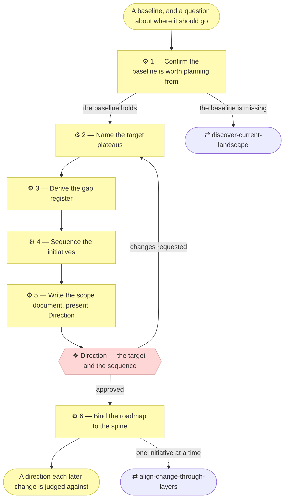

# ⚙ Plan the transition

Every other skill in the method describes a present. This one describes an
intent: where the architecture should be, what stands between here and there,
and in what order the distance is closed.

**A roadmap is a direction, not a permission.** What is approved here is that
this is the right destination and the right order. Each initiative on it still
enters the spine, still aligns through the layers, and still stops at its own
gate before anything is built.

## ⊕ When to use this

| The situation | What it looks like |
| ------------- | ------------------ |
| The Requester asks where this is going | A target state, a to-be architecture, a two-year plan, an answer to "what should we do first?" |
| Changes arrive with nothing to rank them | Each request is defensible on its own and nobody can say which matters more, because there is nothing they are all being measured against |
| The baseline is freshly described | `discover-current-landscape` just closed, and a described estate with no ambition beside it is half an answer |
| A gap keeps being rediscovered | The same missing capability is named in three scope documents' gap notes and nothing has ever been sequenced to close it |
| The roadmap has been overtaken | A plateau was reached, abandoned or invalidated, and the sequence no longer describes the intent |

## ⊖ When not to

| The situation | Use instead |
| ------------- | ----------- |
| There is no baseline to measure from | `discover-current-landscape` first. A target with nothing to subtract from it produces a wish list, not a gap |
| The strategy layer is unfilled | `discover-strategy` — a target that serves no goal cannot be argued with, only agreed with |
| One change needs delivering | `align-change-through-layers`. A roadmap is not how a requirement gets built |
| The current-state documents have drifted | `restate-current-state` first — planning from a model that describes last year produces gaps that were closed months ago |
| One consequential call, no sequence | `record-decision` |

## ⌖ Where this sits

Realizes `BPROC5.1`, and it is the only process in the method whose output
describes a future rather than a present.

It owns **Direction**, which `discover-strategy` also owns: a sequenced target
is direction in the same sense a strategy layer is.

## ⚓ Invariants

- **The roadmap is the only place the model describes a future.** The numbered
  layers describe today and are kept that way by `restate-current-state`;
  `architecture/6_transition/` describes intent. A target element never goes
  into a numbered layer.
- **A gap is derived, never asserted.** Every gap names the baseline it starts
  from — an element that exists and is wrong, or an element that is absent —
  and the plateau that closes it.
- **A plateau is a state, not a project.** It is named for what is true when
  you arrive, and it is reached or it is not. "Single customer record across
  all channels" is a plateau; "the data migration programme" is the work.
- **Sequence by dependency and appetite, not by ambition.** What must be true
  before something else can start is the method's business; how much change
  the organization can absorb at once is the Requester's, and it is asked.
- **The roadmap declares its own standing.** Its documents define elements, so
  they carry a status line like any others: `◐ Draft catalogue` while the
  target is being drafted, `● Validated at Direction` once the Requester has
  settled it (`architecture-document-style` § Document status).
- **Nothing here is approved to build.** Direction approves the destination and
  the order. Every initiative on the roadmap runs the spine, and no gate is
  skipped because the roadmap already named it.
- **Every plateau reached, abandoned or invalidated is written back.** A
  roadmap that is not revisited is worse than none, because it is trusted.

## ⚙ Steps

### 1 — Confirm the baseline is worth planning from

Read what the model says about today before proposing a tomorrow. Check three
things and record the verdict: the strategy layer is filled and approved; the layers relevant to the question hold elements rather than
placeholders; and the current-state documents have not obviously drifted from
what shipped.

**⚖ Judgement.** Empty lower layers mean stopping and handing to
`discover-current-landscape`. Drifted layers mean handing to
`restate-current-state` first. Partial coverage is different from either: a
baseline with a declared boundary is plannable *within that boundary*, and the
roadmap says so.

**→ Produces** the verdict on the baseline, and a handoff if it does not hold.

### 2 — Name the target plateaus

Work backwards from the strategy layer's goals. For each goal, ask what would
have to be true of the architecture for the goal to be met, and name that
state. That is a plateau, and it belongs in `architecture/6_transition/`.

Keep them few. Two or three plateaus for a two-year horizon is a plan a
Requester can argue with; eleven is a backlog with dates on it.

Each plateau names the goals it serves, so a plateau serving no goal is
visible.

**⚖ Judgement.** A plateau that cannot be described without naming the project
that delivers it is a project. Rename it for the state, and if that cannot be
done, it does not belong here.

**← Needs** the strategy layer, and the baseline from Step 1.

**→ Produces** the plateaus in `architecture/6_transition/` — emitted from
the plugin's `assets/layers/6_transition/` the first time, since the folder
does not exist until a target state does.

### 3 — Derive the gap register

For each plateau, walk the layers and subtract. What exists today that the
target does not want; what the target wants that does not exist; what exists
and is in the wrong place, owned by the wrong actor, or duplicated across
three systems.

Each gap gets an identifier, the baseline it is measured from, the plateau it
is closed by, and — where the baseline says so — the element it concerns. A
Pending row from a landscape sweep is already a gap; harvest them.

Say what is *not* a gap, too. A duplicated system the organization has decided
to live with is a deliberate state, and recording it as a gap invites somebody
to close it later without knowing it was a decision.

**← Needs** the plateaus, and the current-state layers.

**→ Produces** the gap register in `architecture/6_transition/`.

### 4 — Sequence the initiatives

Group the gaps into initiatives, and order them. An initiative here is a
placeholder — a name, the gaps it closes, the plateau it moves toward, and
what must be true before it can start. It is not a scope document, and it does
not become one until it is actually started.

Order by dependency first, and where dependencies leave a choice, ask the
Requester.

Mark each initiative with what it depends on rather than with a date. A
sequence survives a slipped quarter; a date does not.

**← Needs** the gap register.

**→ Produces** the sequence in `architecture/6_transition/`.

### 5 — Write the scope document, present Direction

Planning is a full initiative. Create the scope document with
`write-scope-document` before presenting, so the Requester approves against a
document.

The alignment table gets a verdict for every numbered layer, and for most of
them that verdict is an explicit "no change". The one exception is
`1_strategy`, where naming a target routinely surfaces a course of action the
layer did not carry — record that as a change.

**❖ Direction — the target and the sequence.** The Requester approves.

Present the plateaus, the gaps under each, and the order, with full branch
links (`align-change-through-layers` § Show the Requester what they are
approving). Say two things rather than leaving them in the document: that
approving this approves the **destination and the order**, not the work; and
what is deliberately not on it.

Record the approval in the Approvals table, naming the roadmap documents shown.

**← Needs** the plateaus, the gaps, the sequence.

**→ Produces** `architecture/scope/<n>_*.md`, its row in the index, and the
Approvals table's Direction row.

### 6 — Bind the roadmap to the spine

Two bindings keep a roadmap from ageing quietly.

**Each initiative, when it starts, cites the gaps it closes** in its own scope
document, and the roadmap's entry is marked as in flight. `write-scope-document`
already requires every meaningful exclusion to carry a gap note; those notes
are candidate rows in the register.

**Each plateau, when it is reached, is recorded rather than deleted.** The
plateau stays, marked reached, with the initiative that arrived at it. A
plateau abandoned is marked abandoned, with why.

**← Needs** Direction.

**→ Produces** the roadmap's status column, kept current by later initiatives.

## ⇄ Hands off to

| Skill | When | What comes back |
| ----- | ---- | --------------- |
| `discover-current-landscape` | Step 1 finds the lower layers empty | A described, approved baseline — after which this skill restarts at Step 2 |
| `restate-current-state` | Step 1 finds the current-state documents drifted | A model that describes today, which is what a gap has to be measured against |
| `write-scope-document` | Step 5 | The initiative's record, and the Approvals table Direction is written in |
| `align-change-through-layers` | Step 6, once per initiative on the sequence, as each is actually started | A delivered change, whose scope document cites the gaps it closed |
| `record-decision` | A call inside the plan is consequential and smaller than the plan — which plateau a contested system lands in, and why | A numbered decision record the roadmap can point at instead of re-arguing |

## ✎ Worked example

> An organization has a described estate and four strategy goals. Step 2 turns
> the goals into two plateaus, one of them "every customer-facing service
> authenticates against one identity provider". Step 3 subtracts and finds
> eleven gaps, four of which are Pending rows left by the landscape sweep.
> Step 4 groups them into five initiatives and finds that three cannot start
> until the identity work lands, which settles most of the ordering. The
> Requester, at Direction, moves one initiative later because a contract
> renewal makes next year cheaper — an ordering fact no architect had, recorded
> beside the sequence.

## ⚠ Anti-patterns

- A target state with no baseline, so every gap is really a guess.
- Plateaus named after projects — "the ERP programme" is not a state.
- A gap register that restates the target in the negative, adding nothing.
- Dates instead of dependencies, so the whole plan is stale in a quarter.
- Sequencing every gap, until the roadmap is a backlog nobody reads.
- Writing target elements into the numbered layers, which are the model's only
  description of today.
- Treating Direction on the roadmap as approval to build the things on it.
- Deleting a plateau when it is reached, leaving no record that it was ever
  the plan.

## ☑ Done when

- Every plateau names the goals it serves, and is a state rather than a
  project.
- Every gap names the baseline it is measured from and the plateau that closes
  it.
- Deliberate states the organization has chosen to live with are recorded as
  such, not as gaps.
- The sequence orders initiatives by dependency, and the Requester's ordering
  choices are recorded with their reasons.
- Nothing in `architecture/6_transition/` has leaked into the numbered layers.
- The scope document records Direction as granted, naming the roadmap documents
  shown, and the presentation said plainly that the work itself is not
  approved.
- The roadmap says how it is kept current, and who does it.
