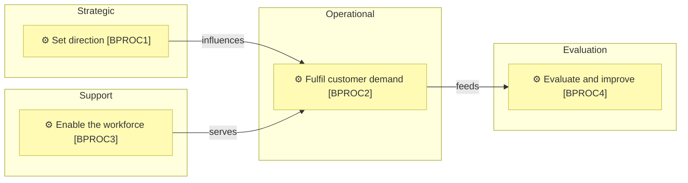

# How a leveled catalogue reads on the page

_Reference for [`process-and-capability-levels`](../SKILL.md) § What is here, and
what is one file away._

Read this when a leveled catalogue is being laid out — processes above all,
because they are the part of a model business people actually relate to and
have to understand well. *What* each level must say is
[`levels-and-descriptions.md`](./levels-and-descriptions.md); *which file* a
level lives in is [`starting-and-filing.md`](./starting-and-filing.md); how a
node or an edge is drawn is `architecture-document-style` and its notation
reference. This page holds only how the content reads once those are settled.

Everything here is a maximum, not a requirement. Combine, reorder or drop an
artifact when the level's meaning is already clear — the page is right when a
reader recovers that meaning without reconciling duplicate facts, and wrong
the moment two artifacts on it say the same thing twice.

## One question per level

A level earns its page shape from the question it answers, and no level
answers more than one:

| Level | The reader's question | The shape that answers it |
| ----- | --------------------- | ------------------------- |
| **1** | What is there? | A **map** — the whole boundary in one diagram, then the catalogue |
| **2** | What does each one owe? | A **contract** — the catalogue rows, whose columns are the contract |
| **3** | How does it run? | A **flow** — ordered steps, decisions and handoffs; processes only |

**A child adds meaning, not size.** A level-2 element that restates its
parent with a longer name is a synonym, not a decomposition — `document-style`
§ Consolidate before you enumerate, applied vertically. And depth is per
branch, on pain (`process-and-capability-levels` § Breadth first, depth on
pain): most models never need the third question anywhere but one or two
branches, and the focus table is what keeps that a visible decision.

**The first two questions are both answered, everywhere.** Levels 1 and 2
are complete across the whole subject — the same § Breadth first, depth on
pain — so a catalogue stopping at level 1 is a table of contents, not a
model: the map says what is there and never what each element owes. Only the
third question is optional.

**Each level gets a heading that names it** — `### Level 1 — the areas`,
`### Level 2 — the contract` — so a reader knows which question the
identifiers in front of them answer without counting dots in an ID.

## Level 1 — the landscape

One diagram of the whole boundary, opening the document. The four bands are
subgraphs — visual containers, no IDs, because a classification is not an
element — with one node per macro process inside them, drawn in the standard
notation. Two restraints do most of the work:

- **Only declared relationships and the real value chain get edges.** Never
  draw one to make a band look connected; a landscape whose every box touches
  every other says nothing.
- **The bands stay in their fixed order** — Strategic, Operational, Support,
  Evaluation — so two models, and two years of one model, read the same way.

The catalogue follows, with the level-1 columns the content contract names —
category, purpose, owner, composed of. Prose after that only for what neither
carries: why the boundary sits where it does, and what an empty band means.

## Level 2 — the contract

**The catalogue rows are the presentation.** A level-2 row is a SIPOC, and its
columns are the contract — there is nothing to lay out beyond keeping the rows
readable:

- **Every cell is one line.** The purpose is the one-sentence formula; the
  supplier and customer are names, not paragraphs. A row that stops fitting on
  a screen is not asking for a wider table — it is asking whether this process
  earned level 3, or whether prose is hiding in a cell that belongs under the
  diagram.
- **One diagram per macro process, in value order.** The level-2 document's
  diagram shows the chain — which process triggers which — drawn from the
  declared supplier and customer references, never invented for symmetry. A
  reader should see where a request enters and where value leaves.
- **The boundary is visible in the rows.** A supplier or customer outside the
  model is named plainly (`Requester`, `Regulator`) and gets an ID only if the
  model defines it. Where the chain leaves the organization is information;
  do not model the world to avoid a plain word.

## Level 3 — the flow

Only where the focus table justifies it. This is the one level whose page is
built around a diagram, because sequence is the first thing a list cannot say.

**The document names its whole branch before anything else** — an H1 like
`# Validate an order [BPROC2.2] — the level-3 flow`, and a nav line linking
up to the level-2 document — so a reader arriving from a deep link knows
where they stand without decoding an identifier.

**The flow diagram opens the document.** Sub-processes in standard notation;
decision diamonds are flow notation and get no IDs; a stop that needs a
person is the rose conditional-human-decision hexagon, and it gets no ID
either. Then the ordered-flow table, when responsibility and artifacts matter
as much as sequence:

| Sub-process | Performed by | Uses | Produces | Control or handoff |
| ----------- | ------------ | ---- | -------- | ------------------ |

`Uses` and `Produces` name the data objects and application services by
`Name [ID]` — a separate column per kind of thing used is how five columns
become nine. Facts shared by the whole flow — participants, inputs, the
outcome, the controls — are said once above the table, never repeated per
row. And exceptions are one list at the end: an exception lane per exception
is how a flow becomes a wall.

**Level 4 stays out of the model.** The content contract already refuses it;
what presentation adds is the seam — the level-3 row links the operating
instruction where one exists, in whatever runbook or procedure library owns
it, and that instruction uses plain step numbers, never architecture IDs.

## The same three questions, for the other leveled catalogues

Capabilities, data objects and products level exactly as processes do — the
map, then the contract — and none of them earns the third question:

| Catalogue | Level 1 — the map | Level 2 — the contract | It never gets |
| --------- | ----------------- | ---------------------- | ------------- |
| **Capabilities** | The areas, grouped the way the organization talks about itself | Each capability's definition and what realizes it | A flow. A capability has no sequence and no trigger — an ordered capability diagram is a process map wearing the wrong label |
| **Data objects** | The data domains and their owners — `Customer data`, `Product data` — one map, few boxes, settled before any object | Each object belongs to a domain and extends its ID; its row carries owner, classification and where it is mastered | A schema. Attributes belong to the systems that store them; the model carries what a decision needs |
| **Products** | The portfolio — what is sold, to which segments | Each product's services and the segments they serve | A technical decomposition — that is the application layer's, reached by relationship |

Domains at Depth 3 look like a fourth case and are not: their map and
charters belong to `model-domains`, which owns that shape entirely.

When in doubt about the third question, don't ask it: a contract kept
current beats a flow that was drawn once and never again opened. The doubt
never reaches level 2 — the contract is complete across the subject, per
§ One question per level.
