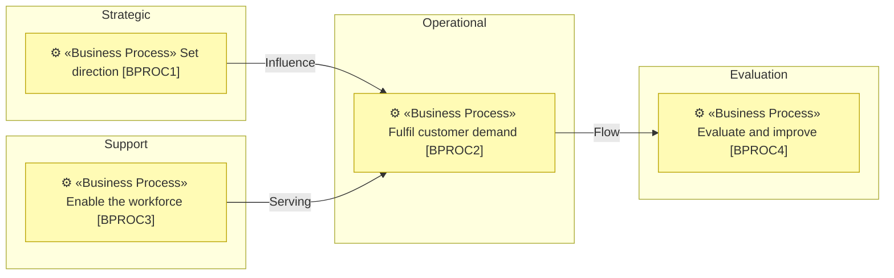
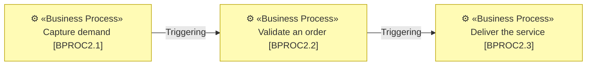
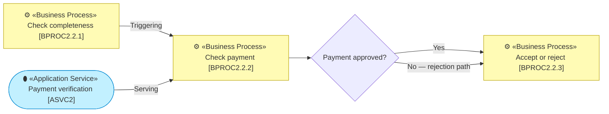
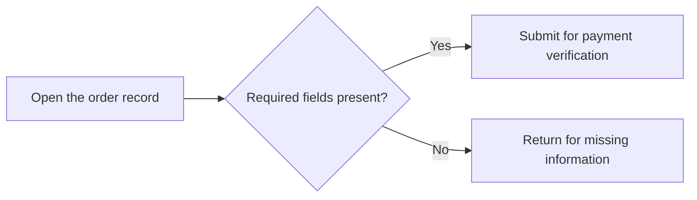

# Process presentation patterns

Use these profiles when a process model needs to be presented to people and
remain traversable by architects and agents. They define the semantic contract
for each level, not a mandatory document template. Combine, omit or reorder
the suggested tables and views when another arrangement is clearer, provided
the selected level still carries its minimum meaning.

## Common contract

Every process presentation follows these rules:

- State the organizational boundary and coverage. A reader must be able to
  distinguish an exclusion, external ownership and an evidence gap.
- Keep the hierarchy in the stable ID: a child process extends its parent's
  numeric ID. Every child also names its parent as `Name [ID]`; a person never
  has to decode the number to recover the hierarchy.
- Give every populated level its own file, following the
  [hierarchical-elements reference](../../architecture-document-style/references/hierarchical-elements.md).
  Every file states its level and `Location`, and the hierarchy index links the
  level files in reading order.
- A catalogue row **defines** an element and stays ID-first, normally
  `ID | Name | ArchiMate type | Description`. A process-specific catalogue
  may add useful fields after the human identity columns.
- Every appearance outside a defining row is a human-first reference as
  `Name [ID]`. This includes prose, composed-of lists, SIPOC fields,
  relationships, diagrams and briefs. Only modeled elements get architecture
  IDs.
- Ground a process in its accountable role, team, written procedure or
  supporting system, or state a specific gap. Link useful evidence where the
  claim needs to be checked.
- Use the notation in `architecture-document-style` for modeled Mermaid nodes
  and label every modeled relationship. A diagram renders declared facts; it
  does not become their only home.
- Keep one fact in one home. If another table or document owns it, use a
  human-first reference rather than copying the definition.
- Do not create empty level files, placeholder sections or repeated notation
  legends. A single level file may carry several views or parent branches when
  that remains easy to read.

## Level 1 — process landscape

Level 1 lets a reader see the whole enterprise or domain boundary before
opening any one process. Its minimum contract is:

- all four bands — Strategic, Operational, Support and Evaluation — populated
  or explicitly explained as empty within the declared coverage;
- the purpose and value of each macro process;
- one accountable owner;
- its composed level-2 processes; and
- a macro view that makes the landscape, main value chain or material
  relationships understandable.

An ID-first definition catalogue is the compact default:

```markdown
| ID | Name | ArchiMate type | Band | Purpose and value | Owner | Composed of |
| --- | --- | --- | --- | --- | --- | --- |
| BPROC1 | Set direction | Business Process | Strategic | Turns evidence into priorities and guardrails for the organization. | Strategy owner [ROLE1] | Assess performance [BPROC1.1]; choose priorities [BPROC1.2] |
| BPROC2 | Fulfil customer demand | Business Process | Operational | Turns an accepted request into value received by the customer. | Service owner [ROLE2] | Capture demand [BPROC2.1]; validate an order [BPROC2.2]; deliver the service [BPROC2.3] |
```

Use a separate coverage table only when the boundary cannot be stated clearly
in one paragraph:

```markdown
| Boundary | Included | External or excluded | Evidence gap |
| --- | --- | --- | --- |
| Operating company | Customer-facing and shared operations | Acquired subsidiary — separate model | Evaluation processes are only partly evidenced. |
```

A macro view groups modeled processes by band. Bands are visual containers,
not elements, and receive no IDs:



Do not draw edges merely to make every band connect. Show only declared
relationships or the real value chain.

## Level 2 — process contract

Level 2 defines an end-to-end process that another process or external actor
can supply or consume. Its minimum contract is:

- purpose and trigger;
- the full Supplier, Input, Process, Output and Customer set;
- accountable owner and realization;
- upstream and downstream processes or external boundaries; and
- the level-1 macro process it decomposes.

Keep the process definition in the ID-first catalogue and name its parent:

```markdown
| ID | Name | ArchiMate type | Description | Parent |
| --- | --- | --- | --- | --- |
| BPROC2.2 | Validate an order | Business Process | Turns a submitted order into an accepted order or a clear rejection. | Fulfil customer demand [BPROC2] |
```

Present the rest of its contract in the most readable form for the audience. A
small vertical table avoids a very wide row:

```markdown
| Concern | Content |
| --- | --- |
| Process | Validate an order [BPROC2.2] |
| Parent macro process | Fulfil customer demand [BPROC2] |
| Purpose | Turns a submitted order into an accepted order or a clear rejection. |
| Trigger | A customer submits an order. |
| Owner | Order operations owner [ROLE3] |
| Realized by | Order operations team [ACT2]; Order workflow [ASVC1] |
| Upstream | Capture demand [BPROC2.1] |
| Downstream | Deliver the service [BPROC2.3] |
```

The SIPOC itself stays recognizable:

```markdown
| Supplier | Input | Process | Output | Customer |
| --- | --- | --- | --- | --- |
| Customer [ACT1] | Submitted order [BOBJ1] | Validate an order [BPROC2.2] | Accepted order [BOBJ2] or rejection reason [BOBJ3] | Delivery team [ACT3] |
```

Where sequence or boundary matters, show upstream and downstream explicitly:



An external supplier or customer need not be invented as a modeled actor. It
may be named plainly at the model boundary and gains an ID only if the model
defines it as an element.

## Level 3 — operational flow

Level 3 explains how one level-2 process progresses through meaningful
sub-processes, decisions, exceptions and handoffs. Its minimum contract is:

- parent process and intended outcome;
- participating actors or roles;
- input and output artifacts;
- ordered sub-processes;
- decisions, exceptions and escalation paths;
- supporting applications or services;
- controls; and
- handoffs between responsibilities.

The file identifies the complete branch before its content:

```markdown
# Validate an order [BPROC2.2] — Level 3 sub-processes

**Location:** Business → Business processes → Fulfil customer demand [BPROC2]
→ Validate an order [BPROC2.2] → Level 3.
```

Define modeled sub-processes in an ID-first catalogue whose `Parent` cell makes
their Level 2 context explicit:

```markdown
| ID | Name | ArchiMate type | Description | Parent |
| --- | --- | --- | --- | --- |
| BPROC2.2.1 | Check completeness | Business Process | Confirms the required order information is present. | Validate an order [BPROC2.2] |
| BPROC2.2.2 | Check payment | Business Process | Establishes whether payment can proceed. | Validate an order [BPROC2.2] |
| BPROC2.2.3 | Accept or reject | Business Process | Produces the final validation outcome. | Validate an order [BPROC2.2] |
```

Then use a compact context table for the facts shared by the whole flow:

```markdown
| Concern | Content |
| --- | --- |
| Parent process | Validate an order [BPROC2.2] |
| Outcome | Accepted order [BOBJ2] or rejection reason [BOBJ3] |
| Participants | Order reviewer [ROLE4]; Finance approver [ROLE5] |
| Inputs | Submitted order [BOBJ1]; Customer account [BOBJ4] |
| Supporting applications | Order workflow [ASVC1]; Payment verification [ASVC2] |
| Controls | Approval threshold [RULE1]; Segregation of duties [P2] |
```

The ordered-flow table is useful when responsibilities and artifacts matter as
much as sequence:

```markdown
| Sub-process | Performed by | Uses | Produces | Supporting application | Control or handoff |
| --- | --- | --- | --- | --- | --- |
| Check completeness [BPROC2.2.1] | Order reviewer [ROLE4] | Submitted order [BOBJ1] | Complete order [BOBJ5] | Order workflow [ASVC1] | Incomplete orders return to the customer. |
| Check payment [BPROC2.2.2] | Finance approver [ROLE5] | Complete order [BOBJ5] | Payment decision [BOBJ6] | Payment verification [ASVC2] | Approval threshold [RULE1] |
| Accept or reject [BPROC2.2.3] | Order reviewer [ROLE4] | Payment decision [BOBJ6] | Accepted order [BOBJ2] or rejection reason [BOBJ3] | Order workflow [ASVC1] | Accepted orders hand off to Delivery team [ACT3]. |
```

Use Mermaid when branching, exception paths or handoffs are the point:



The decision diamond is flow notation and has no architecture ID. When a
material gap, inconsistency, authorization or requested acceptance requires a
person, use the rose conditional-human-decision notation from
`architecture-document-style`; it also receives no element ID.

## Level 4 — operating tasks

Level 4 is an operating instruction, not architecture. It describes what one
person or system does in one sitting. Tasks do not receive architecture IDs or
enter the process catalogue. Link the operating instruction from its level-3
sub-process when the detail is useful.

A task table may use ordinary sequence numbers:

```markdown
| Step | Performed by | Input | Instruction | Output or evidence | Escalation |
| --- | --- | --- | --- | --- | --- |
| 1 | Order reviewer [ROLE4] | Submitted order [BOBJ1] | Check that required customer and delivery fields are present. | Completeness check recorded | Missing information returns to Customer [ACT1]. |
| 2 | Order reviewer [ROLE4] | Complete order [BOBJ5] | Submit the order for payment verification. | Verification request | System failure escalates to Support team [ACT4]. |
```

If a simple operating flow helps, its task nodes remain plain and unnumbered by
the architecture model:



Modeled actors, objects and applications referenced by the instruction retain
their human-first `Name [ID]` form. The task itself does not become a modeled
element merely because it appears in a table or diagram.

## Selecting and combining profiles

- Use Level 1 when the reader needs the whole enterprise or domain landscape.
- Use Level 2 when ownership, interfaces and the process contract matter.
- Add Level 3 only where a named pain, risk, exception or decision needs the
  operational flow.
- Put Level 4 in the operating system, runbook or procedure library that owns
  day-to-day instructions; link it rather than importing it into architecture.
  The instruction names and links its Level 3 parent but gives its tasks no
  architecture IDs.
- Keep each populated architecture level in its own file. Split a level by
  band or parent branch only when navigation or ownership improves.
- Use a table when comparison or exact responsibility matters. Use Mermaid
  when topology, sequence, branching or handoff is easier to see. Use both
  only when each answers a different reader question.
- Reorder the context, catalogue, SIPOC and visual to suit the reader. Omit a
  recommended artifact when its meaning is already clear and linked elsewhere;
  never omit the level's minimum semantic contract.

Apart from the title, direct navigation and compact `Location` line, there are
no mandatory headings. The agent may combine sections, choose a different
table orientation or omit a redundant visual. The result is correct when a
person can recover the required meaning without reconciling duplicate facts.

## Showing selective depth

When any level-2 branch reaches Level 3, use a focus table so deliberate depth
cannot be mistaken for missing work:

```markdown
| Process | Detailed to | Justified by | Note |
| --- | --- | --- | --- |
| Deliver the service [BPROC2.3] | Level 3 | Late handoff [PAIN2] | The exception path causes the delay. |
| Bill and collect [BPROC2.4] | Level 2 | — | No current question requires more detail. |
```

Cover every level-2 process in the boundary. `Justified by` uses a human-first
reference when the reason is a modeled pain, driver, assessment, risk or
decision. Do not create the table when there is no selective depth and
coverage is already unambiguous.
