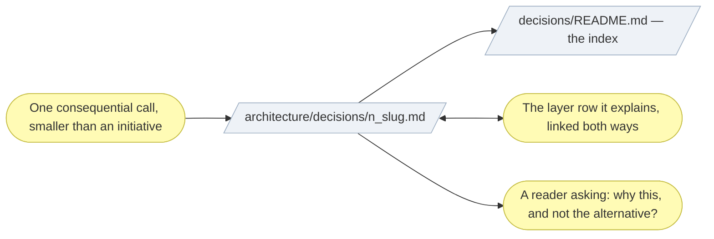

# ▤ Record a decision

An **architecture decision record**. A scope document captures an entire
initiative's alignment; a decision record captures **one call**, in isolation,
in the place a future reader will look for it.

## ⊕ When to use this

| The situation | What it looks like |
| ------------- | ------------------ |
| A rationale, not an element | The call changes no layer's content by itself — it explains a value already going into a table |
| A reader will ask why | "Why this and not the alternative?" is not answerable from the layer documents alone |
| Smaller than an initiative | Too small for plateaus and work packages, too consequential to leave in a PR thread |
| An AI actor's autonomy | Why a role is co-pilot rather than fully autonomous needs a citable answer, not a table cell |

## ⊖ When not to

| The situation | Use instead |
| ------------- | ----------- |
| The change adds or alters model elements | `align-change-through-layers`, then link the decision record from the alignment row it explains |
| Context and Consequences run past half a page | The call is initiative-sized — write a scope document |
| The project makes only a handful of significant calls | Fold the rationale into the scope document's prose; add the folder the first time a decision does not fit |

A decision record supplements a scope document; it never replaces one.

## ⌖ Where this sits

Realizes `BPROC3.2`, in the band that keeps the model true. It carries no
gate: it states a call already made, approved wherever the call was taken.



## ▤ Template

Lives at `architecture/decisions/<n>_<kebab-case-slug>.md` — the first
decision creates the folder from the plugin's `assets/layers/decisions/` —
numbered chronologically in one flat sequence, not per layer, and indexed in
`architecture/decisions/README.md`.

```markdown
# Decision <n> — <Short title>

_[← Decisions index](./README.md)_

**Status:** Proposed | Accepted | Superseded by [decision <m>](./<m>_*.md)
**Date:** <YYYY-MM-DD>
**Touches:** <link the document/row this decision explains, e.g.
[2_business/1_business-actors-and-roles.md#support-triage-agent](../2_business/1_business-actors-and-roles.md#support-triage-agent)>

## Context

<What prompted the call — the constraint, the risk, the requirement that
made this not obvious.>

## Options considered

| Option | Why not (or why) |
| ------ | ---------------- |
| …      | …                |

## Decision

<What was chosen, in one or two sentences.>

## Consequences

<What this makes easier, harder, or newly possible — including, for an actor's
autonomy level, what oversight or audit trail it commits the project to.>
```

## ※ Rules

- **Link both ways.** The layer row links to the decision record; the record
  links back through `Touches`. The value has one home, in the layer table;
  the record holds the *why*, never a restatement of the *what*.
- **A decision record is a historical record once accepted.** Its words do not
  change. A changed call gets a new numbered record, and the old one's
  `Status` line points at it.
- **Keep it short.** Half a page for Context and Consequences together is the
  ceiling, and passing it is the signal that this is an initiative.
- **Options considered earns its place.** Name what was rejected: a record
  with one option is a statement, not a decision.

## ✎ Worked example

> A support-triage role is modeled as `(AI)` at **co-pilot** autonomy. The
> layer table carries the value; the record carries why full autonomy was
> rejected — an unreviewed misclassification reaches a customer — and what
> co-pilot commits the project to: a human review queue and an audit trail.

## ⚠ Anti-patterns

- Restating the value in the record instead of the reasoning behind it.
- A record with no rejected option.
- Rewriting an accepted record instead of superseding it.
- Numbering per layer rather than in one flat chronological sequence.
- Creating the folder for a project whose scope documents would have carried
  the rationale perfectly well.

## ☑ Done when

- The record is numbered, slugged and indexed in `decisions/README.md`.
- `Touches` links the row it explains, and that row links back.
- `Status` is one of Proposed, Accepted, or Superseded with a link.
- Options considered names at least one rejected alternative.
- Consequences say what the call commits the project to, not only what it enables.
