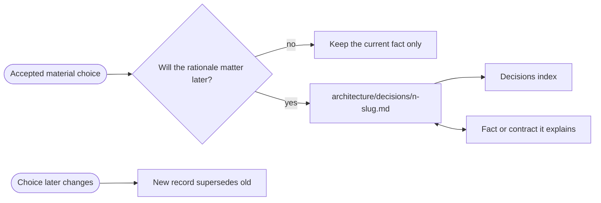

# ▤ Record a durable decision

A decision record preserves why one material choice was made. The model keeps
what is true; the record explains why this option was chosen over a credible
alternative. It records a decision already made and grants no authority itself.

## ⊕ When to use this

| Situation | Observable condition |
| --- | --- |
| A future reader will ask why | The current fact does not explain the decisive constraint or trade-off |
| A material alternative was rejected | Reconsidering it later would repeat costly analysis or risk |
| Authority or autonomy was deliberately bounded | For example, an AI actor's decision rights or checkpoint level |
| A cross-model contract chose one ownership boundary | The rationale matters to more than one repository |

## ⊖ When not to

| Situation | Better route |
| --- | --- |
| A person has not decided yet | Use a temporary decision brief with `write-brief` |
| The model fact is self-explanatory | Record only the fact and source |
| The rationale concerns routine implementation detail | Keep it with code, tests or the delivery discussion |
| The whole initiative needs coordination | Use a temporary scope brief through `deliver-change` |

## ⌖ Where this sits

Supports the durable-rationale parts of Answer a context question [BPROC2.1]
and Frame and assess a change [BPROC3.1]. It owns no
gate; the accountable person or authorized procedure made the decision first.



## ▤ Template

Create `architecture/decisions/` only when the first qualifying decision
exists. Store a flat chronological sequence at
`architecture/decisions/<n>-<short-slug>.md` and link each record from
`architecture/decisions/README.md`.

```markdown
# Decision <n> — <Short title>

_[Decisions](./README.md) · [Architecture](../README.md)_

**Location:** Architecture → Decisions → Decision <n> — <Short title>.

| Field | Value |
| --- | --- |
| Status | Proposed, Accepted, or Superseded by [decision <m>](./<m>-<slug>.md) |
| Date | <YYYY-MM-DD> |
| Decision owner | <Accountable role or person> |
| Explains | <Link to the canonical fact, relationship or contract> |

## Context

<The constraint, risk, gap or requirement that made the choice non-obvious.>

## Options considered

| Option | Material benefit | Material cost or risk |
| --- | --- | --- |

## Decision

<The chosen option and decisive reason, in one or two sentences.>

## Consequences

<What becomes easier, harder, constrained or required.>
```

## ※ Rules

- Link both ways. The canonical model owns the fact; the record owns the
  rationale. Do not restate catalogues or create a second source of truth.
- Name at least one credible rejected option. A statement with no alternative
  is not a useful decision record.
- Keep Context and Consequences together to roughly half a page. If the choice
  needs a delivery plan, it also needs a scope or roadmap outside this record.
- Once Accepted, do not rewrite the reasoning to match later preferences.
  Create a new numbered record and mark the earlier one Superseded with a link.
- A Proposed record is allowed only when the repository benefits from reviewing
  it in place. A temporary decision request still belongs under
  `.archreator/work/<run>/`.
- Record the decision owner, not a generic “approved by architecture.”

## ⇄ Hands off to

| Skill | What it receives | What comes back |
| --- | --- | --- |
| `write-brief` | An unresolved decision | A minimal temporary request for the accountable person |
| `deliver-change` | A decision that changes implementation or modeled behavior | Delivered work and refreshed current facts |
| `architecture-document-style` | The fact, contract and cross-links | Consistent identifiers, ownership and navigation |

## ⚠ Anti-patterns

- Using a permanent record to ask for a decision that has not been made.
- Recording every tool or library choice because a template exists.
- Repeating the chosen model value instead of explaining the trade-off.
- An Options table with only the selected option.
- Editing an accepted record instead of superseding it.
- Creating an empty decisions folder or index in every project.

## ☑ Done when

- The rationale is material enough to outlive the work that produced it.
- Status, date, owner and explained fact are explicit.
- At least one credible alternative and the consequences are recorded.
- The model and decision link to each other without duplicating ownership.
- An accepted changed choice has a new record and a supersession link.
