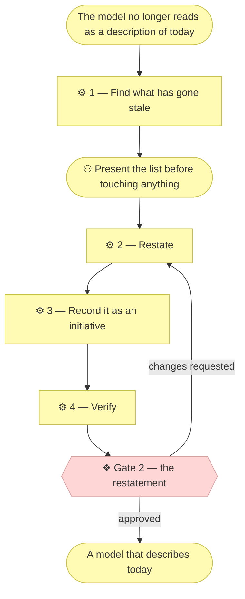

# ⚙ Restate the current state

`architecture/` describes the **current** state. `architecture/scope/` and
`architecture/decisions/` describe **how it got there**. Over a dozen
initiatives those two drift into each other: elements marked "Pending" that
shipped three initiatives ago, services replaced but never removed, questions
answered in a conversation nobody wrote down.

The result is a model still *accurate* line by line and no longer *true* as a
whole — a reader cannot tell which parts describe today.

## ⊕ When to use this

| The situation | What it looks like |
| ------------- | ------------------ |
| Before a whole-model review | A Requester is about to read it end to end, or someone is being onboarded |
| After a run of initiatives | Each left a "Pending" behind |
| The pending table has ghosts | `open-questions.md` holds rows nobody remembers |
| On a cadence | Quarterly is plenty, where the project has one |

## ⊖ When not to

| The situation | Use instead |
| ------------- | ----------- |
| As part of an ordinary initiative | Its own change, with its own scope document — so the diff reads as "what changed about our picture of today" and nothing else |
| The model should assert something different | `align-change-through-layers`. That is the *next* initiative, with its own gates |
| An open question has no answer yet | Nothing. A restatement that quietly closes it is a restatement that lied |

## ⌖ Where this sits

Realizes `BPROC3.1`, and stops at **Gate 2** — because the current-state
documents changed, and retiring an element the Requester still considers live
is exactly the mistake that gate catches.



## ⚓ Invariants

**Restating changes the current-state documents. It never rewrites history.**

| Rewritable — it describes now | Immutable — it describes then |
| ----------------------------- | ----------------------------- |
| Everything under `architecture/` | Merged scope documents in `architecture/scope/` |
| `architecture/scope/README.md`'s index and `open-questions.md` | The Approvals tables inside them |
| A decision record's **Status** line | A decision record's Context, Options, Decision, Consequences |
| Layer README state tables | Anything a Requester approved at a gate |

A merged scope document records what was approved on a date. If it becomes
wrong it is not corrected — it is superseded by a later one, which is the
whole reason the index is chronological. Editing it erases the evidence that a
gate was passed against different information.

- **One carve-out: link targets, not words.** When a later change moves a
  file, repair the path and leave every word alone, link text included. A
  dangling link makes the record less usable without making it more truthful.
  See `write-scope-document` § Rules.
- **An approved element's ID is never reused.** A retired ID stays retired.
  Wanting to reassign `BSVC3` because the old one is gone is the moment to
  stop: a stale reference must fail loudly, not resolve silently to something
  else. The rule starts at the gate, not at first writing
  (`architecture-document-style` § Never-reused starts at the gate) — and by the
  time this skill runs, everything has been through one.

## ⚙ Steps

### 1 — Find what has gone stale

Collect, without changing anything yet.

| # | What to look for | Why it matters |
| - | ---------------- | -------------- |
| 1 | **Pendings that shipped** | The most common staleness and the most damaging — it makes the model look further behind than it is |
| 2 | **Elements with nothing realizing them** | The inverse. If the module was deleted, the element is either retired or Pending again |
| 3 | **Superseded elements** | Two elements describing the same thing at different times, where only one is live |
| 4 | **Resolved open questions** | Answered in a gate conversation, a PR thread, or by the passage of events |
| 5 | **Decision records that no longer bind** | Consequences that no longer describe the project, or one a later decision quietly replaced |
| 6 | **Layer state tables that lie** | "not started" for a layer that now has three documents, or the reverse |
| 7 | **A document narrating its own construction** | What the source held, what was consolidated, why identifiers moved, an empty Retired section. `architecture-document-style` § What the document contains has the test and the worked examples |

**⚖ Judgement.** Present the list to the Requester **before touching
anything**. Restating is mechanical only where the answer is obvious; "is this
element still live?" frequently is not, and guessing wrong deletes something
real.

**→ Produces** a findings list, agreed before any edit.

### 2 — Restate

Every move is corrective in the current-state documents, and leaves history
alone.

| Finding | Move |
| ------- | ---- |
| Pending that shipped | Replace it with the artifact that now realizes it. Link the scope document that delivered it |
| Realizing artifact gone | Retire the element, or mark it Pending again with a note saying what was removed and when |
| Superseded element | Keep the live one. Move the retired one to the layer document's **Retired** section, never delete the row outright |
| Resolved open question | Move the row from Pending to Resolved in `open-questions.md`, with the answer and where it was given. The originating scope document is *not* edited — it recorded what was open at the time |
| Decision no longer binding | Set its Status to `Superseded by <n>_<slug>.md` or `Retired — <one line why>`. Leave every other section untouched |
| Layer state table wrong | Correct it to what the folder actually contains |
| Document narrating its own construction | Delete it, or move it to the scope document that should have carried it. Keep anything awaiting validation where it is; move a surviving subject note to **Additional notes** at the end |

**← Needs** the agreed findings list.

**→ Produces** the corrected layer documents, `open-questions.md`, and any
decision-record Status lines.

#### The Retired section

**It holds gate-approved elements only, and a document that has retired
nothing does not have one.** Not an empty table, not a "None" line — an absent
section says "nothing retired here" more clearly than a sentence saying so,
and such a sentence is the version commentary
`architecture-document-style` § No version commentary forbids.

```markdown
## Retired

Elements that were live and no longer are. Their IDs stay retired; nothing
reuses them.

| ID | Element | Retired in | Why |
| -- | ------- | ---------- | --- |
| `BSVC3` | Supervised build (manual) | [`4_...md`](../../scope/4_....md) | Replaced by `BSVC7` when the process was automated |
```

This is the compromise that makes compaction safe. A reader of the main tables
sees only what is live, which is the point; a reader who finds a dangling
`BSVC3` in an old document can still discover what happened to it. Simply
deleting retired elements produces references that resolve to nothing with no
explanation — worse than the clutter it removed.

Keep it short. Past roughly a dozen rows, the elements at the bottom are old
enough that the scope documents are the better record; move them out and say
so in one line.

### 3 — Record it as an initiative

Restating is a change to the model, so it gets a scope document with
`write-scope-document`:

- an alignment table naming every layer touched, and "no change" for the rest;
- **Gate 2**, because the current-state documents changed;
- Gates 0, 1 and 3 marked `N/A — restatement changes no strategy and delivers
  no code`;
- an in-scope/out-of-scope table. Restating is famously easy to let sprawl
  into "and while I was there I improved…". A change to what the model *says
  about the world* is a different initiative from a change to *how accurately
  the model reports itself*.

**→ Produces** `architecture/scope/<n>_*.md`.

### 4 — Verify

- Every element in every live table names a realizing artifact or is
  explicitly Pending — the grounding rule, re-checked across the whole model.
- No ID appears in both a live table and a Retired table, and none is reused.
- No document narrates its own construction, and none carries an empty Retired
  section.
- **Every merged scope document is byte-identical to before**, except where
  only a link target moved. Check deliberately: `git diff` shows no changes to
  `architecture/scope/<n>_*.md` for any already-merged `<n>`.
- `open-questions.md`'s Pending table holds only questions genuinely still open.
- Cross-links resolve.

## ⇄ Hands off to

| Skill | When | What comes back |
| ----- | ---- | --------------- |
| `write-scope-document` | Step 3 | The document Gate 2 is recorded in |
| `align-change-through-layers` | Restating revealed the architecture *should* be different | That as its own initiative, with its own gates |

## ✎ Worked example

> Four initiatives each left a Pending. Two shipped, one was deleted, one is
> genuinely still pending. Step 1 presents all four; the Requester confirms the
> deleted one is gone for good, so it moves to Retired with its reason rather
> than vanishing. The two shipped ones name their artifacts. `git diff` shows
> no scope document changed, which is the check that proves history survived.

## ⚠ Anti-patterns

- Editing a merged scope document to make it right, instead of superseding it.
- Deleting a retired element rather than moving it to Retired, leaving
  references that resolve to nothing.
- Reusing a retired identifier.
- Closing an open question that has no answer yet.
- Letting the restatement sprawl into improvements to the architecture itself.
- Writing an empty Retired section, or a line saying nothing was retired.

## ☑ Done when

- Every finding from Step 1 has a move applied or a stated reason it did not.
- Gate 2 is recorded in the scope document's Approvals table.
- The four verification checks pass, including the byte-identical one.
- The model reads as a description of today.

## What this does not do

- **It does not compact the git history**, and should not. The commit log and
  the merged scope documents are the audit trail; restating makes the *model*
  readable, not the past shorter.
- **It does not resolve open questions.** Moving a row to Resolved requires an
  answer that already exists.
- **It does not change what the model asserts about the world** — only whether
  the model still describes today.
